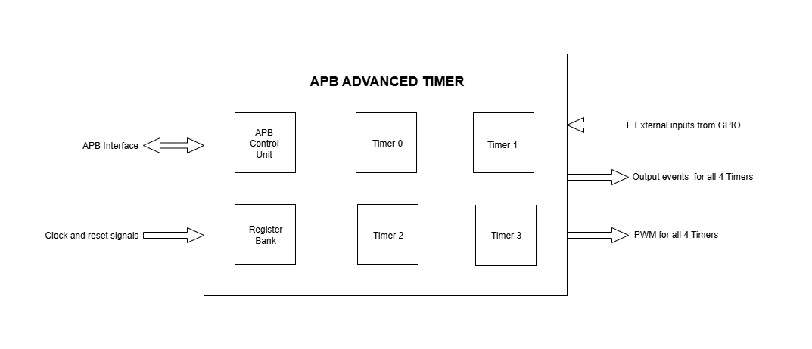
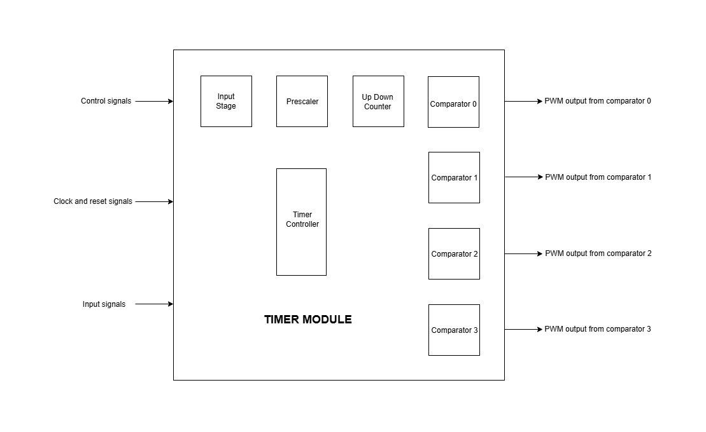
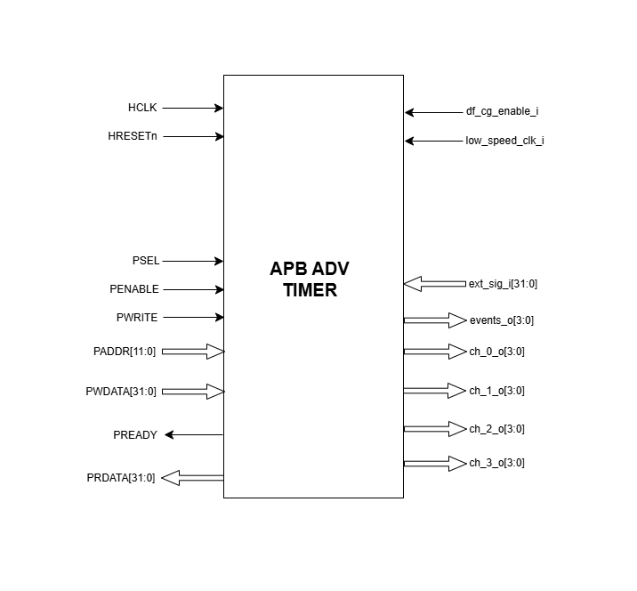

..
   Copyright (c) 2023 OpenHW Group
   Copyright (c) 2024 CircuitSutra

   SPDX-License-Identifier: Apache-2.0 WITH SHL-2.1

.. Level 1
   =======

   Level 2
   -------

   Level 3
   ~~~~~~~

   Level 4
   ^^^^^^^
.. _apb_advanced_timer:

APB Advanced Timer
==================

The Advanced Timer supports four programmable timers called "channels", typically used for PWM generation. These four timers can be configured independently to support four unique PWM generation parallely.   

Features
--------

- Multiple trigger input sources:

  - Output signal channels of all timers
  - 32 GPIOs
  - Reference clock at 32kHz
  - FLL clock

- Configurable input trigger modes for each timer
- Configurable prescaler for each timer
- Configurable counting mode for each timer
- Configurable channel comapartor threshold and comapartor operation for each timer
- Four configurable output events
- Configurable clock gating of each timer

Architecture
-------------

The figure below is a high-level block diagram of the APB Advanced Timer module:-

   APB ADVANCED TIMER Block Diagram

The figure below depicts the connections between the APB ADVANCED TIMER and rest of the modules in Core-V-MCU:-

.. figure:: apb_adv_timer_soc_connections.png
   :name: APB_ADVANCED_TIMER_SoC_Connections
   :align: center
   :alt:

   APB ADVANCED TIMER Core-V-MCU connections diagram

- The ext_sig_i input to the APB_ADVANCED_TIMER is directly connected to the APB_GPIO. 
- APB_ADVANCED_TIMER process this input signals based on the various register configurations.
- APB_ADVANCED_TIMER generate few output event signals that are further parsed as interrupts to the Core/CPU.
- APB_ADVANCED_TIMER generates PWM outputs which are parsed to the external devices through I/O mux.

The APB ADVANCED TIMER IP consists of the following key components:
APB control logic, APB ADVANCED TIMER CSRs and 4 Timer modules

APB control logic
~~~~~~~~~~~~~~~~~
The APB control logic interfaces with the APB bus to decode and execute commands.
It handles register reads and writes according to the APB protocol, providing a standardized interface to the system.

APB ADVANCED TIMER CSRs
~~~~~~~~~~~~~~~~~~~~~~~~~~~~
- There are few common registers that store the following configurations.

  - Output event select  
  - Clock enable

- There are 4 timer modules and each timer module has its own set of registers. Each of the timer module specific registers store the following configuration:

  - Arm, Reset, Update, Stop and Start  
  - Prescalar value, Sawtooth mode, Clksel, Input trigger mode select, Input pins select
  - Count start and Count emd.
  - Counter 
  - Comparator Threshold and Comparator operation mode

Timer Module
~~~~~~~~~~~~

   TIMER Block Diagram

Introduction
^^^^^^^^^^^^^
- Timer module has various submodules/components like Timer Controller, Input stage, Prescalar, Updown counter and Comparators.
- Timer controller manages all the other submodules through few control signals like active, controller reset and update.
- FW performs Initialization and drives various configuration register. 
- Timer module's main objective is to generate PWM signal based on the external input/stimulus provided.
- In order to generate the PWM, the data flows through the following submodules which can also be seen TIMER Block diagram.
  
  - **(ext_sig_i )** -> input stage -> prescaler ->updown counter ->comparators -> **(PWM)**

Timer Controller
^^^^^^^^^^^^^^^^
- Timer controller generates few important signals like active, update and reset. It parses and controls other sub modules through these signals. 

  -  active signal: It is a control signal through which a sub module can either enable or disable its operations.
  -  update signal: It informs the sub module when to update the latest configured register values in order to perform their operations.
  -  reset signal: It resets the sub modules.

- The active signal is driven by a different a value in the following conditions. 

  -  The active signal is driven by value '1', when the START bitfield is '1' in the REG_TIM0_CMD register.

  -  The active signal is driven by value '0'. when the START bitfield is '0' and STOP bitfield is '1' in the REG_TIM0_CMD register. 

- The update signal is always driven by the value UPDATE bitfield in the REG_TIM0_CMD register and controller reset signal is driven by the value RESET bitfield in the REG_TIM0_CMD register. 
- These signals are parsed to all sub modules in the following conditions

  - if START bitfield is 0 in the REG_TIM0_CMD register.

  - if START bitfield is '1' in the REG_TIM0_CMD register and active signal is '1'. When the Timer starts for the first time.

Input Stage
^^^^^^^^^^^
- Input stage receives the ext_sig_i and based on register configurations, it selects the clock, input pin and operating mode to generate the output event signal.  
- Input stage uses the bitfield INSEL in REG_TIM0_CFG register and selects a signal from a set of signals in ext_sig_i.
- Input stage uses the bitfield CLKSEL in REG_TIM0_CFG register and decides whether the input will be either in sync with the rising edge of the low_speed_clk_i or in sync with the ref clock.
- At every positive edge of the selected clock and selected input signal, Input stage uses the bitfield MODE in REG_TIM0_CFG register to generate output event signal according to the below information.

  - If MODE is 3’b000

    - The event is always high

  - If MODE is 3’b001

    - The event is sensitive to the negation of the signal selected

  - If MODE is 3’b010

    - The output event is sensitive to the input signal selected
    
  - If MODE is 3’b011

    - The output event is sensitive to the rising edge of the selected signal in sync with the clock.

  - If MODE is 3’b100

    - The output event is sensitive to the falling edge of the selected signal in sync with the clock.

  - If MODE is 3’b101

    - The output event is sensitive to both rising edge and falling edge of the selected signal in sync with the clock.

  - If MODE is 3’b110

    - If the timer is armed ,i,e,the register ARM is high then the event is made high for the rising edge of the selected signal and remains the same until the next rising edge of the signal.If ARM register is low,then the output event is low forever.

  - If MODE is 3’b111

    - If the timer is armed ,i,e,the register ARM is high then the event is made high for the falling edge of the selected signal and remains the same until the next falling edge of the signal.If ARM register is low,then the output event is low forever.

Prescalar
^^^^^^^^^
- Prescaler scales down the high frequency input signal to low frequency output signal by using the prescaler value. 
- The PRESC bitfield in the REG_TIM0_CFG register is parsed to Prescaler. 
- The output event signal generated in the previous input stage is scaled based on the PRESC value.
- Prescaler module maintains a internal counter whose initial value is 0. At every positive edge of the clock, counter gets incremented by '1' when event input signal is '1' and Timer is active.
- When the internal counter value matches with the PRESC bitfield output event is set to '1' and the counter is updated to '0'. The above process continues and output events are generated.
- Whenever the lock synced events generated is equal to PRESC value then one output event is generated at positive edge of the clock(the frequency is scaled according to the PRESC register value).
- Both the counter and output event is set to 0. When either the hard reset is triggered or when Timer controller parses the RESET bitfield which is set to '1'.

Updown counter
^^^^^^^^^^^^^^
- Updown counter manages the timer counter values based on register configurations and generates few output events.
- The output event generated from prescaler sub module is provided as the input for the updown counter and it is processed further.
- The active, controller reset and update signals are provided by the Timer controller.  
- Updown counter maintains a counter and direction(0- up and 1- down).
- During the initialization, counter value is set to COUNT_START and direction to 0 and any new values of SAWTOOTH, COUNT_START and COUNT_END bitfield can be provided by FW. 
- At every positive edge of the clock, if output event generated from prescaler is '1' and active sigmal is '1' then the following operation is performed.

  - if the SAWTOOTH bitfield is '1':

    - The counter is increemented till it reaches the value of COUNT_END, then an end event is generated.

    - The counter is resetted back to value of COUNT_START bitfield and this process is repeated to generate multiple end events. 
 
  - if the SAWTOOTH bitfield is '0':

    - The counter is increemented till it reaches the value of COUNT_END.

    - Then the counter is decreemented till it reaches the value of COUNT_START. (counter goes in a sawtooth fashion)

    - Now, an end event is generated. this process is repeated to generate multiple end events.

- Re-Initialization of the Updown counter can be done in the following scenarios.

  - Change in update signal: 

    - When the controller is inactive. if the update signal is '1' and active signal is '0'. 

    - When an end event is generated and if the update signal is '1'. 

    - if update signal is '1' and above two conditions for the change in update signal are not met. upcounter counter is initialized for the next end event generation irrespective of update signal value at that instance of time. 

  - Change in reset signal: 

    - When the controller reset signal is '1'. 

- At every positive edge of the clock, if the active signal is '1' then output event is driven by the value of output event generated from prescaler.
- At every positive edge of the clock, The counter value is updated in the REG_TIM0_COUNTER.
- If the hard reset is '0', then the all the register and internal meta data is set to the reset values.

Comparator
^^^^^^^^^^
- Each timer has 4 comparators that can act independently and each comapartor generates a 1 bit PWM output.
- Comparator comapres the timer counter value with compare value and based on register configurations of output mode generates a PWM output.
- The counter value, end event and the output event generated in the updown counter are provided as input to the comparator. 
- The active, controller reset and update signals are provided by the Timer controller.
- COMP_THRESHOLD and COMP_OP can only be updated and used by the comparator. when the update signal is '1'. 
- At every positive edge of the clock, when the output event coming out of the up down counter is '1' and active signal is '1', comparator checks for the following two internal events that can happen, 

  - **(match_event)** is set to '1' when timer counter value reaches the comparator offset 

  - **(event_2)** set to '1' in the following two scenarios:

    - When the SAWTOOTH bitfield is '1' and end event is '1'.

    - When SAWTOOTH is bitfield is '0' and the timer counter value reaches the COMP_THRESHOLD. 

- Then, based on the match_event, event_2 and COMP_OP value, PWM output is generated accordingly.

- If COMP_OP value is 3'b000 (OP_SET) 
  
  - If a match_event is high
  
    - The PWM output is made high
  
  - If a match_event is low
  
    - The PWM output remains the same.

- If COMP_OP value is 3'b001 (OP_TOGRST)
  
  - When Sawtooth Mode is ON

    - If a match_event is high

      - The PWM output is made toggled.
    
    - If event_2 is high 
    
      - The PWM output is made low.

  - When Sawtooth Mode is OFF

    - If match_event is high and event_2 is low

      - The PWM output is toggled.
      - event_2 is made high.

    - If match_event is high and event_2 is high
    
      - The PWM output is made low
      - event_2 is made low.

- If COMP_OP value is 3'b010 (OP_SETRST)

  - When Sawtooth Mode is ON

    - If a match_event is high 
  
      - the PWM output is made high
  
    - If event_2 is high
  
      - then PWM output is made low.

  - When Sawtooth Mode is OFF
    
    - If match_event is high and event_2 is low
    
      - The PWM output is made high
      - event_2 is made high.
    
    - If match_event is high and event_2 also is high
    
      - PWM output is made low
      - event_2 is made low.

- If COMP_OP value is 3'b011 (OP_TOG) 

  - If a match_event is high
  
    - The PWM output is toggled
  
  - If a match_event is low
  
    - The PWM output remains the same.

- If COMP_OP value is 3'b100 (OP_RST)

  - If a match_event is high
  
    - The PWM output is made low
  
  - If a match_event is low
  
    - The PWM output remains the same.

- If COMP_OP value is 3'b101 (OP_TOGSET)

  - When Sawtooth Mode is ON

    - If a match_event is high
  
      - The PWM output is toggled
  
    - If event_2 is high
  
      - then PWM output is made high.

  - When Sawtooth Mode is OFF
  
    - If match_event is high and event_2 is low
  
      - The PWM output is toggled
      - event_2 is made high
  
    - If match_event is high and event_2 also is high
  
      - The PWM output is made high
      - event_2 is made low

- If COMP_OP value is 3'b110 (OP_RSTSET)

  - When Sawtooth Mode is ON
  
    - If a match_event is high
  
      - The PWM output is made low
  
    - If event_2 is high
  
      - The PWM output is made high

  - When Sawtooth Mode is OFF
  
    - If match_event is high and event_2 is low
  
      - The PWM output is made low
      - event_2 is made high
  
    - If match_event is high and event_2 also is high
  
      - The PWM output is made high
      - event_2 is made low.

- By default the PWM output remains the same (state remains same until further change in input) and event_2 is kept low.
- The PWM output is set to 0. When either the hard reset is triggered or controlelr reset is '1'.

APB ADVANCED TIMER CSRs
-----------------------
**REG_TIM0_CMD** offset=0x000

.. list-table::
   :widths: 10 10 10 10 50
   :header-rows: 1

   * - Field
     - Bits
     - Type
     - Access
     - Description
   * - Reserved
     - 31:5
     - 
     - 
     - 
   * - ARM
     - 4:4
     - Config
     - RW
     - arm command bitfield
   * - RESET
     - 3:3
     - Config
     - RW
     - reset command bitfield
   * - UPDATE
     - 2:2
     - Config
     - RW
     - update command bitfield
   * - STOP
     - 1:1
     - Config
     - RW
     - Stop command field
   * - START
     - 0:0
     - Config
     - RW
     - Start command field
..

**REG_TIM0_CFG** offset=0x004

.. list-table::
   :widths: 10 10 10 10 50
   :header-rows: 1

   * - Field
     - Bits
     - Type
     - Access
     - Description
   * - Reserved
     - 31:24
     - 
     - 
     - 
   * - PRESC
     - 23:16
     - Config
     - RW
     - prescaler value configuration bitfield
   * - Reserved
     - 15:13
     - 
     - 
     - 
   * - SAWTOOTH
     - 12:12
     - Config
     - RW
     - center-aligned mode configuration bitfield
   * -
     -
     -
     -
     - 1’b0: The counter counts up and down alternatively
   * -
     -
     -
     -
     - 1’b1: The counter counts up and resets to 0 when it reaches the threshold.
   * - CLKSEL
     - 11:11
     - Config
     - RW
     - clock source configuration bitfield
   * -
     -
     -
     -
     - 1’b0: FLL
   * -
     -
     -
     -
     - 1’b1: Reference clock at 32kHz
   * - MODE
     - 10:8
     - Config
     - RW
     - trigger mode configuration bitfield
   * -
     -
     -
     -
     - 3’h0: Trigger event at each clock cycle
   * -
     -
     -
     -
     - 3’h1: Trigger event if input source is 0
   * -
     -
     -
     -
     - 3’h2: Trigger event if input source is 1
   * -
     -
     -
     -
     - 3’h3: Trigger event on input source rising edge
   * -
     -
     -
     -
     - 3’h4: Trigger event on input source falling edge
   * -
     -
     -
     -
     - 3’h5: Trigger event on input source falling or rising edge
   * -
     -
     -
     -
     - 3’h6: Trigger event on input source rising edge when armed
   * -
     -
     -
     -
     - 3’h7: Trigger event on input source falling edge when armed
   * - INSEL
     - 7:0
     - Config
     - RW
     - input source configuration bitfield
   * -
     -
     -
     -
     - 0-31: GPIO[0] to GPIO[31]
   * -
     -
     -
     -
     - 32-35: Channel 0 to 3 of ADV_TIMER0
   * -
     -
     -
     -
     - 36-39: Channel 0 to 3 of ADV_TIMER1
   * -
     -
     -
     -
     - 40-43: Channel 0 to 3 of ADV_TIMER2
   * -
     -
     -
     -
     - 44-47: Channel 0 to 3 of ADV_TIMER3
..

**REG_TIM0_TH** offset=0x008

.. list-table::
   :widths: 10 10 10 10 50
   :header-rows: 1

   * - Field
     - Bits
     - Type
     - Access
     - Description
   * - COUNT_END
     - 31:16
     - Config
     - RW
     - End value for the updown counter 
   * - COUNT_START
     - 15:0
     - Config
     - RW
     - Start value for the updown counter 

..

**REG_TIM0_CH0_TH** offset=0x00C

.. list-table::
   :widths: 10 10 10 10 50
   :header-rows: 1

   * - Field
     - Bits
     - Type
     - Access
     - Description
   * - Reserved
     - 31:19
     - 
     - 
     - 
   * - COMP_OP
     - 18:16
     - Config
     - RW
     - Channel 0 threshold match action on channel output signal configuration bitfield
   * -
     -
     -
     -     
     - 3’h0: Set
   * -
     -
     -
     -     
     - 3’h1: Toggle then next threshold match action is clear
   * -
     -
     -
     - 
     - 3’h2: Set then next threshold match action is clear
   * -
     -
     -
     -
     - 3’h3: Toggle
   * -
     -
     -
     -
     - 3’h4: Clear
   * -
     -
     -
     -
     - 3’h5: Toggle then next threshold match action is set
   * -
     -
     -
     -
     - 3’h6: Clear then next threshold match action is set
   * - COMP_THRESHOLD
     - 15:0
     - Config
     - RW
     - Channel 0 threshold configuration bitfield

..

**REG_TIM0_CH1_TH** offset=0x010

.. list-table::
   :widths: 10 10 10 10 50
   :header-rows: 1

   * - Field
     - Bits
     - Type
     - Access
     - Description
   * - Reserved
     - 31:19
     - 
     - 
     - 
   * - COMP_OP
     - 18:16
     - Config
     - RW
     - Channel 1 threshold match action on channel output signal configuration bitfield
   * -
     -
     -
     -     
     - 3’h0: Set
   * -
     -
     -
     -
     - 3’h1: Toggle then next threshold match action is clear
   * -
     -
     -
     -
     - 3’h2: Set then next threshold match action is clear
   * -
     -
     -
     -
     - 3’h3: Toggle
   * -
     -
     -
     -
     - 3’h4: Clear
   * -
     -
     -
     -
     - 3’h5: Toggle then next threshold match action is set
   * -
     -
     -
     -
     - 3’h6: Clear then next threshold match action is set
   * - COMP_THRESHOLD
     - 15:0
     - Config
     - RW
     - Channel 1 threshold configuration bitfield

..

**REG_TIM0_CH2_TH** offset=0x014

.. list-table::
   :widths: 10 10 10 10 50
   :header-rows: 1

   * - Field
     - Bits
     - Type
     - Access
     - Description
   * - Reserved
     - 31:19
     - 
     - 
     - 
   * - COMP_OP
     - 18:16
     - Config
     - RW
     - Channel 2 threshold match action on channel output signal configuration bitfield
   * -
     -
     -
     -     
     - 3’h0: Set
   * -
     -
     -
     -     
     - 3’h1: Toggle then next threshold match action is clear
   * -
     -
     -
     -     
     - 3’h2: Set then next threshold match action is clear
   * -
     -
     -
     -     
     - 3’h3: Toggle
   * -
     -
     -
     -    
     - 3’h4: Clear
   * -
     -
     -
     -     
     - 3’h5: Toggle then next threshold match action is set
   * -
     -
     -
     -    
     - 3’h6: Clear then next threshold match action is set
   * - COMP_THRESHOLD
     - 15:0
     - Config
     - RW
     - Channel 2 threshold configuration bitfield

..

**REG_TIM0_CH3_TH** offset=0x018

.. list-table::
   :widths: 10 10 10 10 50
   :header-rows: 1

   * - Field
     - Bits
     - Type
     - Access
     - Description
   * - Reserved
     - 31:19
     - 
     - 
     - 
   * - COMP_OP
     - 18:16
     - Config
     - RW
     - Channel 3 threshold match action on channel output signal configuration bitfield
   * -
     -
     -
     -
     - 3’h0: Set
   * -
     -
     -
     -
     - 3’h1: Toggle then next threshold match action is clear
   * -
     -
     -
     -     
     - 3’h2: Set then next threshold match action is clear
   * -
     -
     -
     -     
     - 3’h3: Toggle
   * -
     -
     -
     -     
     - 3’h4: Clear
   * -
     -
     -
     -    
     - 3’h5: Toggle then next threshold match action is set
   * -
     -
     -
     -     
     - 3’h6: Clear then next threshold match action is set
   * - COMP_THRESHOLD
     - 15:0
     - Config
     - RW
     - Channel 3 threshold configuration bitfield

..

**REG_TIM0_CH0_LUT** offset=0x01C

.. list-table::
   :widths: 10 10 10 10 50
   :header-rows: 1

   * - Field
     - Bits
     - Type
     - Access
     - Description
   * - Reserved
     - 31:18
     - 
     - 
     - 
   * - FLT
     - 23:16
     - Config
     - RW
     - FLT
   * - LUT
     - 15:0
     - Config
     - RW
     - LUT

..

**REG_TIM0_CH1_LUT** offset=0x020

.. list-table::
   :widths: 10 10 10 10 50
   :header-rows: 1

   * - Field
     - Bits
     - Type
     - Access
     - Description
   * - Reserved
     - 31:18
     - 
     - 
     - 
   * - FLT
     - 23:16
     - Config
     - RW
     - FLT
   * - LUT
     - 15:0
     - Config
     - RW
     - LUT

..

**REG_TIM0_CH2_LUT** offset=0x024

.. list-table::
   :widths: 10 10 10 10 50
   :header-rows: 1

   * - Field
     - Bits
     - Type
     - Access
     - Description
   * - Reserved
     - 31:18
     - 
     - 
     - 
   * - FLT
     - 23:16
     - Config
     - RW
     - FLT
   * - LUT
     - 15:0
     - Config
     - RW
     - LUT

..

**REG_TIM0_CH3_LUT** offset=0x028

.. list-table::
   :widths: 10 10 10 10 50
   :header-rows: 1

   * - Field
     - Bits
     - Type
     - Access
     - Description
   * - Reserved
     - 31:18
     - 
     - 
     - 
   * - FLT
     - 23:16
     - Config
     - RW
     - FLT
   * - LUT
     - 15:0
     - Config
     - RW
     - LUT

..

**REG_TIM0_COUNTER** offset=0x02C

.. list-table::
   :widths: 10 10 10 10 50
   :header-rows: 1

   * - Field
     - Bits
     - Type
     - Access
     - Description
   * - T0_COUNTER
     - 31:0
     - Status
     - R
     - ADV_TIMER0 counter register

..

 **REG_TIM1_CMD** offset=0x040

.. list-table::
   :widths: 10 10 10 10 50
   :header-rows: 1

   * - Field
     - Bits
     - Type
     - Access
     - Description
   * - Reserved
     - 31:5
     - 
     - 
     - 
   * - ARM
     - 4:4
     - Config
     - RW
     - arm command bitfield
   * - RESET
     - 3:3
     - Config
     - RW
     - reset command bitfield
   * - UPDATE
     - 2:2
     - Config
     - RW
     - update command bitfield
   * - STOP
     - 1:1
     - Config
     - RW
     - Stop command field
   * - START
     - 0:0
     - Config
     - RW
     - Start command field
..

**REG_TIM1_CFG** offset=0x044

.. list-table::
   :widths: 10 10 10 10 50
   :header-rows: 1

   * - Field
     - Bits
     - Type
     - Access
     - Description
   * - Reserved
     - 31:24
     - 
     - 
     - 
   * - PRESC
     - 23:16
     - Config
     - RW
     - prescaler value configuration bitfield
   * - Reserved
     - 15:13
     - 
     - 
     - 
   * - SAWTOOTH
     - 12:12
     - Config
     - RW
     - center-aligned mode configuration bitfield
   * -
     -
     -
     -
     - 1’b0: The counter counts up and down alternatively
   * -
     -
     -
     -
     - 1’b1: The counter counts up and resets to 0 when it reaches the threshold.
   * - CLKSEL
     - 11:11
     - Config
     - RW
     - clock source configuration bitfield
   * -
     -
     -
     -
     - 1’b0: FLL
   * -
     -
     -
     -
     - 1’b1: Reference clock at 32kHz
   * - MODE
     - 10:8
     - Config
     - RW
     - trigger mode configuration bitfield
   * -
     -
     -
     -
     - 3’h0: Trigger event at each clock cycle
   * -
     -
     -
     -
     - 3’h1: Trigger event if input source is 0
   * -
     -
     -
     -
     - 3’h2: Trigger event if input source is 1
   * -
     -
     -
     -
     - 3’h3: Trigger event on input source rising edge
   * -
     -
     -
     -
     - 3’h4: Trigger event on input source falling edge
   * -
     -
     -
     -
     - 3’h5: Trigger event on input source falling or rising edge
   * -
     -
     -
     -
     - 3’h6: Trigger event on input source rising edge when armed
   * -
     -
     -
     -
     - 3’h7: Trigger event on input source falling edge when armed
   * - INSEL
     - 7:0
     - Config
     - RW
     - input source configuration bitfield
   * -
     -
     -
     -
     - 0-31: GPIO[0] to GPIO[31]
   * -
     -
     -
     -
     - 32-35: Channel 0 to 3 of ADV_TIMER0
   * -
     -
     -
     -
     - 36-39: Channel 0 to 3 of ADV_TIMER1
   * -
     -
     -
     -
     - 40-43: Channel 0 to 3 of ADV_TIMER2
   * -
     -
     -
     -
     - 44-47: Channel 0 to 3 of ADV_TIMER3
..

**REG_TIM1_TH** offset=0x048

.. list-table::
   :widths: 10 10 10 10 50
   :header-rows: 1

   * - Field
     - Bits
     - Type
     - Access
     - Description
   * - COUNT_END
     - 31:16
     - Config
     - RW
     - End value for the updown counter 
   * - COUNT_START
     - 15:0
     - Config
     - RW
     - Start value for the updown counter 

..

**REG_TIM1_CH0_TH** offset=0x04C

.. list-table::
   :widths: 10 10 10 10 50
   :header-rows: 1

   * - Field
     - Bits
     - Type
     - Access
     - Description
   * - Reserved
     - 31:19
     - 
     - 
     - 
   * - COMP_OP
     - 18:16
     - Config
     - RW
     - Channel 0 threshold match action on channel output signal configuration bitfield
   * -
     -
     -
     -     
     - 3’h0: Set
   * -
     -
     -
     -     
     - 3’h1: Toggle then next threshold match action is clear
   * -
     -
     -
     - 
     - 3’h2: Set then next threshold match action is clear
   * -
     -
     -
     -
     - 3’h3: Toggle
   * -
     -
     -
     -
     - 3’h4: Clear
   * -
     -
     -
     -
     - 3’h5: Toggle then next threshold match action is set
   * -
     -
     -
     -
     - 3’h6: Clear then next threshold match action is set
   * - COMP_THRESHOLD
     - 15:0
     - Config
     - RW
     - Channel 0 threshold configuration bitfield

..

**REG_TIM1_CH1_TH** offset=0x050

.. list-table::
   :widths: 10 10 10 10 50
   :header-rows: 1

   * - Field
     - Bits
     - Type
     - Access
     - Description
   * - Reserved
     - 31:19
     - 
     - 
     - 
   * - COMP_OP
     - 18:16
     - Config
     - RW
     - Channel 1 threshold match action on channel output signal configuration bitfield
   * -
     -
     -
     -     
     - 3’h0: Set
   * -
     -
     -
     -
     - 3’h1: Toggle then next threshold match action is clear
   * -
     -
     -
     -
     - 3’h2: Set then next threshold match action is clear
   * -
     -
     -
     -
     - 3’h3: Toggle
   * -
     -
     -
     -
     - 3’h4: Clear
   * -
     -
     -
     -
     - 3’h5: Toggle then next threshold match action is set
   * -
     -
     -
     -
     - 3’h6: Clear then next threshold match action is set
   * - COMP_THRESHOLD
     - 15:0
     - Config
     - RW
     - Channel 1 threshold configuration bitfield

..

**REG_TIM1_CH2_TH** offset=0x054

.. list-table::
   :widths: 10 10 10 10 50
   :header-rows: 1

   * - Field
     - Bits
     - Type
     - Access
     - Description
   * - Reserved
     - 31:19
     - 
     - 
     - 
   * - COMP_OP
     - 18:16
     - Config
     - RW
     - Channel 2 threshold match action on channel output signal configuration bitfield
   * -
     -
     -
     -     
     - 3’h0: Set
   * -
     -
     -
     -     
     - 3’h1: Toggle then next threshold match action is clear
   * -
     -
     -
     -     
     - 3’h2: Set then next threshold match action is clear
   * -
     -
     -
     -     
     - 3’h3: Toggle
   * -
     -
     -
     -    
     - 3’h4: Clear
   * -
     -
     -
     -     
     - 3’h5: Toggle then next threshold match action is set
   * -
     -
     -
     -    
     - 3’h6: Clear then next threshold match action is set
   * - COMP_THRESHOLD
     - 15:0
     - Config
     - RW
     - Channel 2 threshold configuration bitfield

..

**REG_TIM1_CH3_TH** offset=0x058

.. list-table::
   :widths: 10 10 10 10 50
   :header-rows: 1

   * - Field
     - Bits
     - Type
     - Access
     - Description
   * - Reserved
     - 31:19
     - 
     - 
     - 
   * - COMP_OP
     - 18:16
     - Config
     - RW
     - Channel 3 threshold match action on channel output signal configuration bitfield
   * -
     -
     -
     -
     - 3’h0: Set
   * -
     -
     -
     -
     - 3’h1: Toggle then next threshold match action is clear
   * -
     -
     -
     -     
     - 3’h2: Set then next threshold match action is clear
   * -
     -
     -
     -     
     - 3’h3: Toggle
   * -
     -
     -
     -     
     - 3’h4: Clear
   * -
     -
     -
     -    
     - 3’h5: Toggle then next threshold match action is set
   * -
     -
     -
     -     
     - 3’h6: Clear then next threshold match action is set
   * - COMP_THRESHOLD
     - 15:0
     - Config
     - RW
     - Channel 3 threshold configuration bitfield

..

**REG_TIM1_CH0_LUT** offset=0x05C

.. list-table::
   :widths: 10 10 10 10 50
   :header-rows: 1

   * - Field
     - Bits
     - Type
     - Access
     - Description
   * - Reserved
     - 31:18
     - 
     - 
     - 
   * - FLT
     - 23:16
     - Config
     - RW
     - FLT
   * - LUT
     - 15:0
     - Config
     - RW
     - LUT

..

**REG_TIM1_CH1_LUT** offset=0x060

.. list-table::
   :widths: 10 10 10 10 50
   :header-rows: 1

   * - Field
     - Bits
     - Type
     - Access
     - Description
   * - Reserved
     - 31:18
     - 
     - 
     - 
   * - FLT
     - 23:16
     - Config
     - RW
     - FLT
   * - LUT
     - 15:0
     - Config
     - RW
     - LUT

..

**REG_TIM1_CH2_LUT** offset=0x064

.. list-table::
   :widths: 10 10 10 10 50
   :header-rows: 1

   * - Field
     - Bits
     - Type
     - Access
     - Description
   * - Reserved
     - 31:18
     - 
     - 
     - 
   * - FLT
     - 23:16
     - Config
     - RW
     - FLT
   * - LUT
     - 15:0
     - Config
     - RW
     - LUT

..

**REG_TIM1_CH3_LUT** offset=0x068

.. list-table::
   :widths: 10 10 10 10 50
   :header-rows: 1

   * - Field
     - Bits
     - Type
     - Access
     - Description
   * - Reserved
     - 31:18
     - 
     - 
     - 
   * - FLT
     - 23:16
     - Config
     - RW
     - FLT
   * - LUT
     - 15:0
     - Config
     - RW
     - LUT

..

**REG_TIM1_COUNTER** offset=0x06C

.. list-table::
   :widths: 10 10 10 10 50
   :header-rows: 1

   * - Field
     - Bits
     - Type
     - Access
     - Description
   * - T1_COUNTER
     - 31:0
     - Status
     - R
     - ADV_TIMER0 counter register

..

 **REG_TIM2_CMD** offset=0x080

.. list-table::
   :widths: 10 10 10 10 50
   :header-rows: 1

   * - Field
     - Bits
     - Type
     - Access
     - Description
   * - Reserved
     - 31:5
     - 
     - 
     - 
   * - ARM
     - 4:4
     - Config
     - RW
     - arm command bitfield
   * - RESET
     - 3:3
     - Config
     - RW
     - reset command bitfield
   * - UPDATE
     - 2:2
     - Config
     - RW
     - update command bitfield
   * - STOP
     - 1:1
     - Config
     - RW
     - Stop command field
   * - START
     - 0:0
     - Config
     - RW
     - Start command field
..

**REG_TIM2_CFG** offset=0x084

.. list-table::
   :widths: 10 10 10 10 50
   :header-rows: 1

   * - Field
     - Bits
     - Type
     - Access
     - Description
   * - Reserved
     - 31:24
     - 
     - 
     - 
   * - PRESC
     - 23:16
     - Config
     - RW
     - prescaler value configuration bitfield
   * - Reserved
     - 15:13
     - 
     - 
     - 
   * - SAWTOOTH
     - 12:12
     - Config
     - RW
     - center-aligned mode configuration bitfield
   * -
     -
     -
     -
     - 1’b0: The counter counts up and down alternatively
   * -
     -
     -
     -
     - 1’b1: The counter counts up and resets to 0 when it reaches the threshold.
   * - CLKSEL
     - 11:11
     - Config
     - RW
     - clock source configuration bitfield
   * -
     -
     -
     -
     - 1’b0: FLL
   * -
     -
     -
     -
     - 1’b1: Reference clock at 32kHz
   * - MODE
     - 10:8
     - Config
     - RW
     - trigger mode configuration bitfield
   * -
     -
     -
     -
     - 3’h0: Trigger event at each clock cycle
   * -
     -
     -
     -
     - 3’h1: Trigger event if input source is 0
   * -
     -
     -
     -
     - 3’h2: Trigger event if input source is 1
   * -
     -
     -
     -
     - 3’h3: Trigger event on input source rising edge
   * -
     -
     -
     -
     - 3’h4: Trigger event on input source falling edge
   * -
     -
     -
     -
     - 3’h5: Trigger event on input source falling or rising edge
   * -
     -
     -
     -
     - 3’h6: Trigger event on input source rising edge when armed
   * -
     -
     -
     -
     - 3’h7: Trigger event on input source falling edge when armed
   * - INSEL
     - 7:0
     - Config
     - RW
     - input source configuration bitfield
   * -
     -
     -
     -
     - 0-31: GPIO[0] to GPIO[31]
   * -
     -
     -
     -
     - 32-35: Channel 0 to 3 of ADV_TIMER0
   * -
     -
     -
     -
     - 36-39: Channel 0 to 3 of ADV_TIMER1
   * -
     -
     -
     -
     - 40-43: Channel 0 to 3 of ADV_TIMER2
   * -
     -
     -
     -
     - 44-47: Channel 0 to 3 of ADV_TIMER3
..

**REG_TIM2_TH** offset=0x088

.. list-table::
   :widths: 10 10 10 10 50
   :header-rows: 1

   * - Field
     - Bits
     - Type
     - Access
     - Description
   * - COUNT_END
     - 31:16
     - Config
     - RW
     - End value for the updown counter 
   * - COUNT_START
     - 15:0
     - Config
     - RW
     - Start value for the updown counter 

..

**REG_TIM2_CH0_TH** offset=0x08C

.. list-table::
   :widths: 10 10 10 10 50
   :header-rows: 1

   * - Field
     - Bits
     - Type
     - Access
     - Description
   * - Reserved
     - 31:19
     - 
     - 
     - 
   * - COMP_OP
     - 18:16
     - Config
     - RW
     - Channel 0 threshold match action on channel output signal configuration bitfield
   * -
     -
     -
     -     
     - 3’h0: Set
   * -
     -
     -
     -     
     - 3’h1: Toggle then next threshold match action is clear
   * -
     -
     -
     - 
     - 3’h2: Set then next threshold match action is clear
   * -
     -
     -
     -
     - 3’h3: Toggle
   * -
     -
     -
     -
     - 3’h4: Clear
   * -
     -
     -
     -
     - 3’h5: Toggle then next threshold match action is set
   * -
     -
     -
     -
     - 3’h6: Clear then next threshold match action is set
   * - COMP_THRESHOLD
     - 15:0
     - Config
     - RW
     - Channel 0 threshold configuration bitfield

..

**REG_TIM2_CH1_TH** offset=0x090

.. list-table::
   :widths: 10 10 10 10 50
   :header-rows: 1

   * - Field
     - Bits
     - Type
     - Access
     - Description
   * - Reserved
     - 31:19
     - 
     - 
     - 
   * - COMP_OP
     - 18:16
     - Config
     - RW
     - Channel 1 threshold match action on channel output signal configuration bitfield
   * -
     -
     -
     -     
     - 3’h0: Set
   * -
     -
     -
     -
     - 3’h1: Toggle then next threshold match action is clear
   * -
     -
     -
     -
     - 3’h2: Set then next threshold match action is clear
   * -
     -
     -
     -
     - 3’h3: Toggle
   * -
     -
     -
     -
     - 3’h4: Clear
   * -
     -
     -
     -
     - 3’h5: Toggle then next threshold match action is set
   * -
     -
     -
     -
     - 3’h6: Clear then next threshold match action is set
   * - COMP_THRESHOLD
     - 15:0
     - Config
     - RW
     - Channel 1 threshold configuration bitfield

..

**REG_TIM2_CH2_TH** offset=0x094

.. list-table::
   :widths: 10 10 10 10 50
   :header-rows: 1

   * - Field
     - Bits
     - Type
     - Access
     - Description
   * - Reserved
     - 31:19
     - 
     - 
     - 
   * - COMP_OP
     - 18:16
     - Config
     - RW
     - Channel 2 threshold match action on channel output signal configuration bitfield
   * -
     -
     -
     -     
     - 3’h0: Set
   * -
     -
     -
     -     
     - 3’h1: Toggle then next threshold match action is clear
   * -
     -
     -
     -     
     - 3’h2: Set then next threshold match action is clear
   * -
     -
     -
     -     
     - 3’h3: Toggle
   * -
     -
     -
     -    
     - 3’h4: Clear
   * -
     -
     -
     -     
     - 3’h5: Toggle then next threshold match action is set
   * -
     -
     -
     -    
     - 3’h6: Clear then next threshold match action is set
   * - COMP_THRESHOLD
     - 15:0
     - Config
     - RW
     - Channel 2 threshold configuration bitfield

..

**REG_TIM2_CH3_TH** offset=0x098

.. list-table::
   :widths: 10 10 10 10 50
   :header-rows: 1

   * - Field
     - Bits
     - Type
     - Access
     - Description
   * - Reserved
     - 31:19
     - 
     - 
     - 
   * - COMP_OP
     - 18:16
     - Config
     - RW
     - Channel 3 threshold match action on channel output signal configuration bitfield
   * -
     -
     -
     -
     - 3’h0: Set
   * -
     -
     -
     -
     - 3’h1: Toggle then next threshold match action is clear
   * -
     -
     -
     -     
     - 3’h2: Set then next threshold match action is clear
   * -
     -
     -
     -     
     - 3’h3: Toggle
   * -
     -
     -
     -     
     - 3’h4: Clear
   * -
     -
     -
     -    
     - 3’h5: Toggle then next threshold match action is set
   * -
     -
     -
     -     
     - 3’h6: Clear then next threshold match action is set
   * - COMP_THRESHOLD
     - 15:0
     - Config
     - RW
     - Channel 3 threshold configuration bitfield

..

**REG_TIM2_CH0_LUT** offset=0x09C

.. list-table::
   :widths: 10 10 10 10 50
   :header-rows: 1

   * - Field
     - Bits
     - Type
     - Access
     - Description
   * - Reserved
     - 31:18
     - 
     - 
     - 
   * - FLT
     - 23:16
     - Config
     - RW
     - FLT
   * - LUT
     - 15:0
     - Config
     - RW
     - LUT

..

**REG_TIM2_CH1_LUT** offset=0x0A0

.. list-table::
   :widths: 10 10 10 10 50
   :header-rows: 1

   * - Field
     - Bits
     - Type
     - Access
     - Description
   * - Reserved
     - 31:18
     - 
     - 
     - 
   * - FLT
     - 23:16
     - Config
     - RW
     - FLT
   * - LUT
     - 15:0
     - Config
     - RW
     - LUT

..

**REG_TIM2_CH2_LUT** offset=0x0A4

.. list-table::
   :widths: 10 10 10 10 50
   :header-rows: 1

   * - Field
     - Bits
     - Type
     - Access
     - Description
   * - Reserved
     - 31:18
     - 
     - 
     - 
   * - FLT
     - 23:16
     - Config
     - RW
     - FLT
   * - LUT
     - 15:0
     - Config
     - RW
     - LUT

..

**REG_TIM2_CH3_LUT** offset=0x0A8

.. list-table::
   :widths: 10 10 10 10 50
   :header-rows: 1

   * - Field
     - Bits
     - Type
     - Access
     - Description
   * - Reserved
     - 31:18
     - 
     - 
     - 
   * - FLT
     - 23:16
     - Config
     - RW
     - FLT
   * - LUT
     - 15:0
     - Config
     - RW
     - LUT

..

**REG_TIM2_COUNTER** offset=0x0AC

.. list-table::
   :widths: 10 10 10 10 50
   :header-rows: 1

   * - Field
     - Bits
     - Type
     - Access
     - Description
   * - T2_COUNTER
     - 31:0
     - Status
     - R
     - ADV_TIMER0 counter register

..
 **REG_TIM3_CMD** offset=0x0C0

.. list-table::
   :widths: 10 10 10 10 50
   :header-rows: 1

   * - Field
     - Bits
     - Type
     - Access
     - Description
   * - Reserved
     - 31:5
     - 
     - 
     - 
   * - ARM
     - 4:4
     - Config
     - RW
     - arm command bitfield
   * - RESET
     - 3:3
     - Config
     - RW
     - reset command bitfield
   * - UPDATE
     - 2:2
     - Config
     - RW
     - update command bitfield
   * - STOP
     - 1:1
     - Config
     - RW
     - Stop command field
   * - START
     - 0:0
     - Config
     - RW
     - Start command field
..

**REG_TIM3_CFG** offset=0x0C4

.. list-table::
   :widths: 10 10 10 10 50
   :header-rows: 1

   * - Field
     - Bits
     - Type
     - Access
     - Description
   * - Reserved
     - 31:24
     - 
     - 
     - 
   * - PRESC
     - 23:16
     - Config
     - RW
     - prescaler value configuration bitfield
   * - Reserved
     - 15:13
     - 
     - 
     - 
   * - SAWTOOTH
     - 12:12
     - Config
     - RW
     - center-aligned mode configuration bitfield
   * -
     -
     -
     -
     - 1’b0: The counter counts up and down alternatively
   * -
     -
     -
     -
     - 1’b1: The counter counts up and resets to 0 when it reaches the threshold.
   * - CLKSEL
     - 11:11
     - Config
     - RW
     - clock source configuration bitfield
   * -
     -
     -
     -
     - 1’b0: FLL
   * -
     -
     -
     -
     - 1’b1: Reference clock at 32kHz
   * - MODE
     - 10:8
     - Config
     - RW
     - trigger mode configuration bitfield
   * -
     -
     -
     -
     - 3’h0: Trigger event at each clock cycle
   * -
     -
     -
     -
     - 3’h1: Trigger event if input source is 0
   * -
     -
     -
     -
     - 3’h2: Trigger event if input source is 1
   * -
     -
     -
     -
     - 3’h3: Trigger event on input source rising edge
   * -
     -
     -
     -
     - 3’h4: Trigger event on input source falling edge
   * -
     -
     -
     -
     - 3’h5: Trigger event on input source falling or rising edge
   * -
     -
     -
     -
     - 3’h6: Trigger event on input source rising edge when armed
   * -
     -
     -
     -
     - 3’h7: Trigger event on input source falling edge when armed
   * - INSEL
     - 7:0
     - Config
     - RW
     - input source configuration bitfield
   * -
     -
     -
     -
     - 0-31: GPIO[0] to GPIO[31]
   * -
     -
     -
     -
     - 32-35: Channel 0 to 3 of ADV_TIMER0
   * -
     -
     -
     -
     - 36-39: Channel 0 to 3 of ADV_TIMER1
   * -
     -
     -
     -
     - 40-43: Channel 0 to 3 of ADV_TIMER2
   * -
     -
     -
     -
     - 44-47: Channel 0 to 3 of ADV_TIMER3
..

**REG_TIM3_TH** offset=0x0C8

.. list-table::
   :widths: 10 10 10 10 50
   :header-rows: 1

   * - Field
     - Bits
     - Type
     - Access
     - Description
   * - COUNT_END
     - 31:16
     - Config
     - RW
     - End value for the updown counter 
   * - COUNT_START
     - 15:0
     - Config
     - RW
     - Start value for the updown counter 

..

**REG_TIM3_CH0_TH** offset=0x0CC

.. list-table::
   :widths: 10 10 10 10 50
   :header-rows: 1

   * - Field
     - Bits
     - Type
     - Access
     - Description
   * - Reserved
     - 31:19
     - 
     - 
     - 
   * - COMP_OP
     - 18:16
     - Config
     - RW
     - Channel 0 threshold match action on channel output signal configuration bitfield
   * -
     -
     -
     -     
     - 3’h0: Set
   * -
     -
     -
     -     
     - 3’h1: Toggle then next threshold match action is clear
   * -
     -
     -
     - 
     - 3’h2: Set then next threshold match action is clear
   * -
     -
     -
     -
     - 3’h3: Toggle
   * -
     -
     -
     -
     - 3’h4: Clear
   * -
     -
     -
     -
     - 3’h5: Toggle then next threshold match action is set
   * -
     -
     -
     -
     - 3’h6: Clear then next threshold match action is set
   * - COMP_THRESHOLD
     - 15:0
     - Config
     - RW
     - Channel 0 threshold configuration bitfield

..

**REG_TIM3_CH1_TH** offset=0x0D0

.. list-table::
   :widths: 10 10 10 10 50
   :header-rows: 1

   * - Field
     - Bits
     - Type
     - Access
     - Description
   * - Reserved
     - 31:19
     - 
     - 
     - 
   * - COMP_OP
     - 18:16
     - Config
     - RW
     - Channel 1 threshold match action on channel output signal configuration bitfield
   * -
     -
     -
     -     
     - 3’h0: Set
   * -
     -
     -
     -
     - 3’h1: Toggle then next threshold match action is clear
   * -
     -
     -
     -
     - 3’h2: Set then next threshold match action is clear
   * -
     -
     -
     -
     - 3’h3: Toggle
   * -
     -
     -
     -
     - 3’h4: Clear
   * -
     -
     -
     -
     - 3’h5: Toggle then next threshold match action is set
   * -
     -
     -
     -
     - 3’h6: Clear then next threshold match action is set
   * - COMP_THRESHOLD
     - 15:0
     - Config
     - RW
     - Channel 1 threshold configuration bitfield

..

**REG_TIM3_CH2_TH** offset=0x0D4

.. list-table::
   :widths: 10 10 10 10 50
   :header-rows: 1

   * - Field
     - Bits
     - Type
     - Access
     - Description
   * - Reserved
     - 31:19
     - 
     - 
     - 
   * - COMP_OP
     - 18:16
     - Config
     - RW
     - Channel 2 threshold match action on channel output signal configuration bitfield
   * -
     -
     -
     -     
     - 3’h0: Set
   * -
     -
     -
     -     
     - 3’h1: Toggle then next threshold match action is clear
   * -
     -
     -
     -     
     - 3’h2: Set then next threshold match action is clear
   * -
     -
     -
     -     
     - 3’h3: Toggle
   * -
     -
     -
     -    
     - 3’h4: Clear
   * -
     -
     -
     -     
     - 3’h5: Toggle then next threshold match action is set
   * -
     -
     -
     -    
     - 3’h6: Clear then next threshold match action is set
   * - COMP_THRESHOLD
     - 15:0
     - Config
     - RW
     - Channel 2 threshold configuration bitfield

..

**REG_TIM3_CH3_TH** offset=0x0D8

.. list-table::
   :widths: 10 10 10 10 50
   :header-rows: 1

   * - Field
     - Bits
     - Type
     - Access
     - Description
   * - Reserved
     - 31:19
     - 
     - 
     - 
   * - COMP_OP
     - 18:16
     - Config
     - RW
     - Channel 3 threshold match action on channel output signal configuration bitfield
   * -
     -
     -
     -
     - 3’h0: Set
   * -
     -
     -
     -
     - 3’h1: Toggle then next threshold match action is clear
   * -
     -
     -
     -     
     - 3’h2: Set then next threshold match action is clear
   * -
     -
     -
     -     
     - 3’h3: Toggle
   * -
     -
     -
     -     
     - 3’h4: Clear
   * -
     -
     -
     -    
     - 3’h5: Toggle then next threshold match action is set
   * -
     -
     -
     -     
     - 3’h6: Clear then next threshold match action is set
   * - COMP_THRESHOLD
     - 15:0
     - Config
     - RW
     - Channel 3 threshold configuration bitfield

..

**REG_TIM3_CH0_LUT** offset=0x0DC

.. list-table::
   :widths: 10 10 10 10 50
   :header-rows: 1

   * - Field
     - Bits
     - Type
     - Access
     - Description
   * - Reserved
     - 31:18
     - 
     - 
     - 
   * - FLT
     - 23:16
     - Config
     - RW
     - FLT
   * - LUT
     - 15:0
     - Config
     - RW
     - LUT

..

**REG_TIM3_CH1_LUT** offset=0x0E0

.. list-table::
   :widths: 10 10 10 10 50
   :header-rows: 1

   * - Field
     - Bits
     - Type
     - Access
     - Description
   * - Reserved
     - 31:18
     - 
     - 
     - 
   * - FLT
     - 23:16
     - Config
     - RW
     - FLT
   * - LUT
     - 15:0
     - Config
     - RW
     - LUT

..

**REG_TIM3_CH2_LUT** offset=0x0E4

.. list-table::
   :widths: 10 10 10 10 50
   :header-rows: 1

   * - Field
     - Bits
     - Type
     - Access
     - Description
   * - Reserved
     - 31:18
     - 
     - 
     - 
   * - FLT
     - 23:16
     - Config
     - RW
     - FLT
   * - LUT
     - 15:0
     - Config
     - RW
     - LUT

..

**REG_TIM3_CH3_LUT** offset=0x0E8

.. list-table::
   :widths: 10 10 10 10 50
   :header-rows: 1

   * - Field
     - Bits
     - Type
     - Access
     - Description
   * - Reserved
     - 31:18
     - 
     - 
     - 
   * - FLT
     - 23:16
     - Config
     - RW
     - FLT
   * - LUT
     - 15:0
     - Config
     - RW
     - LUT

..

**REG_TIM3_COUNTER** offset=0x0EC

.. list-table::
   :widths: 10 10 10 10 50
   :header-rows: 1

   * - Field
     - Bits
     - Type
     - Access
     - Description
   * - T3_COUNTER
     - 31:0
     - Status
     - R
     - ADV_TIMER0 counter register

..

**REG_EVENT_CFG** offset=0x100

.. list-table::
   :widths: 10 10 10 10 50
   :header-rows: 1

   * - Field
     - Bits
     - Type
     - Access
     - Description
   * - Reserved
     - 31:20
     - 
     - 
     - 
   * - OUT_SEL_EVT_ENABLE
     - 19:16
     - Config
     - RW
     - Output event select ENABLE
   * - OUT_SEL_EVT3
     - 15:12
     - Config
     - RW
     - Output event select 3
   * - OUT_SEL_EVT2
     - 11:8
     - Config
     - RW
     - Output event select 2
   * - OUT_SEL_EVT1
     - 7:4
     - Config
     - RW
     - Output event select 1
   * - OUT_SEL_EVT0
     - 3:0
     - Config
     - RW
     - Output event select 0

..

**REG_CH_EN** offset=0x104

.. list-table::
   :widths: 10 10 10 10 50
   :header-rows: 1

   * - Field
     - Bits
     - Type
     - Access
     - Description
   * - Reserved
     - 31:4
     - 
     - 
     - 
   * - CLK_ENABLE
     - 3:0
     - Status
     - RW
     - Each bit acts as clock enable for each timer. For eg: if 2nd bit is set Timer 2 clock is enabled. 

..  

Firmware Guidelines
-------------------

Initialization:
~~~~~~~~~~~~~~~
- When the HRESETn signal is low, registers default to 0 and outputs are low.
- Four timer modules have four clock gates which will be enabled(meaning passes the ref clock to respective timer module). only when either dft_cg_enable_i is high or the bit in respective position of REG_CH_EN register is high(0th bit for timer_0,1st bit for timer_1,etc).
- At every positive edge of the clock the CSR registers are updated based on APB signals.
- FW can update the below bitfields to any custom value before START bitfield in the REG_TIM0_CMD register is set to '1' and the timer is not active yet (which means the timer is started for the first time. Otherwise, all the config values of all sub-modules are commanded to be updated to default .

  - The COUNT_START start value of the up down counter

  - The COUNT_END value of the up down counter

  - The direction of the up down counter(default is 0) 

  - The SAWTOOTH mode of the up down counter

  - The T3_COUNTER value of the up down counter 

  - The PRESC, MODE and INSEL register values. 

  - For each channel the COMP_THRESHOLD and COMP_OP values

  - Here,The general update of all the config happens in sync with the positive edge of the clock but the configuration of the up down counter (COUNT_START,COUNT_END, direction and SAWTOOTH are updated immediately). 

PWM generation:
~~~~~~~~~~~~~~~
- FW initialization is performed and the external input/stimulus ext_sig_i is provided.
- For each Timer module, at every positive edge of the selected clock and when the timer is active, the following operation is performed.

  - Input stage consumes 32 bit ext_sig_i and processes it accordinly based on CLKSEL, INSEL and MODE. Event signal is generated as per the working of input stage.

  - The Event signal generated in the input stage is scaled to output scaled event based on the prescaler value by Prescaler sub module.

  - The above output scaled events generated go to the up down counter.

  - Depending on various FW configurations of SAWTOOTH, COUNT_START and COUNT_END. The counter value, end event and the output event are generated in the updown counter and are provided as input to the 4 comparators.

  - In each of the Comparator, counter value is compared against the COMP_THRESHOLD and 1 bit PWM is generated based on COMP_OP.

  - 4 Comparator submodules generate 4 bit PWM signal

  - This above process is repeated with respect to change in the FW configurations to generate the PWM signal.

- APB_ADVANCED_TIMER has 4 Timer modules which can generate 4 independent 4-bit PWMs
- Apart from the PWM signal, APB_ADVANCED_TIMER also generates output events based on the OUT_SEL_EVT_ENABLE and OUT_SEL_EVT1 bitfiels of REG_EVENT_CFG register.
- Note: How each of the sub module works and generates these output is already discussed in the Architecture.

Pin Diagram
-----------

The figure below represents the input and output pins for the APB Advanced Timer:-

   
   APB Advanced Timer Pin Diagram

Clock and Reset Signals
~~~~~~~~~~~~~~~~~~~~~~~
  - HCLK: System clock input
  - HRESETn: Active-low reset input

APB Interface Signals
~~~~~~~~~~~~~~~~~~~~~
  - PADDR[11:0]: APB address bus input
  - PSEL: APB peripheral select input
  - PENABLE: APB enable input
  - PWRITE: APB write control input (high for write, low for read)
  - PWDATA[31:0]: APB write data bus input
  - PREADY: APB ready output to indicate transfer completion
  - PRDATA[31:0]: APB read data bus output

APB Advanced Timer Interface Signals
~~~~~~~~~~~~~~~~~~~~~~~~~~~~~~~~~~~~
  - df_cg_enable_i: clock gate enable input
  - low_speed_clk_i: Low speed external clock input
  - ext_sig_i[31:0]: 32 bit GPIO input
  - events_o[3:0]: Output events from all the 4 timers
  - ch_0_o[3:0]: PWM output from Timer 0
  - ch_1_o[3:0]: PWM output from Timer 1
  - ch_2_o[3:0]: PWM output from Timer 2
  - ch_3_o[3:0]: PWM output from Timer 3
