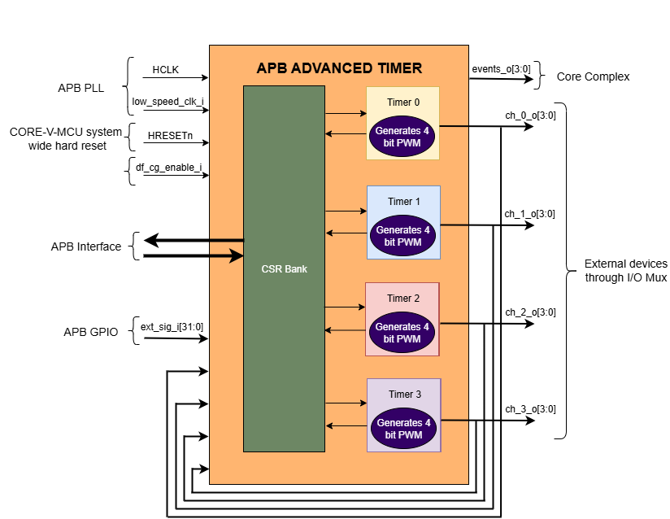
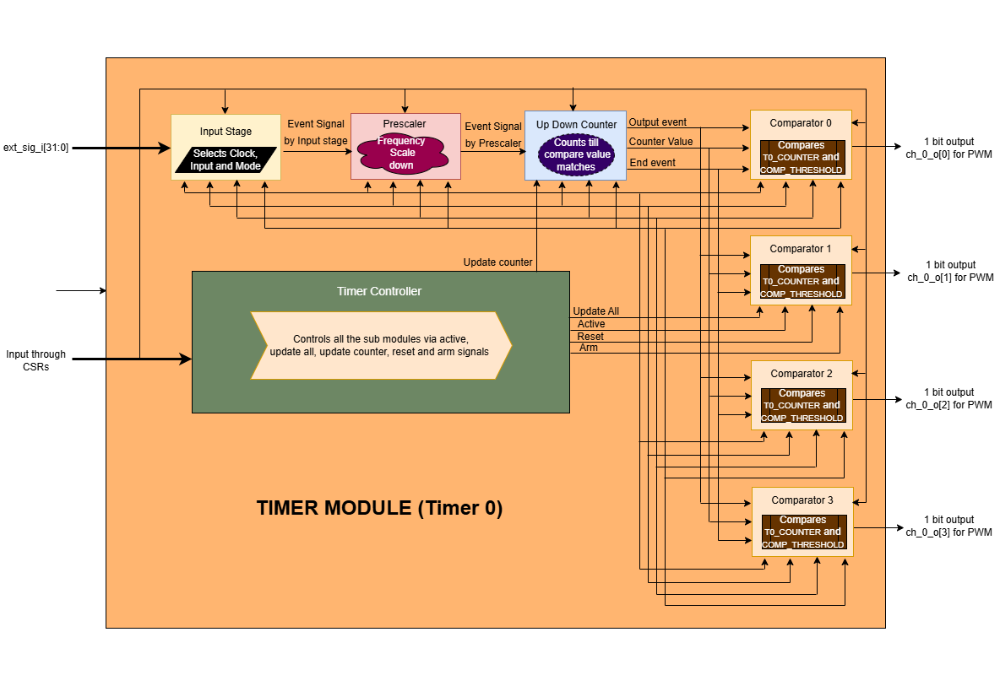
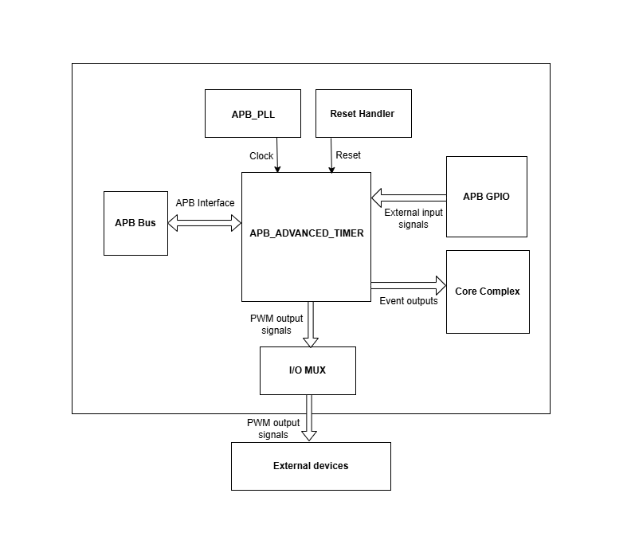
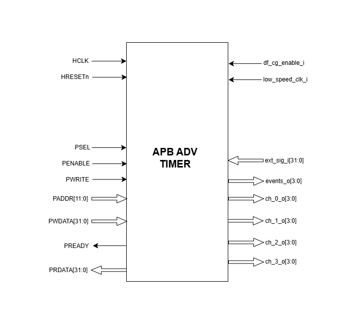

..
   Copyright (c) 2023 OpenHW Group
   Copyright (c) 2024 CircuitSutra

   SPDX-License-Identifier: Apache-2.0 WITH SHL-2.1

.. Level 1
   =======

   Level 2
   -------

   Level 3
   ~~~~~~~

   Level 4
   ^^^^^^^
.. _apb_advanced_timer:

APB ADVANCED TIMER
==================
APB ADVANCED TIMER generates PWM for the external devices connected to CORE_V_MCU and the output events for the CPU subsystem by the use of four programmable 16-bit timers called "channels".
These four timers can be configured independently to support four unique PWM generations in parallel.

Features
--------

- Multiple trigger input sources:

  - PWM output signals of all 4 timers
  - 32 GPIOs

- Multiple clock sources:

  - Reference clock at 32kHz
  - FLL clock

- Configurable input trigger modes for each timer
- Configurable prescaler for each timer
- Configurable counting mode for each timer
- Four comparators for each timer. Configurable channel comparator threshold and comparator operation for each comparator.
- Four configurable output events
- 4-bit PWM output for each timer.
- Configurable clock gating of each timer

Block Architecture
------------------

APB ADVANCED TIMER supports four 16-bit independent Timers.
Each 16-bit timer has submodules, including an input stage, prescaler, up-down counter, and comparators.
Each timer has its own set of CSRs that are used to configure various submodules.

APB timers can generate PWM signals in the following combination: -

- A single timer can generate one 4-bit PWM.
- Two timers can generate two 4-bit PWMs in parallel.
- Three timers can generate three 4-bit PWMs in parallel.
- Four timers can also generate four 4-bit PWMs in parallel.

APB ADVANCED TIMER also generates a 4-bit output event signal to the CPU subsystem, which uses a REG_EVENT_CFG CSR.

The figure below is a high-level block diagram of the APB ADVANCED TIMER module:-

 APB ADVANCED TIMER Block Diagram

Timer Module
~~~~~~~~~~~~

The timer module's main objective is to generate a PWM signal based on the external input/stimulus provided.
The timer module has various submodules/components like the Timer Controller, Input stage, Prescalar, Updown counter, and Comparators.
The timer controller manages all the other submodules through a few control signals like active, controller reset, and update.
FW performs Initialization and drives various configuration CSR. 

To generate the PWM, the data flows through the following submodule:
- **(ext_sig_i )** -> input stage -> prescaler ->updown counter ->comparators -> **(PWM)**

 TIMER Block Diagram

Timer Controller
^^^^^^^^^^^^^^^^
The timer controller generates a few important signals, like active, update, and reset. It parses and controls other submodules through these signals. 

-    Active signal: It is a control signal through which a sub-module can either enable or disable its operations.
-    update signal: It informs the sub-module when to update the latest configured CSR values to perform their operations.
-    reset signal: It resets the submodules.

The active signal is driven by a different value in the following 2 conditions: 

-    The active signal driven by value '1', when the START bitfield is '1' in the REG_TIM[0-3]_CMD CSR.
-    The active signal is driven by value '0'. When the START bitfield is '0' and the STOP bitfield is '1' in the REG_TIM[0-3]_CMD CSR. 

The update signal is always driven by the value UPDATE bitfield in the REG_TIM[0-3]_CMD CSR, and the controller reset signal is driven by the value RESET bitfield in the REG_TIM[0-3]_CMD CSR. 
The update and reset signals are parsed to all sub-modules if any one of the following 2 conditions is satisfied:

- if START bitfield is 0 in the REG_TIM[0-3]_CMD CSR.
- if START bitfield is '1' in the REG_TIM[0-3]_CMD CSR and active signal is '1'. When the Timer starts for the first time.

Input Stage
^^^^^^^^^^^

Input stage receives the 48-bit input (i.e, 32-bit ext_sig_i from APB GPIO and 4 PWM output signals of the 4 timers each) and based on CSR configurations, it selects the clock, input pin, and operating mode to generate the output event signal.    
It selects the clock, input pin, and operating mode to generate the output event signal. Input source is selected based on the value of the INSEL bitfield of REG_TIM[0-3]_CFG CSR.
At every positive edge of the selected clock and selected input signal, the Input stage uses the bitfield MODE in REG_TIM[0-3]_CFG CSR to generate an output event signal according to the information below:

- If MODE is 3’b000

  - The output event is always high

- If MODE is 3’b001

  - The output event is the negation of the signal selected

- If MODE is 3’b010

  - The output event is the same as the input signal selected
    
- If MODE is 3’b011

  - The output event is high at the rising edge of the selected signal in sync with the clock.

- If MODE is 3’b100

  - The output event is high at the falling edge of the selected signal in sync with the clock.

- If MODE is 3’b101

  - The output event is high at both the rising edge and falling edge of the selected signal in sync with the clock.

- If MODE is 3’b110

  - If the timer is armed, i.e., the CSR ARM is high, then the event is made high for the rising edge of the selected signal and remains the same until the next rising edge of the signal. If the ARM CSR is low, then the output event is low forever.

- If MODE is 3’b111

  - If the timer is armed, i.e., the CSR ARM is high, then the event is made high for the falling edge of the selected signal and remains the same until the next falling edge of the signal. If the ARM CSR is low, then the output event is low forever.

Prescalar
^^^^^^^^^
The Prescaler module reduces a high-frequency input signal to a lower-frequency output signal based on a user-defined prescaler value.
The prescaler converts a high-frequency input event (event_i) into a low-frequency output event (event_o) based on the following criteria: -
- When the timer is enabled and an event (event_i) is received from the input-stage module, the prescaler module begins counting clock cycles as specified by the PRESC bitfield in the REG_TIM[0-3]_CFG Control and Status Register (CSR).
- After the configured number of clock cycles has elapsed, the prescaler generates an output signal (event_o) for the Up-Down counter module.

The output signal (event_o) is de-asserted under the following conditions:
- A system reset is received.
- A reset is issued by the timer controller module.
- The input-stage module de-asserts the input event signal (i.e., event_i goes low).
- The timer is disabled by the timer controller.

Updown counter
^^^^^^^^^^^^^^
The updown counter manages the timer counter values based on CSR configurations and generates the following outputs: counter value, end event, and the output event.

The output event generated from the prescaler sub-module is provided as the input for the updown counter.
At every positive edge of the clock, if the active signal is '1', then the output event is driven by the value of the output event generated from the prescaler.
The active, controller reset, and update signals are provided by the Timer controller.    
The updown counter maintains a counter and direction(0- up and 1- down).
During the initialization, the counter value is set to COUNT_START and the direction to 0, and any new values of SAWTOOTH, COUNT_START, and COUNT_END bitfield can be provided by FW. 
At every positive edge of the clock, if the output event generated from the prescaler is '1' and the active signal is '1', then the following operation is performed.

- if the SAWTOOTH bitfield is '1':

  - The counter is incremented till it reaches the value of COUNT_END, then an end event is generated.

  - The counter is reset back to the value of the COUNT_START bitfield, and this process is repeated to generate multiple end events. 
   
- if the SAWTOOTH bitfield is '0':

  - The counter is incremented till it reaches the value of COUNT_END.

  - Then the counter is decremented till it reaches the value of COUNT_START. (counter goes in a sawtooth fashion)

  - Now, an end event is generated. This process is repeated to generate multiple end events.

Re-initialization of the Updown counter can be done in the following scenarios.

- Update signal is '1' and the following conditions are met:

  - When the controller is inactive (active signal is '0'). 

  - When an end event is generated. 
    
  - If the update signal is '1' and the above two conditions are not met, then the updown counter is re-initialized when the next end event is generated, irrespective of the update signal value at that instance of time. 

- Reset signal is '1'.

At every positive edge of the clock, the counter value is updated in the REG_TIM[0-3]_COUNTER. 
If the hard reset is '0', then all the CSR and internal metadata are set to the reset values.

Comparator
^^^^^^^^^^
Each timer has 4 comparators that can act independently, and each comparator generates a 1-bit PWM output.
Comparator compares the timer counter value with the compare value and, based on the CSR configurations of output mode, generates a PWM output.
The counter value, end event, and the output event generated in the updown counter are provided as input to the comparator. 
The active, controller reset, and update signals are provided by the Timer controller.
COMP_THRESHOLD and COMP_OP can only be updated and used by the comparator. When the update signal is '1'. 

At every positive edge of the clock, when the output event coming out of the updown counter is '1' and the active signal is '1', the comparator checks for the following two internal events that can happen, 

- **(match_event)** is set to '1' when the timer counter value reaches the comparator offset 

- **(event_2)** set to '1' in the following two scenarios:

  - When the SAWTOOTH bitfield is '1' and the end event is '1'.

  - When SAWTOOTH is a bitfield of '0' and the timer counter value reaches the COMP_THRESHOLD. 

Then, based on the match_event, event_2, and COMP_OP value, the PWM output is generated after the following operation is performed.

- If COMP_OP value is 3'b000 (OP_SET) 
  
  - If a match_event is high
  
    - The PWM output is made high
  
  - Else, if a match_event is low
  
    - The PWM output remains the same.

- If COMP_OP value is 3'b001 (OP_TOGRST)
  
  - When Sawtooth Mode is ON

    - If a match_event is high

      - The PWM output is made toggled.
    
    - Else, if event_2 is high 
    
      - The PWM output is made low.

  - When Sawtooth Mode is OFF

    - If match_event is high and event_2 is low

      - The PWM output is toggled.
      - event_2 is made high.

    - Else, if match_event is high and event_2 is high
    
      - The PWM output is made low
      - event_2 is made low.

- If COMP_OP value is 3'b010 (OP_SETRST)

  - When Sawtooth Mode is ON

    - If a match_event is high 
  
      - the PWM output is made high
  
    - Else, if event_2 is high
  
      - then PWM output is made low.

  - When Sawtooth Mode is OFF
    
    - If match_event is high and event_2 is low
    
      - The PWM output is made high
      - event_2 is made high.
    
    - Else, if match_event is high and event_2 also is high
    
      - PWM output is made low
      - event_2 is made low.

- If COMP_OP value is 3'b011 (OP_TOG) 

  - If a match_event is high
  
    - The PWM output is toggled
  
  - Else, if a match_event is low
  
    - The PWM output remains the same.

- If COMP_OP value is 3'b100 (OP_RST)

  - If a match_event is high
  
    - The PWM output is made low
  
  - Else, if a match_event is low
  
    - The PWM output remains the same.

- If COMP_OP value is 3'b101 (OP_TOGSET)

  - When Sawtooth Mode is ON

    - If a match_event is high
  
      - The PWM output is toggled
  
    - Else, if event_2 is high
  
      - then PWM output is made high.

  - When Sawtooth Mode is OFF
  
    - If match_event is high and event_2 is low
  
      - The PWM output is toggled
      - event_2 is made high
  
    - Else, if match_event is high and event_2 also is high
  
      - The PWM output is made high
      - event_2 is made low

- If COMP_OP value is 3'b110 (OP_RSTSET)

  - When Sawtooth Mode is ON
  
    - If a match_event is high
  
      - The PWM output is made low
  
    - Else, if event_2 is high
  
      - The PWM output is made high

  - When Sawtooth Mode is OFF
  
    - If match_event is high and event_2 is low
  
      - The PWM output is made low
      - event_2 is made high
  
    - Else, if match_event is high and event_2 also is high
  
      - The PWM output is made high
      - event_2 is made low.

By default, the PWM output remains the same (state remains the same until further change in input), and event_2 is kept low.
The PWM output is set to 0. When either the hard reset is triggered or the controller reset is '1'.

Working of APB ADVANCED TIMER for PWM generation:
~~~~~~~~~~~~~~~~~~~~~~~~~~~~~~~~~~~~~~~~~~~~~~~~~

Based on the detailed working of the submodules above, the working of the APB Advanced timer can be summarised as:
FW initialization is performed, and the external input/stimulus ext_sig_i is provided.
For each Timer module, at every positive edge of the selected clock and when the timer is active, the following operation is performed:

- Input stage consumes 48 bits (i.e, 32 32-bit ext_sig_i and 16-bit PWM output signals of all the 4 timers) and processes it accordingly based on CLKSEL, INSEL, and MODE. The event signal is generated as per the working of the input stage.

- The Event signal generated in the input stage is scaled down to the output scaled event based on the prescaler value by the prescaler sub-module.

- The above output scaled events generated go to the updown counter.

- Depending on various FW configurations of SAWTOOTH, COUNT_START, and COUNT_END. The counter value, end event, and the output event are generated in the updown counter and are provided as input to the 4 comparators.

- In each of the comparators, the counter value is compared against the COMP_THRESHOLD, and a 1-bit PWM is generated based on COMP_OP.

- 4 comparator submodules generate 4 4-bit PWM signals

- The above process is repeated concerning changes in the FW configurations to generate the PWM signal.

APB ADVANCED TIMER has 4 timer modules, which can generate 4 independent 4-bit PWMs

Working of APB ADVANCED TIMER for output event generation:
~~~~~~~~~~~~~~~~~~~~~~~~~~~~~~~~~~~~~~~~~~~~~~~~~~~~~~~~~~

Apart from the PWM signal, APB ADVANCED TIMER also generates output events based on the OUT_SEL_EVT_ENABLE and OUT_SEL_EVT0 bitfiels of REG_EVENT_CFG CSR.

All four 4-bit PWM signals are merged into 16-bit PWMs, where Timer 0 PWM is placed as LSB and Timer 3 PWM is placed at the MSB.
It selects a signal from a 16-bit using bitfields OUT_SEL_EVT0, OUT_SEL_EVT1, OUT_SEL_EVT2, and OUT_SEL_EVT3 of CSR REG_EVENT_CFG, each of which corresponds to the out event bit 0, out event bit 1, out event bit 2, and out event bit 3.

For example: 

if OUT_SEL_EVT0 is '4' then 4th bit of 16 PWM is selected for the 0th bit ouput event generation i.e events_o[0]. 
Similarly signal selection is done for the events_0[1], events_0[2] and events_0[3] is done using the bitfields OUT_SEL_EVT1, OUT_SEL_EVT2 and OUT_SEL_EVT3.

if the 0th bit in OUT_SEL_EVT_ENABLE bitfield is set then output event events_o[0] generation is enabled. 
Similarly, 1st bit, 2nd bit and 3rd bit in OUT_SEL_EVT_ENABLE bitfield corresponds to enabling the events_o[1], events_o[2] and events_o[3].

Once the signal selection is decided, APB ADVANCED TIMER drives the events_o as '1' if the following two conditions are satisfied.
- OUT_SEL_EVT_ENABLE is enabled for the desired events_o
- detects rising edges (from 0 → 1) on the selected signals

For example: 
if the 0th bit in OUT_SEL_EVT_ENABLE is set and OUT_SEL_EVT0 is '4' then 4th bit of 16 PWM is selected for the 0th bit ouput event generation i.e events_o[0].
Then events_o[0] will be asserted when the rising edge is detected on the 4th bit of the 16-bit PWM signal.
   

System Architecture:
--------------------

The figure below depicts the connections between the APB ADVANCED TIMER and the rest of the modules in CORE-V-MCU:-

 APB ADVANCED TIMER CORE-V-MCU connections diagram

- The ext_sig_i input to the APB ADVANCED TIMER is provided by the APB_GPIO. 
- APB ADVANCED TIMER processes these input signals based on the various CSR configurations.
- APB ADVANCED TIMER generates a few output event signals that are further passed as interrupts to the Core complex.
- APB ADVANCED TIMER generates PWM outputs, which are passed to the external devices through the I/O mux.

Programmers View:
-----------------
APB ADVANCED TIMER has 4 Timers, and the following programming model is followed:    

Initial Configurations:
~~~~~~~~~~~~~~~~~~~~~~~
There are CSR bitfields in the APB advanced timer that are required to be configured before any operations are initiated. 

Timer module specific configurations:
^^^^^^^^^^^^^^^^^^^^^^^^^^^^^^^^^^^^^

As we have 4 Timer modules. Each timer has to be configured with appropriate values.

- Configure input clock source using CLKSEL bitfield in the REG_TIM[0-3]_CFG.
- Configure input trigger mode using the MODE bitfield in the REG_TIM[0-3]_CFG.
- Configure which input has to be selected using the INSEL bitfield in the REG_TIM[0-3]_CFG.
- Configure prescaler value for scaling down the frequency using the PRESC bitfield in the REG_TIM[0-3]_CFG.
- Configure sawtooth mode through which the updown down counter operates using the SAWTOOTH bitfield in the REG_TIM[0-3]_CFG.
- Configure updown counter start value and end value using COUNT_START and COUNT_END bitfield respectively in the REG_TIM[0-3]_TH.
- Configure comparator 0 operation and comparator 0 threshold using COMP_OP and COMP_THRESHOLD bitfield respectively in the REG_TIM[0-3]_CH0_TH.
- Configure comparator 1 operation and comparator 1 threshold using COMP_OP and COMP_THRESHOLD bitfield respectively in the REG_TIM[0-3]_CH1_TH.
- Configure comparator 2 operation and comparator 2 threshold using COMP_OP and COMP_THRESHOLD bitfield respectively in the REG_TIM[0-3]_CH2_TH.
- Configure comparator 3 operation and comparator 3 threshold using COMP_OP and COMP_THRESHOLD bitfield respectively in the REG_TIM[0-3]_CH3_TH.

Common configurations:
^^^^^^^^^^^^^^^^^^^^^^

These configurations are common for 4 TIMERs. Typically, these are used to enable or disable output events, clock for TIMERs, and select the output events from a group of 16 PWM events.    

- Configure output select event enable that controls to enable or disable any of the 4-bit output events_o using OUT_SEL_EVT_ENABLE bitfield in the REG_EVENT_CFG.
- Configure output event 0, select the value that is used to select an event from the 16-bit PWM output using the OUT_SEL_EVT0 bitfield in the REG_EVENT_CFG.
- Configure output event 1, select the value that is used to select an event from the 16-bit PWM output using the OUT_SEL_EVT1 bitfield in the REG_EVENT_CFG.
- Configure output event 2 to select a value that is used to select an event from the 16-bit PWM output using the OUT_SEL_EVT2 bitfield in the REG_EVENT_CFG.
- Configure output event 3, select the value that is used to select an event from the 16-bit PWM output using the OUT_SEL_EVT3 bitfield in the REG_EVENT_CFG.
- Enable or disable clocks for each TIMER using the CLK_ENABLE bitfield in the REG_CH_EN.

Control configurations/operations:
~~~~~~~~~~~~~~~~~~~~~~~~~~~~~~~~~~~

There are CSR bitfields in the APB advanced timer that control operations of each of the timer modules and their submodules. 

- Set the START bitfield in the REG_TIM[0-3]_CMD to start the Timer and its sub modules input stage, prescaler, updown counter, and comparators.
- Set the STOP bitfield in the REG_TIM[0-3]_CMD to stop/halt/pause the Timer and its sub modules input stage, prescaler, updown counter, and comparators.
- Set the UPDATE bitfield in the REG_TIM[0-3]_CMD to Re-Initialization with the latest CSRs of the Timer and its sub modules, input stage, prescaler, updown counter, and comparators.
- Set the RESET bitfield in the REG_TIM[0-3]_CMD to reset the Timer and its submodules input stage, prescaler, updown counter, and comparators.
- set the ARM bitfield in the REG_TIM[0-3]_CMD to modify the inputs in the input stage.

Status configurations:
~~~~~~~~~~~~~~~~~~~~~~

The counter values of all 4 Timers can be read via the following CSR bitfields in the APB advanced timer. 

- Use the T[0-3]_COUNTER bitfields in the respective REG_TIM[0-3]_COUNTER to read the values of the counter maintained by updowncounter for each of the timers.

APB ADVANCED TIMER CSRs
-----------------------

Refer to `Memory Map <https://github.com/openhwgroup/core-v-mcu/blob/master/docs/doc-src/mmap.rst>`_ Map for the peripheral domain addresses of the APB ADVANCED TIMER.
NOTE: APB ADVANCED TIMER CSRs are non-volatile, meaning that their read value will not be changed by the hardware. A CSR's volatility is indicated by its "type".
Details of CSR access type are explained `here <https://docs.openhwgroup.org/projects/core-v-mcu/doc-src/mmap.html#csr-access-types>`_.

REG_TIM0_CMD 
~~~~~~~~~~~~
- Address Offset=0x000
- Type: non-volatile

+----------+------+-----------------+--------+-----------------------------------------------------------------------------------------+
| Field    | Bits | Default Value   | Access | Description                                                                             |
+==========+======+=================+========+=========================================================================================+
| RESERVED | 31:5 | 0               | --     | Reserved                                                                                |
+----------+------+-----------------+--------+-----------------------------------------------------------------------------------------+
| ARM      | 4:4  | 0               | RW     | set this bitfield to modfify the input data if MODE bitfield value is 6 or 7            |
+----------+------+-----------------+--------+-----------------------------------------------------------------------------------------+
| RESET    | 3:3  | 0               | RW     | set this bitfield to reset the timer, even when the timer is active for PWM generation. |
+----------+------+-----------------+--------+-----------------------------------------------------------------------------------------+
| UPDATE   | 2:2  | 0               | RW     | set this bitfield to update or re-initialize the timer when the timer is stopped        |
+----------+------+-----------------+--------+-----------------------------------------------------------------------------------------+
| STOP     | 1:1  | 0               | RW     | set this bitfield to stop/pause/halt the timer and its sub modules operations           |
+----------+------+-----------------+--------+-----------------------------------------------------------------------------------------+
| START    | 0:0  | 0               | RW     | set this bitfield to Start the timer operation to generate PWM output                   |
+----------+------+-----------------+--------+-----------------------------------------------------------------------------------------+

REG_TIM0_CFG
~~~~~~~~~~~~
- Address Offset=0x004
- Type: non-volatile

+----------+-------+-----------------+--------+----------------------------------------------------------------------------+
| Field    | Bits  | Default Value   | Access | Description                                                                |
+==========+=======+=================+========+============================================================================+
| RESERVED | 31:24 | 0               | --     | Reserved                                                                   |                                
+----------+-------+-----------------+--------+----------------------------------------------------------------------------+
| PRESC    | 23:16 | 0               | RW     | prescaler value configuration bitfield                                     |
+----------+-------+-----------------+--------+----------------------------------------------------------------------------+
| RESERVED | 15:13 | 0               | --     | Reserved                                                                   |                                 
+----------+-------+-----------------+--------+----------------------------------------------------------------------------+
| SAWTOOTH | 12:12 | 1               | RW     | center-aligned mode configuration bitfield                                 |
|          |       |                 |        |                                                                            |
|          |       |                 |        | 1’b0: The counter counts up and down alternatively                         |
|          |       |                 |        |                                                                            |
|          |       |                 |        | 1’b1: The counter counts up and resets to 0 when it reaches the threshold. | 
+----------+-------+-----------------+--------+----------------------------------------------------------------------------+
| CLKSEL   | 11:11 | 0               | RW     | clock source configuration bitfield                                        |
|          |       |                 |        |                                                                            |
|          |       |                 |        | 1’b0: FLL                                                                  |
|          |       |                 |        |                                                                            |
|          |       |                 |        | 1’b1: Reference clock at 32kHz                                             |
+----------+-------+-----------------+--------+----------------------------------------------------------------------------+
| MODE     | 10:8  | 0               | RW     | trigger mode configuration bitfield                                        |
|          |       |                 |        |                                                                            |
|          |       |                 |        | 3’h0: Trigger event at each clock cycle                                    |
|          |       |                 |        |                                                                            |
|          |       |                 |        | 3’h1: Trigger event if input source is 0                                   |
|          |       |                 |        |                                                                            |
|          |       |                 |        | 3’h2: Trigger event if input source is 1                                   |
|          |       |                 |        |                                                                            |
|          |       |                 |        | 3’h3: Trigger event on input source rising edge                            |
|          |       |                 |        |                                                                            |
|          |       |                 |        | 3’h4: Trigger event on input source falling edge                           |
|          |       |                 |        |                                                                            |
|          |       |                 |        | 3’h5: Trigger event on input source falling or rising edge                 |
|          |       |                 |        |                                                                            |
|          |       |                 |        | 3’h6: Trigger event on input source rising edge when armed                 |
|          |       |                 |        |                                                                            |
|          |       |                 |        | 3’h7: Trigger event on input source falling edge when armed                |
+----------+-------+-----------------+--------+----------------------------------------------------------------------------+
| INSEL    | 7:0   | 0               | RW     | input source configuration bitfield                                        |
|          |       |                 |        |                                                                            |
|          |       |                 |        | 0-31: GPIO[0] to GPIO[31]                                                  |
|          |       |                 |        |                                                                            |
|          |       |                 |        | 32-35: Channel 0 to 3 of ADV_TIMER0                                        |
|          |       |                 |        |                                                                            |
|          |       |                 |        | 36-39: Channel 0 to 3 of ADV_TIMER1                                        |
|          |       |                 |        |                                                                            |
|          |       |                 |        | 40-43: Channel 0 to 3 of ADV_TIMER2                                        |
|          |       |                 |        |                                                                            |
|          |       |                 |        | 44-47: Channel 0 to 3 of ADV_TIMER3                                        |
+----------+-------+-----------------+--------+----------------------------------------------------------------------------+

REG_TIM0_TH
~~~~~~~~~~~~
- Address Offset=0x008
- Type: non-volatile

+-------------+-------+-----------------+--------+------------------------------------+
| Field       | Bits  | Default Value   | Access | Description                        |
+=============+=======+=================+========+====================================+
| COUNT_END   | 31:16 | 0               | RW     | End value for the updown counter   |
+-------------+-------+-----------------+--------+------------------------------------+
| COUNT_START | 15:0  | 0               | RW     | Start value for the updown counter |
+-------------+-------+-----------------+--------+------------------------------------+

REG_TIM0_CH0_TH
~~~~~~~~~~~~~~~
- Address Offset=0x00C
- Type: non-volatile

+----------------+-------+-----------------+--------+----------------------------------------------------------------------------------+
| Field          | Bits  | Default Value   | Access | Description                                                                      |
+================+=======+=================+========+==================================================================================+
| RESERVED       | 31:19 | 0               | --     | Reserved                                                                         | 
+----------------+-------+-----------------+--------+----------------------------------------------------------------------------------+
| COMP_OP        | 18:16 | 0               | RW     | Channel 0 threshold match action on channel output signal configuration bitfield |
|                |       |                 |        |                                                                                  |
|                |       |                 |        | 3’h0: Set                                                                        |
|                |       |                 |        |                                                                                  |
|                |       |                 |        | 3’h1: Toggle then next threshold match action is clear                           |
|                |       |                 |        |                                                                                  |
|                |       |                 |        | 3’h2: Set then next threshold match action is clear                              |
|                |       |                 |        |                                                                                  |
|                |       |                 |        | 3’h3: Toggle                                                                     |
|                |       |                 |        |                                                                                  |
|                |       |                 |        | 3’h4: Clear                                                                      |
|                |       |                 |        |                                                                                  |
|                |       |                 |        | 3’h5: Toggle then next threshold match action is set                             |
|                |       |                 |        |                                                                                  |
|                |       |                 |        | 3’h6: Clear then next threshold match action is set                              |
+----------------+-------+-----------------+--------+----------------------------------------------------------------------------------+
| COMP_THRESHOLD | 15:0  | 0               | RW     | Channel 0 threshold configuration bitfield                                       |
+----------------+-------+-----------------+--------+----------------------------------------------------------------------------------+

REG_TIM0_CH1_TH
~~~~~~~~~~~~~~~
- Address Offset=0x010
- Type: non-volatile

+----------------+-------+-----------------+--------+----------------------------------------------------------------------------------+
| Field          | Bits  | Default Value   | Access | Description                                                                      |
+================+=======+=================+========+==================================================================================+
| RESERVED       | 31:19 | 0               | --     | Reserved                                                                         | 
+----------------+-------+-----------------+--------+----------------------------------------------------------------------------------+
| COMP_OP        | 18:16 | 0               | RW     | Channel 0 threshold match action on channel output signal configuration bitfield |
|                |       |                 |        |                                                                                  |
|                |       |                 |        | 3’h0: Set                                                                        |
|                |       |                 |        |                                                                                  |
|                |       |                 |        | 3’h1: Toggle then next threshold match action is clear                           |
|                |       |                 |        |                                                                                  |
|                |       |                 |        | 3’h2: Set then next threshold match action is clear                              |
|                |       |                 |        |                                                                                  |
|                |       |                 |        | 3’h3: Toggle                                                                     |
|                |       |                 |        |                                                                                  |
|                |       |                 |        | 3’h4: Clear                                                                      |
|                |       |                 |        |                                                                                  |
|                |       |                 |        | 3’h5: Toggle then next threshold match action is set                             |
|                |       |                 |        |                                                                                  |
|                |       |                 |        | 3’h6: Clear then next threshold match action is set                              |
+----------------+-------+-----------------+--------+----------------------------------------------------------------------------------+
| COMP_THRESHOLD | 15:0  | 0               | RW     | Channel 0 threshold configuration bitfield                                       |
+----------------+-------+-----------------+--------+----------------------------------------------------------------------------------+

REG_TIM0_CH2_TH
~~~~~~~~~~~~~~~
- Address Offset=0x014
- Type: non-volatile

+----------------+-------+-----------------+--------+----------------------------------------------------------------------------------+
| Field          | Bits  | Default Value   | Access | Description                                                                      |
+================+=======+=================+========+==================================================================================+
| RESERVED       | 31:19 | 0               | --     | Reserved                                                                         | 
+----------------+-------+-----------------+--------+----------------------------------------------------------------------------------+
| COMP_OP        | 18:16 | 0               | RW     | Channel 0 threshold match action on channel output signal configuration bitfield |
|                |       |                 |        |                                                                                  |
|                |       |                 |        | 3’h0: Set                                                                        |
|                |       |                 |        |                                                                                  |
|                |       |                 |        | 3’h1: Toggle then next threshold match action is clear                           |
|                |       |                 |        |                                                                                  |
|                |       |                 |        | 3’h2: Set then next threshold match action is clear                              |
|                |       |                 |        |                                                                                  |
|                |       |                 |        | 3’h3: Toggle                                                                     |
|                |       |                 |        |                                                                                  |
|                |       |                 |        | 3’h4: Clear                                                                      |
|                |       |                 |        |                                                                                  |
|                |       |                 |        | 3’h5: Toggle then next threshold match action is set                             |
|                |       |                 |        |                                                                                  |
|                |       |                 |        | 3’h6: Clear then next threshold match action is set                              |
+----------------+-------+-----------------+--------+----------------------------------------------------------------------------------+
| COMP_THRESHOLD | 15:0  | 0               | RW     | Channel 0 threshold configuration bitfield                                       |
+----------------+-------+-----------------+--------+----------------------------------------------------------------------------------+

REG_TIM0_CH3_TH
~~~~~~~~~~~~~~~
- Address Offset=0x018
- Type: non-volatile

+----------------+-------+-----------------+--------+----------------------------------------------------------------------------------+
| Field          | Bits  | Default Value   | Access | Description                                                                      |
+================+=======+=================+========+==================================================================================+
| RESERVED       | 31:19 | 0               | --     | Reserved                                                                         | 
+----------------+-------+-----------------+--------+----------------------------------------------------------------------------------+
| COMP_OP        | 18:16 | 0               | RW     | Channel 0 threshold match action on channel output signal configuration bitfield |
|                |       |                 |        |                                                                                  |
|                |       |                 |        | 3’h0: Set                                                                        |
|                |       |                 |        |                                                                                  |
|                |       |                 |        | 3’h1: Toggle then next threshold match action is clear                           |
|                |       |                 |        |                                                                                  |
|                |       |                 |        | 3’h2: Set then next threshold match action is clear                              |
|                |       |                 |        |                                                                                  |
|                |       |                 |        | 3’h3: Toggle                                                                     |
|                |       |                 |        |                                                                                  |
|                |       |                 |        | 3’h4: Clear                                                                      |
|                |       |                 |        |                                                                                  |
|                |       |                 |        | 3’h5: Toggle then next threshold match action is set                             |
|                |       |                 |        |                                                                                  |
|                |       |                 |        | 3’h6: Clear then next threshold match action is set                              |
+----------------+-------+-----------------+--------+----------------------------------------------------------------------------------+
| COMP_THRESHOLD | 15:0  | 0               | RW     | Channel 0 threshold configuration bitfield                                       |
+----------------+-------+-----------------+--------+----------------------------------------------------------------------------------+

REG_TIM0_CH0_LUT
~~~~~~~~~~~~~~~~~
- Address Offset=0x01C
- Type: non-volatile

+-----------+--------+-----------------+--------+-------------------------------------------------------------+
| Field     | Bits   | Default Value   | Access | Description                                                 |
+===========+========+=================+========+=============================================================+
| RESERVED  | 31:18  | 0               | --     | Reserved                                                    | 
+-----------+--------+-----------------+--------+-------------------------------------------------------------+
| FLT       | 23:16  | 0               | RW     | FLT (Not used in the current implementation)                |
+-----------+--------+-----------------+--------+-------------------------------------------------------------+
| LUT       | 15:0   | 0               | RW     | LUT (Not used in the current implementation)                |
+-----------+--------+-----------------+--------+-------------------------------------------------------------+

REG_TIM0_CH1_LUT
~~~~~~~~~~~~~~~~~
- Address Offset=0x020
- Type: non-volatile

+-----------+--------+-----------------+--------+-------------------------------------------------------------+
| Field     | Bits   | Default Value   | Access | Description                                                 |
+===========+========+=================+========+=============================================================+
| RESERVED  | 31:18  | 0               | --     | Reserved                                                    | 
+-----------+--------+-----------------+--------+-------------------------------------------------------------+
| FLT       | 23:16  | 0               | RW     | FLT (Not used in the current implementation)                |
+-----------+--------+-----------------+--------+-------------------------------------------------------------+
| LUT       | 15:0   | 0               | RW     | LUT (Not used in the current implementation)                |
+-----------+--------+-----------------+--------+-------------------------------------------------------------+

REG_TIM0_CH2_LUT
~~~~~~~~~~~~~~~~~
- Address Offset=0x024
- Type: non-volatile

+-----------+--------+-----------------+--------+-------------------------------------------------------------+
| Field     | Bits   | Default Value   | Access | Description                                                 |
+===========+========+=================+========+=============================================================+
| RESERVED  | 31:18  | 0               | --     | Reserved                                                    | 
+-----------+--------+-----------------+--------+-------------------------------------------------------------+
| FLT       | 23:16  | 0               | RW     | FLT (Not used in the current implementation)                |
+-----------+--------+-----------------+--------+-------------------------------------------------------------+
| LUT       | 15:0   | 0               | RW     | LUT (Not used in the current implementation)                |
+-----------+--------+-----------------+--------+-------------------------------------------------------------+

REG_TIM0_CH3_LUT
~~~~~~~~~~~~~~~~~
- Address Offset=0x028
- Type: non-volatile

+-----------+--------+-----------------+--------+-------------------------------------------------------------+
| Field     | Bits   | Default Value   | Access | Description                                                 |
+===========+========+=================+========+=============================================================+
| RESERVED  | 31:18  | 0               | --     | Reserved                                                    |
+-----------+--------+-----------------+--------+-------------------------------------------------------------+
| FLT       | 23:16  | 0               | RW     | FLT (Not used in the current implementation)                |
+-----------+--------+-----------------+--------+-------------------------------------------------------------+
| LUT       | 15:0   | 0               | RW     | LUT (Not used in the current implementation)                |
+-----------+--------+-----------------+--------+-------------------------------------------------------------+

REG_TIM0_COUNTER
~~~~~~~~~~~~~~~~~
- Address Offset=0x02C
- Type: non-volatile

+------------+------+-----------------+--------+------------------------+
| Field      | Bits | Default Value   | Access | Description            |
+============+======+=================+========+========================+
| T0_COUNTER | 31:0 | 0               | R      | TIMER0 counter         |
+------------+------+-----------------+--------+------------------------+

REG_TIM1_CMD 
~~~~~~~~~~~~
- Address Offset=0x040
- Type: non-volatile

+----------+------+-----------------+--------+-----------------------------------------------------------------------------------------+
| Field    | Bits | Default Value   | Access | Description                                                                             |
+==========+======+=================+========+=========================================================================================+
| RESERVED | 31:5 | 0               | --     | Reserved                                                                                |
+----------+------+-----------------+--------+-----------------------------------------------------------------------------------------+
| ARM      | 4:4  | 0               | RW     | set this bitfield to modfify the input data if MODE bitfield value is 6 or 7            |
+----------+------+-----------------+--------+-----------------------------------------------------------------------------------------+
| RESET    | 3:3  | 0               | RW     | set this bitfield to reset the timer, even when the timer is active for PWM generation. |
+----------+------+-----------------+--------+-----------------------------------------------------------------------------------------+
| UPDATE   | 2:2  | 0               | RW     | set this bitfield to update or re-initialize the timer when the timer is stopped        |
+----------+------+-----------------+--------+-----------------------------------------------------------------------------------------+
| STOP     | 1:1  | 0               | RW     | set this bitfield to stop/pause/halt the timer and its sub modules operations           |
+----------+------+-----------------+--------+-----------------------------------------------------------------------------------------+
| START    | 0:0  | 0               | RW     | set this bitfield to Start the timer operation to generate PWM output                   |
+----------+------+-----------------+--------+-----------------------------------------------------------------------------------------+

REG_TIM1_CFG
~~~~~~~~~~~~
- Address Offset=0x044
- Type: non-volatile

+----------+-------+-----------------+--------+----------------------------------------------------------------------------+
| Field    | Bits  | Default Value   | Access | Description                                                                |
+==========+=======+=================+========+============================================================================+
| RESERVED | 31:24 | 0               | --     | Reserved                                                                   |                                
+----------+-------+-----------------+--------+----------------------------------------------------------------------------+
| PRESC    | 23:16 | 0               | RW     | prescaler value configuration bitfield                                     |
+----------+-------+-----------------+--------+----------------------------------------------------------------------------+
| RESERVED | 15:13 | 0               | --     | Reserved                                                                   |                                 
+----------+-------+-----------------+--------+----------------------------------------------------------------------------+
| SAWTOOTH | 12:12 | 1               | RW     | center-aligned mode configuration bitfield                                 |
|          |       |                 |        |                                                                            |
|          |       |                 |        | 1’b0: The counter counts up and down alternatively                         |
|          |       |                 |        |                                                                            |
|          |       |                 |        | 1’b1: The counter counts up and resets to 0 when it reaches the threshold. | 
+----------+-------+-----------------+--------+----------------------------------------------------------------------------+
| CLKSEL   | 11:11 | 0               | RW     | clock source configuration bitfield                                        |
|          |       |                 |        |                                                                            |
|          |       |                 |        | 1’b0: FLL                                                                  |
|          |       |                 |        |                                                                            |
|          |       |                 |        | 1’b1: Reference clock at 32kHz                                             |
+----------+-------+-----------------+--------+----------------------------------------------------------------------------+
| MODE     | 10:8  | 0               | RW     | trigger mode configuration bitfield                                        |
|          |       |                 |        |                                                                            |
|          |       |                 |        | 3’h0: Trigger event at each clock cycle                                    |
|          |       |                 |        |                                                                            |
|          |       |                 |        | 3’h1: Trigger event if input source is 0                                   |
|          |       |                 |        |                                                                            |
|          |       |                 |        | 3’h2: Trigger event if input source is 1                                   |
|          |       |                 |        |                                                                            |
|          |       |                 |        | 3’h3: Trigger event on input source rising edge                            |
|          |       |                 |        |                                                                            |
|          |       |                 |        | 3’h4: Trigger event on input source falling edge                           |
|          |       |                 |        |                                                                            |
|          |       |                 |        | 3’h5: Trigger event on input source falling or rising edge                 |
|          |       |                 |        |                                                                            |
|          |       |                 |        | 3’h6: Trigger event on input source rising edge when armed                 |
|          |       |                 |        |                                                                            |
|          |       |                 |        | 3’h7: Trigger event on input source falling edge when armed                |
+----------+-------+-----------------+--------+----------------------------------------------------------------------------+
| INSEL    | 7:0   | 0               | RW     | input source configuration bitfield                                        |
|          |       |                 |        |                                                                            |
|          |       |                 |        | 0-31: GPIO[0] to GPIO[31]                                                  |
|          |       |                 |        |                                                                            |
|          |       |                 |        | 32-35: Channel 0 to 3 of ADV_TIMER0                                        |
|          |       |                 |        |                                                                            |
|          |       |                 |        | 36-39: Channel 0 to 3 of ADV_TIMER1                                        |
|          |       |                 |        |                                                                            |
|          |       |                 |        | 40-43: Channel 0 to 3 of ADV_TIMER2                                        |
|          |       |                 |        |                                                                            |
|          |       |                 |        | 44-47: Channel 0 to 3 of ADV_TIMER3                                        |
+----------+-------+-----------------+--------+----------------------------------------------------------------------------+

REG_TIM1_TH
~~~~~~~~~~~~
- Address Offset=0x048
- Type: non-volatile

+-------------+-------+-----------------+--------+------------------------------------+
| Field       | Bits  | Default Value   | Access | Description                        |
+=============+=======+=================+========+====================================+
| COUNT_END   | 31:16 | 0               | RW     | End value for the updown counter   |
+-------------+-------+-----------------+--------+------------------------------------+
| COUNT_START | 15:0  | 0               | RW     | Start value for the updown counter |
+-------------+-------+-----------------+--------+------------------------------------+

REG_TIM1_CH0_TH
~~~~~~~~~~~~~~~
- Address Offset=0x04C
- Type: non-volatile

+----------------+-------+-----------------+--------+----------------------------------------------------------------------------------+
| Field          | Bits  | Default Value   | Access | Description                                                                      |
+================+=======+=================+========+==================================================================================+
| RESERVED       | 31:19 | 0               | --     | Reserved                                                                         | 
+----------------+-------+-----------------+--------+----------------------------------------------------------------------------------+
| COMP_OP        | 18:16 | 0               | RW     | Channel 0 threshold match action on channel output signal configuration bitfield |
|                |       |                 |        |                                                                                  |
|                |       |                 |        | 3’h0: Set                                                                        |
|                |       |                 |        |                                                                                  |
|                |       |                 |        | 3’h1: Toggle then next threshold match action is clear                           |
|                |       |                 |        |                                                                                  |
|                |       |                 |        | 3’h2: Set then next threshold match action is clear                              |
|                |       |                 |        |                                                                                  |
|                |       |                 |        | 3’h3: Toggle                                                                     |
|                |       |                 |        |                                                                                  |
|                |       |                 |        | 3’h4: Clear                                                                      |
|                |       |                 |        |                                                                                  |
|                |       |                 |        | 3’h5: Toggle then next threshold match action is set                             |
|                |       |                 |        |                                                                                  |
|                |       |                 |        | 3’h6: Clear then next threshold match action is set                              |
+----------------+-------+-----------------+--------+----------------------------------------------------------------------------------+
| COMP_THRESHOLD | 15:0  | 0               | RW     | Channel 0 threshold configuration bitfield                                       |
+----------------+-------+-----------------+--------+----------------------------------------------------------------------------------+

REG_TIM1_CH1_TH
~~~~~~~~~~~~~~~
- Address Offset=0x050
- Type: non-volatile

+----------------+-------+-----------------+--------+----------------------------------------------------------------------------------+
| Field          | Bits  | Default Value   | Access | Description                                                                      |
+================+=======+=================+========+==================================================================================+
| RESERVED       | 31:19 | 0               | --     | Reserved                                                                         | 
+----------------+-------+-----------------+--------+----------------------------------------------------------------------------------+
| COMP_OP        | 18:16 | 0               | RW     | Channel 0 threshold match action on channel output signal configuration bitfield |
|                |       |                 |        |                                                                                  |
|                |       |                 |        | 3’h0: Set                                                                        |
|                |       |                 |        |                                                                                  |
|                |       |                 |        | 3’h1: Toggle then next threshold match action is clear                           |
|                |       |                 |        |                                                                                  |
|                |       |                 |        | 3’h2: Set then next threshold match action is clear                              |
|                |       |                 |        |                                                                                  |
|                |       |                 |        | 3’h3: Toggle                                                                     |
|                |       |                 |        |                                                                                  |
|                |       |                 |        | 3’h4: Clear                                                                      |
|                |       |                 |        |                                                                                  |
|                |       |                 |        | 3’h5: Toggle then next threshold match action is set                             |
|                |       |                 |        |                                                                                  |
|                |       |                 |        | 3’h6: Clear then next threshold match action is set                              |
+----------------+-------+-----------------+--------+----------------------------------------------------------------------------------+
| COMP_THRESHOLD | 15:0  | 0               | RW     | Channel 0 threshold configuration bitfield                                       |
+----------------+-------+-----------------+--------+----------------------------------------------------------------------------------+

REG_TIM1_CH2_TH
~~~~~~~~~~~~~~~
- Address Offset=0x054
- Type: non-volatile

+----------------+-------+-----------------+--------+----------------------------------------------------------------------------------+
| Field          | Bits  | Default Value   | Access | Description                                                                      |
+================+=======+=================+========+==================================================================================+
| RESERVED       | 31:19 | 0               | --     | Reserved                                                                         | 
+----------------+-------+-----------------+--------+----------------------------------------------------------------------------------+
| COMP_OP        | 18:16 | 0               | RW     | Channel 0 threshold match action on channel output signal configuration bitfield |
|                |       |                 |        |                                                                                  |
|                |       |                 |        | 3’h0: Set                                                                        |
|                |       |                 |        |                                                                                  |
|                |       |                 |        | 3’h1: Toggle then next threshold match action is clear                           |
|                |       |                 |        |                                                                                  |
|                |       |                 |        | 3’h2: Set then next threshold match action is clear                              |
|                |       |                 |        |                                                                                  |
|                |       |                 |        | 3’h3: Toggle                                                                     |
|                |       |                 |        |                                                                                  |
|                |       |                 |        | 3’h4: Clear                                                                      |
|                |       |                 |        |                                                                                  |
|                |       |                 |        | 3’h5: Toggle then next threshold match action is set                             |
|                |       |                 |        |                                                                                  |
|                |       |                 |        | 3’h6: Clear then next threshold match action is set                              |
+----------------+-------+-----------------+--------+----------------------------------------------------------------------------------+
| COMP_THRESHOLD | 15:0  | 0               | RW     | Channel 0 threshold configuration bitfield                                       |
+----------------+-------+-----------------+--------+----------------------------------------------------------------------------------+

REG_TIM1_CH3_TH
~~~~~~~~~~~~~~~
- Address Offset=0x058
- Type: non-volatile

+----------------+-------+-----------------+--------+----------------------------------------------------------------------------------+
| Field          | Bits  | Default Value   | Access | Description                                                                      |
+================+=======+=================+========+==================================================================================+
| RESERVED       | 31:19 | 0               | --     | Reserved                                                                         | 
+----------------+-------+-----------------+--------+----------------------------------------------------------------------------------+
| COMP_OP        | 18:16 | 0               | RW     | Channel 0 threshold match action on channel output signal configuration bitfield |
|                |       |                 |        |                                                                                  |
|                |       |                 |        | 3’h0: Set                                                                        |
|                |       |                 |        |                                                                                  |
|                |       |                 |        | 3’h1: Toggle then next threshold match action is clear                           |
|                |       |                 |        |                                                                                  |
|                |       |                 |        | 3’h2: Set then next threshold match action is clear                              |
|                |       |                 |        |                                                                                  |
|                |       |                 |        | 3’h3: Toggle                                                                     |
|                |       |                 |        |                                                                                  |
|                |       |                 |        | 3’h4: Clear                                                                      |
|                |       |                 |        |                                                                                  |
|                |       |                 |        | 3’h5: Toggle then next threshold match action is set                             |
|                |       |                 |        |                                                                                  |
|                |       |                 |        | 3’h6: Clear then next threshold match action is set                              |
+----------------+-------+-----------------+--------+----------------------------------------------------------------------------------+
| COMP_THRESHOLD | 15:0  | 0               | RW     | Channel 0 threshold configuration bitfield                                       |
+----------------+-------+-----------------+--------+----------------------------------------------------------------------------------+

REG_TIM1_CH0_LUT
~~~~~~~~~~~~~~~~~
- Address Offset=0x05C
- Type: non-volatile

+-----------+--------+-----------------+--------+-------------------------------------------------------------+
| Field     | Bits   | Default Value   | Access | Description                                                 |
+===========+========+=================+========+=============================================================+
| RESERVED  | 31:18  | 0               | --     | Reserved                                                    | 
+-----------+--------+-----------------+--------+-------------------------------------------------------------+
| FLT       | 23:16  | 0               | RW     | FLT (Not used in the current implementation)                |
+-----------+--------+-----------------+--------+-------------------------------------------------------------+
| LUT       | 15:0   | 0               | RW     | LUT (Not used in the current implementation)                |
+-----------+--------+-----------------+--------+-------------------------------------------------------------+

REG_TIM1_CH1_LUT
~~~~~~~~~~~~~~~~~
- Address Offset=0x060
- Type: non-volatile

+-----------+--------+-----------------+--------+-------------------------------------------------------------+
| Field     | Bits   | Default Value   | Access | Description                                                 |
+===========+========+=================+========+=============================================================+
| RESERVED  | 31:18  | 0               | --     | Reserved                                                    | 
+-----------+--------+-----------------+--------+-------------------------------------------------------------+
| FLT       | 23:16  | 0               | RW     | FLT (Not used in the current implementation)                |
+-----------+--------+-----------------+--------+-------------------------------------------------------------+
| LUT       | 15:0   | 0               | RW     | LUT (Not used in the current implementation)                |
+-----------+--------+-----------------+--------+-------------------------------------------------------------+

REG_TIM1_CH2_LUT
~~~~~~~~~~~~~~~~~
- Address Offset=0x064
- Type: non-volatile

+-----------+--------+-----------------+--------+-------------------------------------------------------------+
| Field     | Bits   | Default Value   | Access | Description                                                 |
+===========+========+=================+========+=============================================================+
| RESERVED  | 31:18  | 0               | --     | Reserved                                                    | 
+-----------+--------+-----------------+--------+-------------------------------------------------------------+
| FLT       | 23:16  | 0               | RW     | FLT (Not used in the current implementation)                |
+-----------+--------+-----------------+--------+-------------------------------------------------------------+
| LUT       | 15:0   | 0               | RW     | LUT (Not used in the current implementation)                |
+-----------+--------+-----------------+--------+-------------------------------------------------------------+

REG_TIM1_CH3_LUT
~~~~~~~~~~~~~~~~~
- Address Offset=0x068
- Type: non-volatile

+-----------+--------+-----------------+--------+-------------------------------------------------------------+
| Field     | Bits   | Default Value   | Access | Description                                                 |
+===========+========+=================+========+=============================================================+
| RESERVED  | 31:18  | 0               | --     | Reserved                                                    |
+-----------+--------+-----------------+--------+-------------------------------------------------------------+
| FLT       | 23:16  | 0               | RW     | FLT (Not used in the current implementation)                |
+-----------+--------+-----------------+--------+-------------------------------------------------------------+
| LUT       | 15:0   | 0               | RW     | LUT (Not used in the current implementation)                |
+-----------+--------+-----------------+--------+-------------------------------------------------------------+

REG_TIM1_COUNTER
~~~~~~~~~~~~~~~~~
- Address Offset=0x06C
- Type: non-volatile

+------------+------+-----------------+--------+------------------------+
| Field      | Bits | Default Value   | Access | Description            |
+============+======+=================+========+========================+
| T1_COUNTER | 31:0 | 0               | R      | TIMER1 counter         |
+------------+------+-----------------+--------+------------------------+

REG_TIM2_CMD 
~~~~~~~~~~~~
- Address Offset=0x080
- Type: non-volatile

+----------+------+-----------------+--------+-----------------------------------------------------------------------------------------+
| Field    | Bits | Default Value   | Access | Description                                                                             |
+==========+======+=================+========+=========================================================================================+
| RESERVED | 31:5 | 0               | --     | Reserved                                                                                |
+----------+------+-----------------+--------+-----------------------------------------------------------------------------------------+
| ARM      | 4:4  | 0               | RW     | set this bitfield to modfify the input data if MODE bitfield value is 6 or 7            |
+----------+------+-----------------+--------+-----------------------------------------------------------------------------------------+
| RESET    | 3:3  | 0               | RW     | set this bitfield to reset the timer, even when the timer is active for PWM generation. |
+----------+------+-----------------+--------+-----------------------------------------------------------------------------------------+
| UPDATE   | 2:2  | 0               | RW     | set this bitfield to update or re-initialize the timer when the timer is stopped        |
+----------+------+-----------------+--------+-----------------------------------------------------------------------------------------+
| STOP     | 1:1  | 0               | RW     | set this bitfield to stop/pause/halt the timer and its sub modules operations           |
+----------+------+-----------------+--------+-----------------------------------------------------------------------------------------+
| START    | 0:0  | 0               | RW     | set this bitfield to Start the timer operation to generate PWM output                   |
+----------+------+-----------------+--------+-----------------------------------------------------------------------------------------+

REG_TIM2_CFG
~~~~~~~~~~~~
- Address Offset=0x084
- Type: non-volatile

+----------+-------+-----------------+--------+----------------------------------------------------------------------------+
| Field    | Bits  | Default Value   | Access | Description                                                                |
+==========+=======+=================+========+============================================================================+
| RESERVED | 31:24 | 0               | --     | Reserved                                                                   |                                
+----------+-------+-----------------+--------+----------------------------------------------------------------------------+
| PRESC    | 23:16 | 0               | RW     | prescaler value configuration bitfield                                     |
+----------+-------+-----------------+--------+----------------------------------------------------------------------------+
| RESERVED | 15:13 | 0               | --     | Reserved                                                                   |                                 
+----------+-------+-----------------+--------+----------------------------------------------------------------------------+
| SAWTOOTH | 12:12 | 1               | RW     | center-aligned mode configuration bitfield                                 |
|          |       |                 |        |                                                                            |
|          |       |                 |        | 1’b0: The counter counts up and down alternatively                         |
|          |       |                 |        |                                                                            |
|          |       |                 |        | 1’b1: The counter counts up and resets to 0 when it reaches the threshold. | 
+----------+-------+-----------------+--------+----------------------------------------------------------------------------+
| CLKSEL   | 11:11 | 0               | RW     | clock source configuration bitfield                                        |
|          |       |                 |        |                                                                            |
|          |       |                 |        | 1’b0: FLL                                                                  |
|          |       |                 |        |                                                                            |
|          |       |                 |        | 1’b1: Reference clock at 32kHz                                             |
+----------+-------+-----------------+--------+----------------------------------------------------------------------------+
| MODE     | 10:8  | 0               | RW     | trigger mode configuration bitfield                                        |
|          |       |                 |        |                                                                            |
|          |       |                 |        | 3’h0: Trigger event at each clock cycle                                    |
|          |       |                 |        |                                                                            |
|          |       |                 |        | 3’h1: Trigger event if input source is 0                                   |
|          |       |                 |        |                                                                            |
|          |       |                 |        | 3’h2: Trigger event if input source is 1                                   |
|          |       |                 |        |                                                                            |
|          |       |                 |        | 3’h3: Trigger event on input source rising edge                            |
|          |       |                 |        |                                                                            |
|          |       |                 |        | 3’h4: Trigger event on input source falling edge                           |
|          |       |                 |        |                                                                            |
|          |       |                 |        | 3’h5: Trigger event on input source falling or rising edge                 |
|          |       |                 |        |                                                                            |
|          |       |                 |        | 3’h6: Trigger event on input source rising edge when armed                 |
|          |       |                 |        |                                                                            |
|          |       |                 |        | 3’h7: Trigger event on input source falling edge when armed                |
+----------+-------+-----------------+--------+----------------------------------------------------------------------------+
| INSEL    | 7:0   | 0               | RW     | input source configuration bitfield                                        |
|          |       |                 |        |                                                                            |
|          |       |                 |        | 0-31: GPIO[0] to GPIO[31]                                                  |
|          |       |                 |        |                                                                            |
|          |       |                 |        | 32-35: Channel 0 to 3 of ADV_TIMER0                                        |
|          |       |                 |        |                                                                            |
|          |       |                 |        | 36-39: Channel 0 to 3 of ADV_TIMER1                                        |
|          |       |                 |        |                                                                            |
|          |       |                 |        | 40-43: Channel 0 to 3 of ADV_TIMER2                                        |
|          |       |                 |        |                                                                            |
|          |       |                 |        | 44-47: Channel 0 to 3 of ADV_TIMER3                                        |
+----------+-------+-----------------+--------+----------------------------------------------------------------------------+

REG_TIM2_TH
~~~~~~~~~~~~

- Address Offset=0x088
- Type: non-volatile

+-------------+-------+-----------------+--------+------------------------------------+
| Field       | Bits  | Default Value   | Access | Description                        |
+=============+=======+=================+========+====================================+
| COUNT_END   | 31:16 | 0               | RW     | End value for the updown counter   |
+-------------+-------+-----------------+--------+------------------------------------+
| COUNT_START | 15:0  | 0               | RW     | Start value for the updown counter |
+-------------+-------+-----------------+--------+------------------------------------+

REG_TIM2_CH0_TH
~~~~~~~~~~~~~~~
- Address Offset=0x08C
- Type: non-volatile

+----------------+-------+-----------------+--------+----------------------------------------------------------------------------------+
| Field          | Bits  | Default Value   | Access | Description                                                                      |
+================+=======+=================+========+==================================================================================+
| RESERVED       | 31:19 | 0               | --     | Reserved                                                                         | 
+----------------+-------+-----------------+--------+----------------------------------------------------------------------------------+
| COMP_OP        | 18:16 | 0               | RW     | Channel 0 threshold match action on channel output signal configuration bitfield |
|                |       |                 |        |                                                                                  |
|                |       |                 |        | 3’h0: Set                                                                        |
|                |       |                 |        |                                                                                  |
|                |       |                 |        | 3’h1: Toggle then next threshold match action is clear                           |
|                |       |                 |        |                                                                                  |
|                |       |                 |        | 3’h2: Set then next threshold match action is clear                              |
|                |       |                 |        |                                                                                  |
|                |       |                 |        | 3’h3: Toggle                                                                     |
|                |       |                 |        |                                                                                  |
|                |       |                 |        | 3’h4: Clear                                                                      |
|                |       |                 |        |                                                                                  |
|                |       |                 |        | 3’h5: Toggle then next threshold match action is set                             |
|                |       |                 |        |                                                                                  |
|                |       |                 |        | 3’h6: Clear then next threshold match action is set                              |
+----------------+-------+-----------------+--------+----------------------------------------------------------------------------------+
| COMP_THRESHOLD | 15:0  | 0               | RW     | Channel 0 threshold configuration bitfield                                       |
+----------------+-------+-----------------+--------+----------------------------------------------------------------------------------+

REG_TIM2_CH1_TH
~~~~~~~~~~~~~~~
- Address Offset=0x090
- Type: non-volatile

+----------------+-------+-----------------+--------+----------------------------------------------------------------------------------+
| Field          | Bits  | Default Value   | Access | Description                                                                      |
+================+=======+=================+========+==================================================================================+
| RESERVED       | 31:19 | 0               | --     | Reserved                                                                         | 
+----------------+-------+-----------------+--------+----------------------------------------------------------------------------------+
| COMP_OP        | 18:16 | 0               | RW     | Channel 0 threshold match action on channel output signal configuration bitfield |
|                |       |                 |        |                                                                                  |
|                |       |                 |        | 3’h0: Set                                                                        |
|                |       |                 |        |                                                                                  |
|                |       |                 |        | 3’h1: Toggle then next threshold match action is clear                           |
|                |       |                 |        |                                                                                  |
|                |       |                 |        | 3’h2: Set then next threshold match action is clear                              |
|                |       |                 |        |                                                                                  |
|                |       |                 |        | 3’h3: Toggle                                                                     |
|                |       |                 |        |                                                                                  |
|                |       |                 |        | 3’h4: Clear                                                                      |
|                |       |                 |        |                                                                                  |
|                |       |                 |        | 3’h5: Toggle then next threshold match action is set                             |
|                |       |                 |        |                                                                                  |
|                |       |                 |        | 3’h6: Clear then next threshold match action is set                              |
+----------------+-------+-----------------+--------+----------------------------------------------------------------------------------+
| COMP_THRESHOLD | 15:0  | 0               | RW     | Channel 0 threshold configuration bitfield                                       |
+----------------+-------+-----------------+--------+----------------------------------------------------------------------------------+

REG_TIM2_CH2_TH
~~~~~~~~~~~~~~~
- Address Offset=0x094
- Type: non-volatile

+----------------+-------+-----------------+--------+----------------------------------------------------------------------------------+
| Field          | Bits  | Default Value   | Access | Description                                                                      |
+================+=======+=================+========+==================================================================================+
| RESERVED       | 31:19 | 0               | --     | Reserved                                                                         | 
+----------------+-------+-----------------+--------+----------------------------------------------------------------------------------+
| COMP_OP        | 18:16 | 0               | RW     | Channel 0 threshold match action on channel output signal configuration bitfield |
|                |       |                 |        |                                                                                  |
|                |       |                 |        | 3’h0: Set                                                                        |
|                |       |                 |        |                                                                                  |
|                |       |                 |        | 3’h1: Toggle then next threshold match action is clear                           |
|                |       |                 |        |                                                                                  |
|                |       |                 |        | 3’h2: Set then next threshold match action is clear                              |
|                |       |                 |        |                                                                                  |
|                |       |                 |        | 3’h3: Toggle                                                                     |
|                |       |                 |        |                                                                                  |
|                |       |                 |        | 3’h4: Clear                                                                      |
|                |       |                 |        |                                                                                  |
|                |       |                 |        | 3’h5: Toggle then next threshold match action is set                             |
|                |       |                 |        |                                                                                  |
|                |       |                 |        | 3’h6: Clear then next threshold match action is set                              |
+----------------+-------+-----------------+--------+----------------------------------------------------------------------------------+
| COMP_THRESHOLD | 15:0  | 0               | RW     | Channel 0 threshold configuration bitfield                                       |
+----------------+-------+-----------------+--------+----------------------------------------------------------------------------------+

REG_TIM2_CH3_TH
~~~~~~~~~~~~~~~
- Address Offset=0x098
- Type: non-volatile

+----------------+-------+-----------------+--------+----------------------------------------------------------------------------------+
| Field          | Bits  | Default Value   | Access | Description                                                                      |
+================+=======+=================+========+==================================================================================+
| RESERVED       | 31:19 | 0               | --     | Reserved                                                                         | 
+----------------+-------+-----------------+--------+----------------------------------------------------------------------------------+
| COMP_OP        | 18:16 | 0               | RW     | Channel 0 threshold match action on channel output signal configuration bitfield |
|                |       |                 |        |                                                                                  |
|                |       |                 |        | 3’h0: Set                                                                        |
|                |       |                 |        |                                                                                  |
|                |       |                 |        | 3’h1: Toggle then next threshold match action is clear                           |
|                |       |                 |        |                                                                                  |
|                |       |                 |        | 3’h2: Set then next threshold match action is clear                              |
|                |       |                 |        |                                                                                  |
|                |       |                 |        | 3’h3: Toggle                                                                     |
|                |       |                 |        |                                                                                  |
|                |       |                 |        | 3’h4: Clear                                                                      |
|                |       |                 |        |                                                                                  |
|                |       |                 |        | 3’h5: Toggle then next threshold match action is set                             |
|                |       |                 |        |                                                                                  |
|                |       |                 |        | 3’h6: Clear then next threshold match action is set                              |
+----------------+-------+-----------------+--------+----------------------------------------------------------------------------------+
| COMP_THRESHOLD | 15:0  | 0               | RW     | Channel 0 threshold configuration bitfield                                       |
+----------------+-------+-----------------+--------+----------------------------------------------------------------------------------+

REG_TIM2_CH0_LUT
~~~~~~~~~~~~~~~~~
- Address Offset=0x09C
- Type: non-volatile

+-----------+--------+-----------------+--------+-------------------------------------------------------------+
| Field     | Bits   | Default Value   | Access | Description                                                 |
+===========+========+=================+========+=============================================================+
| RESERVED  | 31:18  | 0               | --     | Reserved                                                    | 
+-----------+--------+-----------------+--------+-------------------------------------------------------------+
| FLT       | 23:16  | 0               | RW     | FLT (Not used in the current implementation)                |
+-----------+--------+-----------------+--------+-------------------------------------------------------------+
| LUT       | 15:0   | 0               | RW     | LUT (Not used in the current implementation)                |
+-----------+--------+-----------------+--------+-------------------------------------------------------------+

REG_TIM2_CH1_LUT
~~~~~~~~~~~~~~~~~
- Address Offset=0x0A0
- Type: non-volatile

+-----------+--------+-----------------+--------+-------------------------------------------------------------+
| Field     | Bits   | Default Value   | Access | Description                                                 |
+===========+========+=================+========+=============================================================+
| RESERVED  | 31:18  | 0               | --     | Reserved                                                    | 
+-----------+--------+-----------------+--------+-------------------------------------------------------------+
| FLT       | 23:16  | 0               | RW     | FLT (Not used in the current implementation)                |
+-----------+--------+-----------------+--------+-------------------------------------------------------------+
| LUT       | 15:0   | 0               | RW     | LUT (Not used in the current implementation)                |
+-----------+--------+-----------------+--------+-------------------------------------------------------------+

REG_TIM2_CH2_LUT
~~~~~~~~~~~~~~~~~
- Address Offset=0x0A4
- Type: non-volatile

+-----------+--------+-----------------+--------+-------------------------------------------------------------+
| Field     | Bits   | Default Value   | Access | Description                                                 |
+===========+========+=================+========+=============================================================+
| RESERVED  | 31:18  | 0               | --     | Reserved                                                    | 
+-----------+--------+-----------------+--------+-------------------------------------------------------------+
| FLT       | 23:16  | 0               | RW     | FLT (Not used in the current implementation)                |
+-----------+--------+-----------------+--------+-------------------------------------------------------------+
| LUT       | 15:0   | 0               | RW     | LUT (Not used in the current implementation)                |
+-----------+--------+-----------------+--------+-------------------------------------------------------------+

REG_TIM2_CH3_LUT
~~~~~~~~~~~~~~~~~
- Address Offset=0x0A8
- Type: non-volatile

+-----------+--------+-----------------+--------+-------------------------------------------------------------+
| Field     | Bits   | Default Value   | Access | Description                                                 |
+===========+========+=================+========+=============================================================+
| RESERVED  | 31:18  | 0               | --     | Reserved                                                    |
+-----------+--------+-----------------+--------+-------------------------------------------------------------+
| FLT       | 23:16  | 0               | RW     | FLT (Not used in the current implementation)                |
+-----------+--------+-----------------+--------+-------------------------------------------------------------+
| LUT       | 15:0   | 0               | RW     | LUT (Not used in the current implementation)                |
+-----------+--------+-----------------+--------+-------------------------------------------------------------+

REG_TIM2_COUNTER
~~~~~~~~~~~~~~~~~
- Address Offset=0x0AC
- Type: non-volatile

+------------+------+-----------------+--------+------------------------+
| Field      | Bits | Default Value   | Access | Description            |
+============+======+=================+========+========================+
| T2_COUNTER | 31:0 | 0               | R      | TIMER2 counter         |
+------------+------+-----------------+--------+------------------------+

REG_TIM3_CMD 
~~~~~~~~~~~~
- Address Offset=0x0C0
- Type: non-volatile

+----------+------+-----------------+--------+-----------------------------------------------------------------------------------------+
| Field    | Bits | Default Value   | Access | Description                                                                             |
+==========+======+=================+========+=========================================================================================+
| RESERVED | 31:5 | 0               | --     | Reserved                                                                                |
+----------+------+-----------------+--------+-----------------------------------------------------------------------------------------+
| ARM      | 4:4  | 0               | RW     | set this bitfield to modfify the input data if MODE bitfield value is 6 or 7            |
+----------+------+-----------------+--------+-----------------------------------------------------------------------------------------+
| RESET    | 3:3  | 0               | RW     | set this bitfield to reset the timer, even when the timer is active for PWM generation. |
+----------+------+-----------------+--------+-----------------------------------------------------------------------------------------+
| UPDATE   | 2:2  | 0               | RW     | set this bitfield to update or re-initialize the timer when the timer is stopped        |
+----------+------+-----------------+--------+-----------------------------------------------------------------------------------------+
| STOP     | 1:1  | 0               | RW     | set this bitfield to stop/pause/halt the timer and its sub modules operations           |
+----------+------+-----------------+--------+-----------------------------------------------------------------------------------------+
| START    | 0:0  | 0               | RW     | set this bitfield to Start the timer operation to generate PWM output                   |
+----------+------+-----------------+--------+-----------------------------------------------------------------------------------------+

REG_TIM3_CFG
~~~~~~~~~~~~
- Address Offset=0x0C4
- Type: non-volatile

+----------+-------+-----------------+--------+----------------------------------------------------------------------------+
| Field    | Bits  | Default Value   | Access | Description                                                                |
+==========+=======+=================+========+============================================================================+
| RESERVED | 31:24 | 0               | --     | Reserved                                                                   |                                
+----------+-------+-----------------+--------+----------------------------------------------------------------------------+
| PRESC    | 23:16 | 0               | RW     | prescaler value configuration bitfield                                     |
+----------+-------+-----------------+--------+----------------------------------------------------------------------------+
| RESERVED | 15:13 | 0               | --     | Reserved                                                                   |                                 
+----------+-------+-----------------+--------+----------------------------------------------------------------------------+
| SAWTOOTH | 12:12 | 1               | RW     | center-aligned mode configuration bitfield                                 |
|          |       |                 |        |                                                                            |
|          |       |                 |        | 1’b0: The counter counts up and down alternatively                         |
|          |       |                 |        |                                                                            |
|          |       |                 |        | 1’b1: The counter counts up and resets to 0 when it reaches the threshold. | 
+----------+-------+-----------------+--------+----------------------------------------------------------------------------+
| CLKSEL   | 11:11 | 0               | RW     | clock source configuration bitfield                                        |
|          |       |                 |        |                                                                            |
|          |       |                 |        | 1’b0: FLL                                                                  |
|          |       |                 |        |                                                                            |
|          |       |                 |        | 1’b1: Reference clock at 32kHz                                             |
+----------+-------+-----------------+--------+----------------------------------------------------------------------------+
| MODE     | 10:8  | 0               | RW     | trigger mode configuration bitfield                                        |
|          |       |                 |        |                                                                            |
|          |       |                 |        | 3’h0: Trigger event at each clock cycle                                    |
|          |       |                 |        |                                                                            |
|          |       |                 |        | 3’h1: Trigger event if input source is 0                                   |
|          |       |                 |        |                                                                            |
|          |       |                 |        | 3’h2: Trigger event if input source is 1                                   |
|          |       |                 |        |                                                                            |
|          |       |                 |        | 3’h3: Trigger event on input source rising edge                            |
|          |       |                 |        |                                                                            |
|          |       |                 |        | 3’h4: Trigger event on input source falling edge                           |
|          |       |                 |        |                                                                            |
|          |       |                 |        | 3’h5: Trigger event on input source falling or rising edge                 |
|          |       |                 |        |                                                                            |
|          |       |                 |        | 3’h6: Trigger event on input source rising edge when armed                 |
|          |       |                 |        |                                                                            |
|          |       |                 |        | 3’h7: Trigger event on input source falling edge when armed                |
+----------+-------+-----------------+--------+----------------------------------------------------------------------------+
| INSEL    | 7:0   | 0               | RW     | input source configuration bitfield                                        |
|          |       |                 |        |                                                                            |
|          |       |                 |        | 0-31: GPIO[0] to GPIO[31]                                                  |
|          |       |                 |        |                                                                            |
|          |       |                 |        | 32-35: Channel 0 to 3 of ADV_TIMER0                                        |
|          |       |                 |        |                                                                            |
|          |       |                 |        | 36-39: Channel 0 to 3 of ADV_TIMER1                                        |
|          |       |                 |        |                                                                            |
|          |       |                 |        | 40-43: Channel 0 to 3 of ADV_TIMER2                                        |
|          |       |                 |        |                                                                            |
|          |       |                 |        | 44-47: Channel 0 to 3 of ADV_TIMER3                                        |
+----------+-------+-----------------+--------+----------------------------------------------------------------------------+

REG_TIM3_TH
~~~~~~~~~~~~
- Address Offset=0x0C8
- Type: non-volatile

+-------------+-------+-----------------+--------+------------------------------------+
| Field       | Bits  | Default Value   | Access | Description                        |
+=============+=======+=================+========+====================================+
| COUNT_END   | 31:16 | 0               | RW     | End value for the updown counter   |
+-------------+-------+-----------------+--------+------------------------------------+
| COUNT_START | 15:0  | 0               | RW     | Start value for the updown counter |
+-------------+-------+-----------------+--------+------------------------------------+

REG_TIM3_CH0_TH
~~~~~~~~~~~~~~~
- Address Offset=0x0CC
- Type: non-volatile

+----------------+-------+-----------------+--------+----------------------------------------------------------------------------------+
| Field          | Bits  | Default Value   | Access | Description                                                                      |
+================+=======+=================+========+==================================================================================+
| RESERVED       | 31:19 | 0               | --     | Reserved                                                                         | 
+----------------+-------+-----------------+--------+----------------------------------------------------------------------------------+
| COMP_OP        | 18:16 | 0               | RW     | Channel 0 threshold match action on channel output signal configuration bitfield |
|                |       |                 |        |                                                                                  |
|                |       |                 |        | 3’h0: Set                                                                        |
|                |       |                 |        |                                                                                  |
|                |       |                 |        | 3’h1: Toggle then next threshold match action is clear                           |
|                |       |                 |        |                                                                                  |
|                |       |                 |        | 3’h2: Set then next threshold match action is clear                              |
|                |       |                 |        |                                                                                  |
|                |       |                 |        | 3’h3: Toggle                                                                     |
|                |       |                 |        |                                                                                  |
|                |       |                 |        | 3’h4: Clear                                                                      |
|                |       |                 |        |                                                                                  |
|                |       |                 |        | 3’h5: Toggle then next threshold match action is set                             |
|                |       |                 |        |                                                                                  |
|                |       |                 |        | 3’h6: Clear then next threshold match action is set                              |
+----------------+-------+-----------------+--------+----------------------------------------------------------------------------------+
| COMP_THRESHOLD | 15:0  | 0               | RW     | Channel 0 threshold configuration bitfield                                       |
+----------------+-------+-----------------+--------+----------------------------------------------------------------------------------+

REG_TIM3_CH1_TH
~~~~~~~~~~~~~~~
- Address Offset=0x0D0
- Type: non-volatile

+----------------+-------+-----------------+--------+----------------------------------------------------------------------------------+
| Field          | Bits  | Default Value   | Access | Description                                                                      |
+================+=======+=================+========+==================================================================================+
| RESERVED       | 31:19 | 0               | --     | Reserved                                                                         | 
+----------------+-------+-----------------+--------+----------------------------------------------------------------------------------+
| COMP_OP        | 18:16 | 0               | RW     | Channel 0 threshold match action on channel output signal configuration bitfield |
|                |       |                 |        |                                                                                  |
|                |       |                 |        | 3’h0: Set                                                                        |
|                |       |                 |        |                                                                                  |
|                |       |                 |        | 3’h1: Toggle then next threshold match action is clear                           |
|                |       |                 |        |                                                                                  |
|                |       |                 |        | 3’h2: Set then next threshold match action is clear                              |
|                |       |                 |        |                                                                                  |
|                |       |                 |        | 3’h3: Toggle                                                                     |
|                |       |                 |        |                                                                                  |
|                |       |                 |        | 3’h4: Clear                                                                      |
|                |       |                 |        |                                                                                  |
|                |       |                 |        | 3’h5: Toggle then next threshold match action is set                             |
|                |       |                 |        |                                                                                  |
|                |       |                 |        | 3’h6: Clear then next threshold match action is set                              |
+----------------+-------+-----------------+--------+----------------------------------------------------------------------------------+
| COMP_THRESHOLD | 15:0  | 0               | RW     | Channel 0 threshold configuration bitfield                                       |
+----------------+-------+-----------------+--------+----------------------------------------------------------------------------------+

REG_TIM3_CH2_TH
~~~~~~~~~~~~~~~
- Address Offset=0x0D4
- Type: non-volatile

+----------------+-------+-----------------+--------+----------------------------------------------------------------------------------+
| Field          | Bits  | Default Value   | Access | Description                                                                      |
+================+=======+=================+========+==================================================================================+
| RESERVED       | 31:19 | 0               | --     | Reserved                                                                         | 
+----------------+-------+-----------------+--------+----------------------------------------------------------------------------------+
| COMP_OP        | 18:16 | 0               | RW     | Channel 0 threshold match action on channel output signal configuration bitfield |
|                |       |                 |        |                                                                                  |
|                |       |                 |        | 3’h0: Set                                                                        |
|                |       |                 |        |                                                                                  |
|                |       |                 |        | 3’h1: Toggle then next threshold match action is clear                           |
|                |       |                 |        |                                                                                  |
|                |       |                 |        | 3’h2: Set then next threshold match action is clear                              |
|                |       |                 |        |                                                                                  |
|                |       |                 |        | 3’h3: Toggle                                                                     |
|                |       |                 |        |                                                                                  |
|                |       |                 |        | 3’h4: Clear                                                                      |
|                |       |                 |        |                                                                                  |
|                |       |                 |        | 3’h5: Toggle then next threshold match action is set                             |
|                |       |                 |        |                                                                                  |
|                |       |                 |        | 3’h6: Clear then next threshold match action is set                              |
+----------------+-------+-----------------+--------+----------------------------------------------------------------------------------+
| COMP_THRESHOLD | 15:0  | 0               | RW     | Channel 0 threshold configuration bitfield                                       |
+----------------+-------+-----------------+--------+----------------------------------------------------------------------------------+

REG_TIM3_CH3_TH
~~~~~~~~~~~~~~~
- Address Offset=0x0D8
- Type: non-volatile

+----------------+-------+-----------------+--------+----------------------------------------------------------------------------------+
| Field          | Bits  | Default Value   | Access | Description                                                                      |
+================+=======+=================+========+==================================================================================+
| RESERVED       | 31:19 | 0               | --     | Reserved                                                                         | 
+----------------+-------+-----------------+--------+----------------------------------------------------------------------------------+
| COMP_OP        | 18:16 | 0               | RW     | Channel 0 threshold match action on channel output signal configuration bitfield |
|                |       |                 |        |                                                                                  |
|                |       |                 |        | 3’h0: Set                                                                        |
|                |       |                 |        |                                                                                  |
|                |       |                 |        | 3’h1: Toggle then next threshold match action is clear                           |
|                |       |                 |        |                                                                                  |
|                |       |                 |        | 3’h2: Set then next threshold match action is clear                              |
|                |       |                 |        |                                                                                  |
|                |       |                 |        | 3’h3: Toggle                                                                     |
|                |       |                 |        |                                                                                  |
|                |       |                 |        | 3’h4: Clear                                                                      |
|                |       |                 |        |                                                                                  |
|                |       |                 |        | 3’h5: Toggle then next threshold match action is set                             |
|                |       |                 |        |                                                                                  |
|                |       |                 |        | 3’h6: Clear then next threshold match action is set                              |
+----------------+-------+-----------------+--------+----------------------------------------------------------------------------------+
| COMP_THRESHOLD | 15:0  | 0               | RW     | Channel 0 threshold configuration bitfield                                       |
+----------------+-------+-----------------+--------+----------------------------------------------------------------------------------+

REG_TIM3_CH0_LUT
~~~~~~~~~~~~~~~~~
- Address Offset=0x0DC
- Type: non-volatile

+-----------+--------+-----------------+--------+-------------------------------------------------------------+
| Field     | Bits   | Default Value   | Access | Description                                                 |
+===========+========+=================+========+=============================================================+
| RESERVED  | 31:18  | 0               | --     | Reserved                                                    | 
+-----------+--------+-----------------+--------+-------------------------------------------------------------+
| FLT       | 23:16  | 0               | RW     | FLT (Not used in the current implementation)                |
+-----------+--------+-----------------+--------+-------------------------------------------------------------+
| LUT       | 15:0   | 0               | RW     | LUT (Not used in the current implementation)                |
+-----------+--------+-----------------+--------+-------------------------------------------------------------+

REG_TIM3_CH1_LUT
~~~~~~~~~~~~~~~~~
- Address Offset=0x0E0
- Type: non-volatile

+-----------+--------+-----------------+--------+-------------------------------------------------------------+
| Field     | Bits   | Default Value   | Access | Description                                                 |
+===========+========+=================+========+=============================================================+
| RESERVED  | 31:18  | 0               | --     | Reserved                                                    | 
+-----------+--------+-----------------+--------+-------------------------------------------------------------+
| FLT       | 23:16  | 0               | RW     | FLT (Not used in the current implementation)                |
+-----------+--------+-----------------+--------+-------------------------------------------------------------+
| LUT       | 15:0   | 0               | RW     | LUT (Not used in the current implementation)                |
+-----------+--------+-----------------+--------+-------------------------------------------------------------+

REG_TIM3_CH2_LUT
~~~~~~~~~~~~~~~~~
- Address Offset=0x0E4
- Type: non-volatile

+-----------+--------+-----------------+--------+-------------------------------------------------------------+
| Field     | Bits   | Default Value   | Access | Description                                                 |
+===========+========+=================+========+=============================================================+
| RESERVED  | 31:18  | 0               | --     | Reserved                                                    | 
+-----------+--------+-----------------+--------+-------------------------------------------------------------+
| FLT       | 23:16  | 0               | RW     | FLT (Not used in the current implementation)                |
+-----------+--------+-----------------+--------+-------------------------------------------------------------+
| LUT       | 15:0   | 0               | RW     | LUT (Not used in the current implementation)                |
+-----------+--------+-----------------+--------+-------------------------------------------------------------+

REG_TIM3_CH3_LUT
~~~~~~~~~~~~~~~~~
- Address Offset=0x0E8
- Type: non-volatile

+-----------+--------+-----------------+--------+-------------------------------------------------------------+
| Field     | Bits   | Default Value   | Access | Description                                                 |
+===========+========+=================+========+=============================================================+
| RESERVED  | 31:18  | 0               | --     | Reserved                                                    |
+-----------+--------+-----------------+--------+-------------------------------------------------------------+
| FLT       | 23:16  | 0               | RW     | FLT (Not used in the current implementation)                |
+-----------+--------+-----------------+--------+-------------------------------------------------------------+
| LUT       | 15:0   | 0               | RW     | LUT (Not used in the current implementation)                |
+-----------+--------+-----------------+--------+-------------------------------------------------------------+

REG_TIM3_COUNTER
~~~~~~~~~~~~~~~~~
- Address Offset=0x0EC
- Type: non-volatile

+------------+------+-----------------+--------+------------------------+
| Field      | Bits | Default Value   | Access | Description            |
+============+======+=================+========+========================+
| T3_COUNTER | 31:0 | 0               | R      | TIMER3 counter         |
+------------+------+-----------------+--------+------------------------+

REG_EVENT_CFG 
~~~~~~~~~~~~~
- Address Offset=0x100
- Type: non-volatile

+--------------------+-------+-----------------+--------+-------------------------------------------------------------------------------------------+
| Field              | Bits  | Default Value   | Access | Description                                                                               |
+====================+=======+=================+========+===========================================================================================+
| RESERVED           | 31:20 | 0               | --     | Reserved                                                                                  |
+--------------------+-------+-----------------+--------+-------------------------------------------------------------------------------------------+
| OUT_SEL_EVT_ENABLE | 19:16 | 0               | RW     | Output event select ENABLE. Each bit represents an event enable for 4 bit events_o output.|
+--------------------+-------+-----------------+--------+-------------------------------------------------------------------------------------------+
| OUT_SEL_EVT3       | 15:12 | 0               | RW     | Output event select 3 from a group of 16 PWM outputs                                      |
+--------------------+-------+-----------------+--------+-------------------------------------------------------------------------------------------+
| OUT_SEL_EVT2       | 11:8  | 0               | RW     | Output event select 2 from a group of 16 PWM outputs                                      |
+--------------------+-------+-----------------+--------+-------------------------------------------------------------------------------------------+
| OUT_SEL_EVT1       | 7:4   | 0               | RW     | Output event select 1 from a group of 16 PWM outputs                                      |
+--------------------+-------+-----------------+--------+-------------------------------------------------------------------------------------------+
| OUT_SEL_EVT0       | 3:0   | 0               | RW     | Output event select 0 from a group of 16 PWM outputs                                      |
+--------------------+-------+-----------------+--------+-------------------------------------------------------------------------------------------+

REG_CH_EN 
~~~~~~~~~~~~~
- Address Offset=0x104
- Type: non-volatile
+------------+-------+-----------------+--------+---------------------------------------------------------------------------------------------------+
| Field      | Bits  | Default Value   | Access | Description                                                                                       |
+============+=======+=================+========+===================================================================================================+
| RESERVED   | 31:4  | 0               | --     | Reserved                                                                                          |
+------------+-------+-----------------+--------+---------------------------------------------------------------------------------------------------+
| CLK_ENABLE | 3:0   | 0               | RW     | Each bit acts as clock enable for each timer. For eg: if 2nd bit is set Timer 2 clock is enabled. |
+------------+-------+-----------------+--------+---------------------------------------------------------------------------------------------------+

Firmware Guidelines
-------------------

Initialization:
~~~~~~~~~~~~~~~
- When the HRESETn signal is low, CSRs default to 0, and outputs are low.
- Four timer modules have four clock gates, which will be enabled(meaning they pass the ref clock to the respective timer module). only when either dft_cg_enable_i is high or the bit in respective position of REG_CH_EN CSR is high(0th bit for timer_0,1st bit for timer_1,etc).
- At every positive edge of the clock, the CSR CSRs are updated based on APB signals.
- FW can update the below bitfields to any custom value before the START bitfield in the REG_TIM[0-3]_CMD CSR is set to '1' and the timer is not active yet (which means the timer is started for the first time). Otherwise, all the config values of all sub-modules are commanded to be updated to the default.

  - The CLK_ENABLE bitfields of REG_CH_EN.

  - The PRESC, SAWTOOTH, CLKSEL, MODE, and INSEL bitfields of REG_TIM[0-3]_CFG.

  - The COUNT_START and COUNT_END bitfields of REG_TIM[0-3]_TH.

  - The direction of the updown counter(default is 0)

  - COMP_THRESHOLD and COMP_OP bitfields of REG_TIM[0-3]_CH0_TH, REG_TIM[0-3]_CH1_TH, REG_TIM[0-3]_CH2_TH and REG_TIM[0-3]_CH3_TH

  - The OUT_SEL_EVT_ENABLE, OUT_SEL_EVT3, OUT_SEL_EVT2, OUT_SEL_EVT1 and OUT_SEL_EVT0 bitfields of REG_EVENT_CFG 

  - Here, the general update of all the config happens in sync with the positive edge of the clock, but the configuration of certain bitfields like COUNT_START, COUNT_END, direction, and SAWTOOTH are updated immediately. 

PWM generation or Start the Timer:
~~~~~~~~~~~~~~~~~~~~~~~~~~~~~~~~~~

FW can start the timer or PWM generation via the steps below.

- When the External input/stimulus ext_sig_i is provided by the APB_GPIO.
- START bitfield in the REG_TIM[0-3]_CMD is set to '1'and STOP bitfield in the REG_TIM[0-3]_CMD is set to '0', then all the timer and its sub modules are made active.

This input signal is processed by the APB ADVANCED TIMER according to the CSR configurations.
Use the T[0-3]_COUNTER bitfields in the respective REG_TIM[0-3]_COUNTER to read the values of the counter for each timer.
According to the CSR configurations, APB ADVANCED TIMER has 4 Timer modules, and a maximum of four independent 4-bit PWM outputs are generated, which are parsed to the I/O MUX.

Stop the Timer:
~~~~~~~~~~~~~~~

FW can stop the PWM generation. It can be done by the following steps.

- START bitfield in the REG_TIM[0-3]_CMD is set to '0' and STOP bitfield in the REG_TIM[0-3]_CMD is set to '1', then all the timer and its sub modules are made to inactive state.

The counter values will remain the same, and they will not be incremented after the Timer is stopped. When T[0-3]_COUNTER bitfields in the respective REG_TIM[0-3]_COUNTER remain the same after the STOP timer.
The PWM output will hold the previous value. 

Update the Timer:
~~~~~~~~~~~~~~~~~

FW can update certain configurations or reinitialize the CSRs to generate a different kind of PWM. It can be done by the following steps.

- START bitfield in the REG_TIM[0-3]_CMD is set to '0' and STOP bitfield in the REG_TIM[0-3]_CMD is set to '1', then all the timer and its sub modules are made to inactive state. UPDATE bitfield in the REG_TIM[0-3]_CMD is set to '1'.

Once the update to the Timer is finished, the PWM output will be holding the previous value, and T[0-3]_COUNTER bitfields in the respective REG_TIM[0-3]_COUNTER will be holding the COUNT_START value. 
All the latest CSR configurations will be parsed to the model, and once the Timer is started, it will generate a PWM output based on these configurations.

Reset the Timer:
~~~~~~~~~~~~~~~~~

FW can reset the Timer by the following steps.

- RESET bitfield in the REG_TIM[0-3]_CMD is set to '1'.

Once the reset is issued. The PWM output will be zero, and T[0-3]_COUNTER bitfields in the respective REG_TIM[0-3]_COUNTER will be holding the COUNT_START value. 

Pin Diagram
-----------

The figure below represents the input and output pins for the APB ADVANCED TIMER:-

   
   APB ADVANCED TIMER Pin Diagram

Clock and Reset Signals
~~~~~~~~~~~~~~~~~~~~~~~
- HCLK: System clock input
- HRESETn: Active-low reset input

APB Interface Signals
~~~~~~~~~~~~~~~~~~~~~
- PADDR[11:0]: APB address bus input
- PSEL: APB peripheral select input
- PENABLE: APB enable input
- PWRITE: APB write control input (high for write, low for read)
- PWDATA[31:0]: APB write data bus input
- PREADY: APB ready output to indicate transfer completion
- PRDATA[31:0]: APB read data bus output
- PSLVERR: APB slave error

APB ADVANCED TIMER Interface Signals
~~~~~~~~~~~~~~~~~~~~~~~~~~~~~~~~~~~~
- df_cg_enable_i: clock gate enable input
- low_speed_clk_i: Low speed external clock input
- ext_sig_i[31:0]: 32 bit GPIO input
- events_o[3:0]: Output events from all the 4 timers
- ch_0_o[3:0]: PWM output from Timer 0
- ch_1_o[3:0]: PWM output from Timer 1
- ch_2_o[3:0]: PWM output from Timer 2
- ch_3_o[3:0]: PWM output from Timer 3
