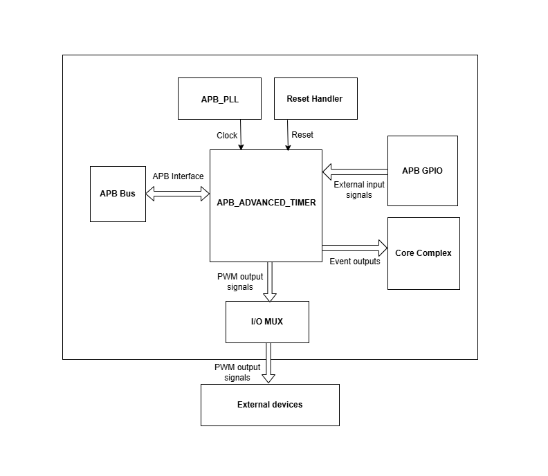
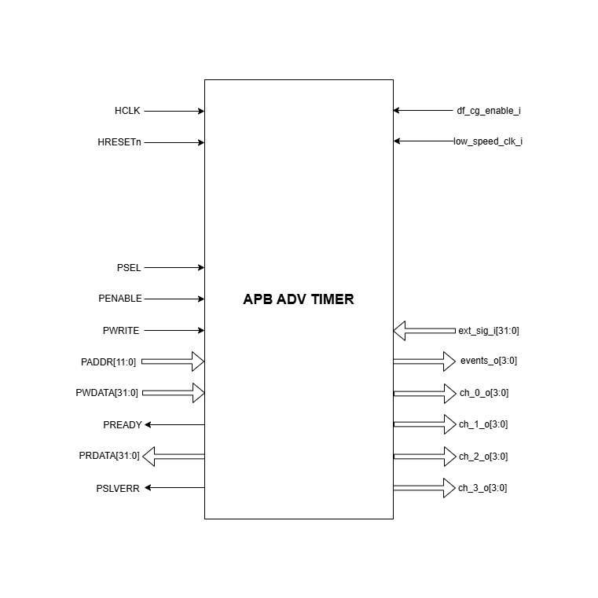

..
   Copyright (c) 2023 OpenHW Group
   Copyright (c) 2024 CircuitSutra

   SPDX-License-Identifier: Apache-2.0 WITH SHL-2.1

.. Level 1
   =======

   Level 2
   -------

   Level 3
   ~~~~~~~

   Level 4
   ^^^^^^^
.. _apb_advanced_timer:

APB Advanced Timer
==================
APB Advanced Timer generates PWM for the Core complex or CPU subsystem by the use of four programmable timers called "channels".
These four timers can be configured independently to support four unique PWM generation parallely.   

Features
--------

- Multiple trigger input sources:

  - PWM output signals of all the 4 timers
  - 32 GPIOs

- Multiple clock sources:

  - Reference clock at 32kHz
  - FLL clock

- Configurable input trigger modes for each timer
- Configurable prescaler for each timer
- Configurable counting mode for each timer
- Four comparators for each timer. Configurable channel comparator threshold and comparator operation for each comparator.
- Four configurable output events
- 4-bit PWM output for each timer.
- Configurable clock gating of each timer

Architecture
------------

The figure below is a high-level block diagram of the APB Advanced Timer module:-

.. figure:: apb_adv_timer_block_diagram.png
   :name: APB Advanced Timer Block Diagram
   :align: center
   :alt:

   APB ADVANCED TIMER Block Diagram

The APB ADVANCED TIMER IP consists of the following key components:
APB control logic, APB ADVANCED TIMER CSRs and 4 Timer modules

APB control logic
~~~~~~~~~~~~~~~~~
The APB control logic interfaces with the APB bus to decode and execute commands.
It handles CSR reads and writes according to the APB protocol, providing a standardized interface to the system.

APB ADVANCED TIMER CSRs
~~~~~~~~~~~~~~~~~~~~~~~~~~~~
- There are few common CSRs that store the following configurations.

  - Output event select 
  - Output event enable  
  - Clock enable

- There are 4 timer modules and each timer module has its own set of CSRs. Each of the timer module specific CSRs store the following configuration:

  - Arm, Reset, Update, Stop and Start  
  - Prescalar value, Sawtooth mode, Clksel, Input trigger mode select, Input pins select
  - Count start and Count emd.
  - Counter 
  - Comparator Threshold and Comparator operation mode

Timer Module
~~~~~~~~~~~~

   TIMER Block Diagram

Introduction
^^^^^^^^^^^^^
- Timer module's main objective is to generate PWM signal based on the external input/stimulus provided.
- Timer module has various submodules/components like Timer Controller, Input stage, Prescalar, Updown counter and Comparators.
- Timer controller manages all the other submodules through few control signals like active, controller reset and update.
- FW performs Initialization and drives various configuration CSR. 
- In order to generate the PWM, the data flows through the following submodule.
  
  - **(ext_sig_i )** -> input stage -> prescaler ->updown counter ->comparators -> **(PWM)**

Timer Controller
^^^^^^^^^^^^^^^^
- Timer controller generates few important signals like active, update and reset. It parses and controls other sub modules through these signals. 

  -  active signal: It is a control signal through which a sub module can either enable or disable its operations.
  -  update signal: It informs the sub module when to update the latest configured CSR values in order to perform their operations.
  -  reset signal: It resets the sub modules.

- The active signal is driven by a different a value in the following conditions. 

  -  The active signal is driven by value '1', when the START bitfield is '1' in the REG_TIM[0-3]_CMD CSR.

  -  The active signal is driven by value '0'. when the START bitfield is '0' and STOP bitfield is '1' in the REG_TIM[0-3]_CMD CSR. 

- The update signal is always driven by the value UPDATE bitfield in the REG_TIM[0-3]_CMD CSR and controller reset signal is driven by the value RESET bitfield in the REG_TIM[0-3]_CMD CSR. 
- These signals are parsed to all sub modules in the following conditions

  - if START bitfield is 0 in the REG_TIM[0-3]_CMD CSR.

  - if START bitfield is '1' in the REG_TIM[0-3]_CMD CSR and active signal is '1'. When the Timer starts for the first time.

Input Stage
^^^^^^^^^^^
- Input stage receives the input (i.e ext_sig_i and PWM output signals of all the 4 timers) and based on CSR configurations, it selects the clock, input pin and operating mode to generate the output event signal.  
- Input stage uses the bitfield INSEL in REG_TIM[0-3]_CFG CSR and selects a signal from a set of signals in ext_sig_i.
- Input stage uses the bitfield CLKSEL in REG_TIM[0-3]_CFG CSR and decides whether the input will be either in sync with the rising edge of the low_speed_clk_i or in sync with the ref clock.
- At every positive edge of the selected clock and selected input signal, Input stage uses the bitfield MODE in REG_TIM[0-3]_CFG CSR to generate output event signal according to the below information.

  - If MODE is 3’b000

    - The event is always high

  - If MODE is 3’b001

    - The event is sensitive to the negation of the signal selected

  - If MODE is 3’b010

    - The output event is sensitive to the input signal selected
    
  - If MODE is 3’b011

    - The output event is sensitive to the rising edge of the selected signal in sync with the clock.

  - If MODE is 3’b100

    - The output event is sensitive to the falling edge of the selected signal in sync with the clock.

  - If MODE is 3’b101

    - The output event is sensitive to both rising edge and falling edge of the selected signal in sync with the clock.

  - If MODE is 3’b110

    - If the timer is armed ,i,e,the CSR ARM is high then the event is made high for the rising edge of the selected signal and remains the same until the next rising edge of the signal.If ARM CSR is low,then the output event is low forever.

  - If MODE is 3’b111

    - If the timer is armed ,i,e,the CSR ARM is high then the event is made high for the falling edge of the selected signal and remains the same until the next falling edge of the signal.If ARM CSR is low,then the output event is low forever.

Prescalar
^^^^^^^^^
- Prescaler scales down the high frequency input signal to low frequency output signal by using the prescaler value. 
- The PRESC bitfield in the REG_TIM[0-3]_CFG CSR is parsed to Prescaler and the output event signal generated in the previous input stage is scaled based on the PRESC value.
- Prescaler module maintains a internal counter whose initial value is 0. At every positive edge of the clock, counter gets incremented by '1' when event input signal is '1' and Timer is active.
- When the internal counter value matches with the PRESC bitfield output event is set to '1' at positive edge of the clock(the frequency is scaled according to the PRESC CSR value) and the counter is updated to '0'. The above process continues and output events are generated.
- Both the counter and output event is set to 0. When either the hard reset is triggered or when Timer controller parses the RESET bitfield which is set to '1'.

Updown counter
^^^^^^^^^^^^^^
- Updown counter manages the timer counter values based on CSR configurations and generates the following outputs: counter value, end event and the output event.
- The output event generated from prescaler sub module is provided as the input for the updown counter. At every positive edge of the clock, if the active signal is '1' then output event is driven by the value of output event generated from prescaler.
- The active, controller reset and update signals are provided by the Timer controller.  
- Updown counter maintains a counter and direction(0- up and 1- down).
- During the initialization, counter value is set to COUNT_START and direction to 0 and any new values of SAWTOOTH, COUNT_START and COUNT_END bitfield can be provided by FW. 
- At every positive edge of the clock, if output event generated from prescaler is '1' and active sigmal is '1' then the following operation is performed.

  - if the SAWTOOTH bitfield is '1':

    - The counter is incremented till it reaches the value of COUNT_END, then an end event is generated.

    - The counter is resetted back to value of COUNT_START bitfield and this process is repeated to generate multiple end events. 
 
  - if the SAWTOOTH bitfield is '0':

    - The counter is incremented till it reaches the value of COUNT_END.

    - Then the counter is decremented till it reaches the value of COUNT_START. (counter goes in a sawtooth fashion)

    - Now, an end event is generated. this process is repeated to generate multiple end events.

- Re-Initialization of the Updown counter can be done in the following scenarios.

  - Update signal is '1' and the below conditions are met:

    - When the controller is inactive (active signal is '0'). 

    - When an end event is generated. 

  - If update signal is '1' and above two conditions are not met, then upcounter counter is re-initialized when the next end event is generated, irrespective of update signal value at that instance of time. 

  - Reset signal is '1'.

- At every positive edge of the clock, The counter value is updated in the REG_TIM[0-3]_COUNTER.
- If the hard reset is '0', then the all the CSR and internal meta data is set to the reset values.

Comparator
^^^^^^^^^^
- Each timer has 4 comparators that can act independently and each comapartor generates a 1 bit PWM output.
- Comparator compares the timer counter value with compare value and based on CSR configurations of output mode generates a PWM output.
- The counter value, end event and the output event generated in the updown counter are provided as input to the comparator. 
- The active, controller reset and update signals are provided by the Timer controller.
- COMP_THRESHOLD and COMP_OP can only be updated and used by the comparator. when the update signal is '1'. 
- At every positive edge of the clock, when the output event coming out of the up down counter is '1' and active signal is '1', comparator checks for the following two internal events that can happen, 

  - **(match_event)** is set to '1' when timer counter value reaches the comparator offset 

  - **(event_2)** set to '1' in the following two scenarios:

    - When the SAWTOOTH bitfield is '1' and end event is '1'.

    - When SAWTOOTH is bitfield is '0' and the timer counter value reaches the COMP_THRESHOLD. 

- Then, based on the match_event, event_2 and COMP_OP value, PWM output is generated accordingly.

- If COMP_OP value is 3'b000 (OP_SET) 
  
  - If a match_event is high
  
    - The PWM output is made high
  
  - Else, if a match_event is low
  
    - The PWM output remains the same.

- If COMP_OP value is 3'b001 (OP_TOGRST)
  
  - When Sawtooth Mode is ON

    - If a match_event is high

      - The PWM output is made toggled.
    
    - Else, if event_2 is high 
    
      - The PWM output is made low.

  - When Sawtooth Mode is OFF

    - If match_event is high and event_2 is low

      - The PWM output is toggled.
      - event_2 is made high.

    - Else, if match_event is high and event_2 is high
    
      - The PWM output is made low
      - event_2 is made low.

- If COMP_OP value is 3'b010 (OP_SETRST)

  - When Sawtooth Mode is ON

    - If a match_event is high 
  
      - the PWM output is made high
  
    - Else, if event_2 is high
  
      - then PWM output is made low.

  - When Sawtooth Mode is OFF
    
    - If match_event is high and event_2 is low
    
      - The PWM output is made high
      - event_2 is made high.
    
    - Else, if match_event is high and event_2 also is high
    
      - PWM output is made low
      - event_2 is made low.

- If COMP_OP value is 3'b011 (OP_TOG) 

  - If a match_event is high
  
    - The PWM output is toggled
  
  - Else, if a match_event is low
  
    - The PWM output remains the same.

- If COMP_OP value is 3'b100 (OP_RST)

  - If a match_event is high
  
    - The PWM output is made low
  
  - Else, if a match_event is low
  
    - The PWM output remains the same.

- If COMP_OP value is 3'b101 (OP_TOGSET)

  - When Sawtooth Mode is ON

    - If a match_event is high
  
      - The PWM output is toggled
  
    - Else, if event_2 is high
  
      - then PWM output is made high.

  - When Sawtooth Mode is OFF
  
    - If match_event is high and event_2 is low
  
      - The PWM output is toggled
      - event_2 is made high
  
    - Else, if match_event is high and event_2 also is high
  
      - The PWM output is made high
      - event_2 is made low

- If COMP_OP value is 3'b110 (OP_RSTSET)

  - When Sawtooth Mode is ON
  
    - If a match_event is high
  
      - The PWM output is made low
  
    - Else, if event_2 is high
  
      - The PWM output is made high

  - When Sawtooth Mode is OFF
  
    - If match_event is high and event_2 is low
  
      - The PWM output is made low
      - event_2 is made high
  
    - Else, if match_event is high and event_2 also is high
  
      - The PWM output is made high
      - event_2 is made low.

- By default the PWM output remains the same (state remains same until further change in input) and event_2 is kept low.
- The PWM output is set to 0. When either the hard reset is triggered or controller reset is '1'.

Working of APB Advanced Timer for PWM generation:
~~~~~~~~~~~~~~~~~~~~~~~~~~~~~~~~~~~~~~~~~~~~~~~~~

Based on the detailed working of the submodules above, the working of the APB Advanced timer can be summarised as:
- FW initialization is performed and the external input/stimulus ext_sig_i is provided.
- For each Timer module, at every positive edge of the selected clock and when the timer is active, the following operation is performed.

  - Input stage consumes 48 bit (i.e ext_sig_i and PWM output signals of all the 4 timers) and processes it accordingly based on CLKSEL, INSEL and MODE. Event signal is generated as per the working of input stage.

  - The Event signal generated in the input stage is scaled down to output scaled event based on the prescaler value by prescaler sub module.

  - The above output scaled events generated go to the up down counter.

  - Depending on various FW configurations of SAWTOOTH, COUNT_START and COUNT_END. The counter value, end event and the output event are generated in the updown counter and are provided as input to the 4 comparators.

  - In each of the comparator, counter value is compared against the COMP_THRESHOLD and 1 bit PWM is generated based on COMP_OP.

  - 4 comparator submodules generate 4 bit PWM signal

  - This above process is repeated with respect to change in the FW configurations to generate the PWM signal.

- APB Advanced Timer has 4 timer modules which can generate 4 independent 4-bit PWMs
- Apart from the PWM signal, APB Advanced Timer also generates output events based on the OUT_SEL_EVT_ENABLE and OUT_SEL_EVT1 bitfiels of REG_EVENT_CFG CSR.

System Architecture:
--------------------

The figure below depicts the connections between the APB ADVANCED TIMER and rest of the modules in Core-V-MCU:-

   APB ADVANCED TIMER Core-V-MCU connections diagram

- The ext_sig_i input to the APB Advanced Timer is provided by the APB_GPIO. 
- APB Advanced Timer process this input signals based on the various CSR configurations.
- APB Advanced Timer generate few output event signals that are further passed as interrupts to the Core complex.
- APB Advanced Timer generates PWM outputs which are passed to the external devices through I/O mux.

Programmers View:
-----------------
APB Advanced Timer has 4 Timers and below programming model is followed:  

Initial Configurations:
~~~~~~~~~~~~~~~~~~~~~~~
There are CSR bitfields in the APB advanced timer that are required to be configured before any operations are initiated. 

Timer module specific configurations:
^^^^^^^^^^^^^^^^^^^^^^^^^^^^^^^^^^^^^

As we have 4 Timer modules. Each timer has to be configured with appropriate values.

- Configure input clock source using CLKSEL bitfield in the REG_TIM[0-3]_CFG.
- Configure input trigger mode using MODE bitfield in the REG_TIM[0-3]_CFG.
- Configure which input has to selected using INSEL bitfield in the REG_TIM[0-3]_CFG.
- Configure prescaler value for scaling down the frequency using PRESC bitfield in the REG_TIM[0-3]_CFG.
- Configure sawtooth mode through which the updown down counter operates using SAWTOOTH bitfield in the REG_TIM[0-3]_CFG.
- Configure updown counter start value and end value using COUNT_START and COUNT_END bitfield respectively in the REG_TIM[0-3]_TH.
- Configure comparator 0 operation and comparator 0 threshold using COMP_OP and COMP_THRESHOLD bitfield respectively in the REG_TIM[0-3]_CH0_TH.
- Configure comparator 1 operation and comparator 1 threshold using COMP_OP and COMP_THRESHOLD bitfield respectively in the REG_TIM[0-3]_CH1_TH.
- Configure comparator 2 operation and comparator 2 threshold using COMP_OP and COMP_THRESHOLD bitfield respectively in the REG_TIM[0-3]_CH2_TH.
- Configure comparator 3 operation and comparator 3 threshold using COMP_OP and COMP_THRESHOLD bitfield respectively in the REG_TIM[0-3]_CH3_TH.

Common configurations:
^^^^^^^^^^^^^^^^^^^^^^

These configurations are common for 4 TIMERs. Typically these are used to enable or disable output events, clock for TIMERs and select the output events from a group of 16 PWM events.  

- Configure output select event enable that controls to enable or disable any of the 4 bit output events_o using OUT_SEL_EVT_ENABLE bitfield in the REG_EVENT_CFG.
- Configure output event 0 select value which is used to select an event from 16 bit PWM output using using OUT_SEL_EVT0 bitfield in the REG_EVENT_CFG.
- Configure output event 1 select value which is used to select an event from 16 bit PWM output using using OUT_SEL_EVT1 bitfield in the REG_EVENT_CFG.
- Configure output event 2 select value which is used to select an event from 16 bit PWM output using using OUT_SEL_EVT2 bitfield in the REG_EVENT_CFG.
- Configure output event 3 select value which is used to select an event from 16 bit PWM output using using OUT_SEL_EVT3 bitfield in the REG_EVENT_CFG.
- Enable or disable clocks for each TIMER using using CLK_ENABLE bitfield in the REG_CH_EN.

Control configurations/operations:
~~~~~~~~~~~~~~~~~~~~~~~~~~~~~~~~~~~

There are CSR bitfields in the APB advanced timer which controls operations of each of the timer module and its sub modules. 

- set the START bitfield in the REG_TIM[0-3]_CMD to start the Timer and its sub modules input stage, prescaler, updown counter and comparators.
- set the STOP bitfield in the REG_TIM[0-3]_CMD to stop/halt/pause the the Timer and its sub modules input stage, prescaler, updown counter and comparators.
- set the UPDATE bitfield in the REG_TIM[0-3]_CMD to Re-Initialization with the latest CSRs of the the Timer and its sub modules input stage, prescaler, updown counter and comparators.
- set the RESET bitfield in the REG_TIM[0-3]_CMD to Reset the the Timer and its sub modules input stage, prescaler, updown counter and comparators.
- set the ARM bitfield in the REG_TIM[0-3]_CMD to modify the inputs in the input stage.

Status configurations:
~~~~~~~~~~~~~~~~~~~~~~

The counter values of all the 4 Timers can be read via the following CSR bitfields in the APB advanced timer. 

- Use the T[0-3]_COUNTER bitfields in the respective REG_TIM[0-3]_COUNTER to read the values of counter maintained by updowncounter for each of the Timer.

APB ADVANCED TIMER CSRs
-----------------------

REG_TIM0_CMD 
~~~~~~~~~~~~
  - Address Offset=0x000

+----------+------+-----------------+--------+-----------------------------------------------------------------------------------------+
| Field    | Bits | Default Value   | Access | Description                                                                             |
+==========+======+=================+========+=========================================================================================+
| RESERVED | 31:5 | 0               | --     | Reserved                                                                                |
+----------+------+-----------------+--------+-----------------------------------------------------------------------------------------+
| ARM      | 4:4  | 0               | RW     | set this bitfield to modfify the input data if MODE bitfield value is 6 or 7            |
+----------+------+-----------------+--------+-----------------------------------------------------------------------------------------+
| RESET    | 3:3  | 0               | RW     | set this bitfield to reset the timer, even when the timer is active for PWM generation. |
+----------+------+-----------------+--------+-----------------------------------------------------------------------------------------+
| UPDATE   | 2:2  | 0               | RW     | set this bitfield to update or re-initialize the timer when the timer is stopped        |
+----------+------+-----------------+--------+-----------------------------------------------------------------------------------------+
| STOP     | 1:1  | 0               | RW     | set this bitfield to stop/pause/halt the timer and its sub modules operations           |
+----------+------+-----------------+--------+-----------------------------------------------------------------------------------------+
| START    | 0:0  | 0               | RW     | set this bitfield to Start the timer operation to generate PWM output                   |
+----------+------+-----------------+--------+-----------------------------------------------------------------------------------------+

REG_TIM0_CFG
~~~~~~~~~~~~
  - Address Offset=0x004

+----------+-------+-----------------+--------+----------------------------------------------------------------------------+
| Field    | Bits  | Default Value   | Access | Description                                                                |
+==========+=======+=================+========+============================================================================+
| RESERVED | 31:24 | 0               | --     | Reserved                                                                   |                                
+----------+-------+-----------------+--------+----------------------------------------------------------------------------+
| PRESC    | 23:16 | 0               | RW     | prescaler value configuration bitfield                                     |
+----------+-------+-----------------+--------+----------------------------------------------------------------------------+
| RESERVED | 15:13 | 0               | --     | Reserved                                                                   |                                 
+----------+-------+-----------------+--------+----------------------------------------------------------------------------+
| SAWTOOTH | 12:12 | 1               | RW     | center-aligned mode configuration bitfield                                 |
|          |       |                 |        |                                                                            |
|          |       |                 |        | 1’b0: The counter counts up and down alternatively                         |
|          |       |                 |        |                                                                            |
|          |       |                 |        | 1’b1: The counter counts up and resets to 0 when it reaches the threshold. | 
+----------+-------+-----------------+--------+----------------------------------------------------------------------------+
| CLKSEL   | 11:11 | 0               | RW     | clock source configuration bitfield                                        |
|          |       |                 |        |                                                                            |
|          |       |                 |        | 1’b0: FLL                                                                  |
|          |       |                 |        |                                                                            |
|          |       |                 |        | 1’b1: Reference clock at 32kHz                                             |
+----------+-------+-----------------+--------+----------------------------------------------------------------------------+
| MODE     | 10:8  | 0               | RW     | trigger mode configuration bitfield                                        |
|          |       |                 |        |                                                                            |
|          |       |                 |        | 3’h0: Trigger event at each clock cycle                                    |
|          |       |                 |        |                                                                            |
|          |       |                 |        | 3’h1: Trigger event if input source is 0                                   |
|          |       |                 |        |                                                                            |
|          |       |                 |        | 3’h2: Trigger event if input source is 1                                   |
|          |       |                 |        |                                                                            |
|          |       |                 |        | 3’h3: Trigger event on input source rising edge                            |
|          |       |                 |        |                                                                            |
|          |       |                 |        | 3’h4: Trigger event on input source falling edge                           |
|          |       |                 |        |                                                                            |
|          |       |                 |        | 3’h5: Trigger event on input source falling or rising edge                 |
|          |       |                 |        |                                                                            |
|          |       |                 |        | 3’h6: Trigger event on input source rising edge when armed                 |
|          |       |                 |        |                                                                            |
|          |       |                 |        | 3’h7: Trigger event on input source falling edge when armed                |
+----------+-------+-----------------+--------+----------------------------------------------------------------------------+
| INSEL    | 7:0   | 0               | RW     | input source configuration bitfield                                        |
|          |       |                 |        |                                                                            |
|          |       |                 |        | 0-31: GPIO[0] to GPIO[31]                                                  |
|          |       |                 |        |                                                                            |
|          |       |                 |        | 32-35: Channel 0 to 3 of ADV_TIMER0                                        |
|          |       |                 |        |                                                                            |
|          |       |                 |        | 36-39: Channel 0 to 3 of ADV_TIMER1                                        |
|          |       |                 |        |                                                                            |
|          |       |                 |        | 40-43: Channel 0 to 3 of ADV_TIMER2                                        |
|          |       |                 |        |                                                                            |
|          |       |                 |        | 44-47: Channel 0 to 3 of ADV_TIMER3                                        |
+----------+-------+-----------------+--------+----------------------------------------------------------------------------+

REG_TIM0_TH
~~~~~~~~~~~~
  - Address Offset=0x008

+-------------+-------+-----------------+--------+------------------------------------+
| Field       | Bits  | Default Value   | Access | Description                        |
+=============+=======+=================+========+====================================+
| COUNT_END   | 31:16 | 0               | RW     | End value for the updown counter   |
+-------------+-------+-----------------+--------+------------------------------------+
| COUNT_START | 15:0  | 0               | RW     | Start value for the updown counter |
+-------------+-------+-----------------+--------+------------------------------------+

REG_TIM0_CH0_TH
~~~~~~~~~~~~~~~
  - Address Offset=0x00C

+----------------+-------+-----------------+--------+----------------------------------------------------------------------------------+
| Field          | Bits  | Default Value   | Access | Description                                                                      |
+================+=======+=================+========+==================================================================================+
| RESERVED       | 31:19 | 0               | --     | Reserved                                                                         | 
+----------------+-------+-----------------+--------+----------------------------------------------------------------------------------+
| COMP_OP        | 18:16 | 0               | RW     | Channel 0 threshold match action on channel output signal configuration bitfield |
|                |       |                 |        |                                                                                  |
|                |       |                 |        | 3’h0: Set                                                                        |
|                |       |                 |        |                                                                                  |
|                |       |                 |        | 3’h1: Toggle then next threshold match action is clear                           |
|                |       |                 |        |                                                                                  |
|                |       |                 |        | 3’h2: Set then next threshold match action is clear                              |
|                |       |                 |        |                                                                                  |
|                |       |                 |        | 3’h3: Toggle                                                                     |
|                |       |                 |        |                                                                                  |
|                |       |                 |        | 3’h4: Clear                                                                      |
|                |       |                 |        |                                                                                  |
|                |       |                 |        | 3’h5: Toggle then next threshold match action is set                             |
|                |       |                 |        |                                                                                  |
|                |       |                 |        | 3’h6: Clear then next threshold match action is set                              |
+----------------+-------+-----------------+--------+----------------------------------------------------------------------------------+
| COMP_THRESHOLD | 15:0  | 0               | RW     | Channel 0 threshold configuration bitfield                                       |
+----------------+-------+-----------------+--------+----------------------------------------------------------------------------------+

REG_TIM0_CH1_TH
~~~~~~~~~~~~~~~
  - Address Offset=0x010

+----------------+-------+-----------------+--------+----------------------------------------------------------------------------------+
| Field          | Bits  | Default Value   | Access | Description                                                                      |
+================+=======+=================+========+==================================================================================+
| RESERVED       | 31:19 | 0               | --     | Reserved                                                                         | 
+----------------+-------+-----------------+--------+----------------------------------------------------------------------------------+
| COMP_OP        | 18:16 | 0               | RW     | Channel 0 threshold match action on channel output signal configuration bitfield |
|                |       |                 |        |                                                                                  |
|                |       |                 |        | 3’h0: Set                                                                        |
|                |       |                 |        |                                                                                  |
|                |       |                 |        | 3’h1: Toggle then next threshold match action is clear                           |
|                |       |                 |        |                                                                                  |
|                |       |                 |        | 3’h2: Set then next threshold match action is clear                              |
|                |       |                 |        |                                                                                  |
|                |       |                 |        | 3’h3: Toggle                                                                     |
|                |       |                 |        |                                                                                  |
|                |       |                 |        | 3’h4: Clear                                                                      |
|                |       |                 |        |                                                                                  |
|                |       |                 |        | 3’h5: Toggle then next threshold match action is set                             |
|                |       |                 |        |                                                                                  |
|                |       |                 |        | 3’h6: Clear then next threshold match action is set                              |
+----------------+-------+-----------------+--------+----------------------------------------------------------------------------------+
| COMP_THRESHOLD | 15:0  | 0               | RW     | Channel 0 threshold configuration bitfield                                       |
+----------------+-------+-----------------+--------+----------------------------------------------------------------------------------+

REG_TIM0_CH2_TH
~~~~~~~~~~~~~~~
  - Address Offset=0x014

+----------------+-------+-----------------+--------+----------------------------------------------------------------------------------+
| Field          | Bits  | Default Value   | Access | Description                                                                      |
+================+=======+=================+========+==================================================================================+
| RESERVED       | 31:19 | 0               | --     | Reserved                                                                         | 
+----------------+-------+-----------------+--------+----------------------------------------------------------------------------------+
| COMP_OP        | 18:16 | 0               | RW     | Channel 0 threshold match action on channel output signal configuration bitfield |
|                |       |                 |        |                                                                                  |
|                |       |                 |        | 3’h0: Set                                                                        |
|                |       |                 |        |                                                                                  |
|                |       |                 |        | 3’h1: Toggle then next threshold match action is clear                           |
|                |       |                 |        |                                                                                  |
|                |       |                 |        | 3’h2: Set then next threshold match action is clear                              |
|                |       |                 |        |                                                                                  |
|                |       |                 |        | 3’h3: Toggle                                                                     |
|                |       |                 |        |                                                                                  |
|                |       |                 |        | 3’h4: Clear                                                                      |
|                |       |                 |        |                                                                                  |
|                |       |                 |        | 3’h5: Toggle then next threshold match action is set                             |
|                |       |                 |        |                                                                                  |
|                |       |                 |        | 3’h6: Clear then next threshold match action is set                              |
+----------------+-------+-----------------+--------+----------------------------------------------------------------------------------+
| COMP_THRESHOLD | 15:0  | 0               | RW     | Channel 0 threshold configuration bitfield                                       |
+----------------+-------+-----------------+--------+----------------------------------------------------------------------------------+

REG_TIM0_CH3_TH
~~~~~~~~~~~~~~~
  - Address Offset=0x018

+----------------+-------+-----------------+--------+----------------------------------------------------------------------------------+
| Field          | Bits  | Default Value   | Access | Description                                                                      |
+================+=======+=================+========+==================================================================================+
| RESERVED       | 31:19 | 0               | --     | Reserved                                                                         | 
+----------------+-------+-----------------+--------+----------------------------------------------------------------------------------+
| COMP_OP        | 18:16 | 0               | RW     | Channel 0 threshold match action on channel output signal configuration bitfield |
|                |       |                 |        |                                                                                  |
|                |       |                 |        | 3’h0: Set                                                                        |
|                |       |                 |        |                                                                                  |
|                |       |                 |        | 3’h1: Toggle then next threshold match action is clear                           |
|                |       |                 |        |                                                                                  |
|                |       |                 |        | 3’h2: Set then next threshold match action is clear                              |
|                |       |                 |        |                                                                                  |
|                |       |                 |        | 3’h3: Toggle                                                                     |
|                |       |                 |        |                                                                                  |
|                |       |                 |        | 3’h4: Clear                                                                      |
|                |       |                 |        |                                                                                  |
|                |       |                 |        | 3’h5: Toggle then next threshold match action is set                             |
|                |       |                 |        |                                                                                  |
|                |       |                 |        | 3’h6: Clear then next threshold match action is set                              |
+----------------+-------+-----------------+--------+----------------------------------------------------------------------------------+
| COMP_THRESHOLD | 15:0  | 0               | RW     | Channel 0 threshold configuration bitfield                                       |
+----------------+-------+-----------------+--------+----------------------------------------------------------------------------------+

REG_TIM0_CH0_LUT
~~~~~~~~~~~~~~~~~
  - Address Offset=0x01C

+-----------+--------+-----------------+--------+-------------------------------------------------------------+
| Field     | Bits   | Default Value   | Access | Description                                                 |
+===========+========+=================+========+=============================================================+
| RESERVED  | 31:18  | 0               | --     | Reserved                                                    | 
+-----------+--------+-----------------+--------+-------------------------------------------------------------+
| FLT       | 23:16  | 0               | RW     | FLT (Not used in the current implementation)                |
+-----------+--------+-----------------+--------+-------------------------------------------------------------+
| LUT       | 15:0   | 0               | RW     | LUT (Not used in the current implementation)                |
+-----------+--------+-----------------+--------+-------------------------------------------------------------+

REG_TIM0_CH1_LUT
~~~~~~~~~~~~~~~~~
  - Address Offset=0x020

+-----------+--------+-----------------+--------+-------------------------------------------------------------+
| Field     | Bits   | Default Value   | Access | Description                                                 |
+===========+========+=================+========+=============================================================+
| RESERVED  | 31:18  | 0               | --     | Reserved                                                    | 
+-----------+--------+-----------------+--------+-------------------------------------------------------------+
| FLT       | 23:16  | 0               | RW     | FLT (Not used in the current implementation)                |
+-----------+--------+-----------------+--------+-------------------------------------------------------------+
| LUT       | 15:0   | 0               | RW     | LUT (Not used in the current implementation)                |
+-----------+--------+-----------------+--------+-------------------------------------------------------------+

REG_TIM0_CH2_LUT
~~~~~~~~~~~~~~~~~
  - Address Offset=0x024

+-----------+--------+-----------------+--------+-------------------------------------------------------------+
| Field     | Bits   | Default Value   | Access | Description                                                 |
+===========+========+=================+========+=============================================================+
| RESERVED  | 31:18  | 0               | --     | Reserved                                                    | 
+-----------+--------+-----------------+--------+-------------------------------------------------------------+
| FLT       | 23:16  | 0               | RW     | FLT (Not used in the current implementation)                |
+-----------+--------+-----------------+--------+-------------------------------------------------------------+
| LUT       | 15:0   | 0               | RW     | LUT (Not used in the current implementation)                |
+-----------+--------+-----------------+--------+-------------------------------------------------------------+

REG_TIM0_CH3_LUT
~~~~~~~~~~~~~~~~~
  - Address Offset=0x028

+-----------+--------+-----------------+--------+-------------------------------------------------------------+
| Field     | Bits   | Default Value   | Access | Description                                                 |
+===========+========+=================+========+=============================================================+
| RESERVED  | 31:18  | 0               | --     | Reserved                                                    |
+-----------+--------+-----------------+--------+-------------------------------------------------------------+
| FLT       | 23:16  | 0               | RW     | FLT (Not used in the current implementation)                |
+-----------+--------+-----------------+--------+-------------------------------------------------------------+
| LUT       | 15:0   | 0               | RW     | LUT (Not used in the current implementation)                |
+-----------+--------+-----------------+--------+-------------------------------------------------------------+

REG_TIM0_COUNTER
~~~~~~~~~~~~~~~~~
  - Address Offset=0x02C

+------------+------+-----------------+--------+------------------------+
| Field      | Bits | Default Value   | Access | Description            |
+============+======+=================+========+========================+
| T0_COUNTER | 31:0 | 0               | R      | TIMER0 counter         |
+------------+------+-----------------+--------+------------------------+

REG_TIM1_CMD 
~~~~~~~~~~~~
  - Address Offset=0x040

+----------+------+-----------------+--------+-----------------------------------------------------------------------------------------+
| Field    | Bits | Default Value   | Access | Description                                                                             |
+==========+======+=================+========+=========================================================================================+
| RESERVED | 31:5 | 0               | --     | Reserved                                                                                |
+----------+------+-----------------+--------+-----------------------------------------------------------------------------------------+
| ARM      | 4:4  | 0               | RW     | set this bitfield to modfify the input data if MODE bitfield value is 6 or 7            |
+----------+------+-----------------+--------+-----------------------------------------------------------------------------------------+
| RESET    | 3:3  | 0               | RW     | set this bitfield to reset the timer, even when the timer is active for PWM generation. |
+----------+------+-----------------+--------+-----------------------------------------------------------------------------------------+
| UPDATE   | 2:2  | 0               | RW     | set this bitfield to update or re-initialize the timer when the timer is stopped        |
+----------+------+-----------------+--------+-----------------------------------------------------------------------------------------+
| STOP     | 1:1  | 0               | RW     | set this bitfield to stop/pause/halt the timer and its sub modules operations           |
+----------+------+-----------------+--------+-----------------------------------------------------------------------------------------+
| START    | 0:0  | 0               | RW     | set this bitfield to Start the timer operation to generate PWM output                   |
+----------+------+-----------------+--------+-----------------------------------------------------------------------------------------+

REG_TIM1_CFG
~~~~~~~~~~~~
  - Address Offset=0x044

+----------+-------+-----------------+--------+----------------------------------------------------------------------------+
| Field    | Bits  | Default Value   | Access | Description                                                                |
+==========+=======+=================+========+============================================================================+
| RESERVED | 31:24 | 0               | --     | Reserved                                                                   |                                
+----------+-------+-----------------+--------+----------------------------------------------------------------------------+
| PRESC    | 23:16 | 0               | RW     | prescaler value configuration bitfield                                     |
+----------+-------+-----------------+--------+----------------------------------------------------------------------------+
| RESERVED | 15:13 | 0               | --     | Reserved                                                                   |                                 
+----------+-------+-----------------+--------+----------------------------------------------------------------------------+
| SAWTOOTH | 12:12 | 1               | RW     | center-aligned mode configuration bitfield                                 |
|          |       |                 |        |                                                                            |
|          |       |                 |        | 1’b0: The counter counts up and down alternatively                         |
|          |       |                 |        |                                                                            |
|          |       |                 |        | 1’b1: The counter counts up and resets to 0 when it reaches the threshold. | 
+----------+-------+-----------------+--------+----------------------------------------------------------------------------+
| CLKSEL   | 11:11 | 0               | RW     | clock source configuration bitfield                                        |
|          |       |                 |        |                                                                            |
|          |       |                 |        | 1’b0: FLL                                                                  |
|          |       |                 |        |                                                                            |
|          |       |                 |        | 1’b1: Reference clock at 32kHz                                             |
+----------+-------+-----------------+--------+----------------------------------------------------------------------------+
| MODE     | 10:8  | 0               | RW     | trigger mode configuration bitfield                                        |
|          |       |                 |        |                                                                            |
|          |       |                 |        | 3’h0: Trigger event at each clock cycle                                    |
|          |       |                 |        |                                                                            |
|          |       |                 |        | 3’h1: Trigger event if input source is 0                                   |
|          |       |                 |        |                                                                            |
|          |       |                 |        | 3’h2: Trigger event if input source is 1                                   |
|          |       |                 |        |                                                                            |
|          |       |                 |        | 3’h3: Trigger event on input source rising edge                            |
|          |       |                 |        |                                                                            |
|          |       |                 |        | 3’h4: Trigger event on input source falling edge                           |
|          |       |                 |        |                                                                            |
|          |       |                 |        | 3’h5: Trigger event on input source falling or rising edge                 |
|          |       |                 |        |                                                                            |
|          |       |                 |        | 3’h6: Trigger event on input source rising edge when armed                 |
|          |       |                 |        |                                                                            |
|          |       |                 |        | 3’h7: Trigger event on input source falling edge when armed                |
+----------+-------+-----------------+--------+----------------------------------------------------------------------------+
| INSEL    | 7:0   | 0               | RW     | input source configuration bitfield                                        |
|          |       |                 |        |                                                                            |
|          |       |                 |        | 0-31: GPIO[0] to GPIO[31]                                                  |
|          |       |                 |        |                                                                            |
|          |       |                 |        | 32-35: Channel 0 to 3 of ADV_TIMER0                                        |
|          |       |                 |        |                                                                            |
|          |       |                 |        | 36-39: Channel 0 to 3 of ADV_TIMER1                                        |
|          |       |                 |        |                                                                            |
|          |       |                 |        | 40-43: Channel 0 to 3 of ADV_TIMER2                                        |
|          |       |                 |        |                                                                            |
|          |       |                 |        | 44-47: Channel 0 to 3 of ADV_TIMER3                                        |
+----------+-------+-----------------+--------+----------------------------------------------------------------------------+

REG_TIM1_TH
~~~~~~~~~~~~
  - Address Offset=0x048

+-------------+-------+-----------------+--------+------------------------------------+
| Field       | Bits  | Default Value   | Access | Description                        |
+=============+=======+=================+========+====================================+
| COUNT_END   | 31:16 | 0               | RW     | End value for the updown counter   |
+-------------+-------+-----------------+--------+------------------------------------+
| COUNT_START | 15:0  | 0               | RW     | Start value for the updown counter |
+-------------+-------+-----------------+--------+------------------------------------+

REG_TIM1_CH0_TH
~~~~~~~~~~~~~~~
  - Address Offset=0x04C

+----------------+-------+-----------------+--------+----------------------------------------------------------------------------------+
| Field          | Bits  | Default Value   | Access | Description                                                                      |
+================+=======+=================+========+==================================================================================+
| RESERVED       | 31:19 | 0               | --     | Reserved                                                                         | 
+----------------+-------+-----------------+--------+----------------------------------------------------------------------------------+
| COMP_OP        | 18:16 | 0               | RW     | Channel 0 threshold match action on channel output signal configuration bitfield |
|                |       |                 |        |                                                                                  |
|                |       |                 |        | 3’h0: Set                                                                        |
|                |       |                 |        |                                                                                  |
|                |       |                 |        | 3’h1: Toggle then next threshold match action is clear                           |
|                |       |                 |        |                                                                                  |
|                |       |                 |        | 3’h2: Set then next threshold match action is clear                              |
|                |       |                 |        |                                                                                  |
|                |       |                 |        | 3’h3: Toggle                                                                     |
|                |       |                 |        |                                                                                  |
|                |       |                 |        | 3’h4: Clear                                                                      |
|                |       |                 |        |                                                                                  |
|                |       |                 |        | 3’h5: Toggle then next threshold match action is set                             |
|                |       |                 |        |                                                                                  |
|                |       |                 |        | 3’h6: Clear then next threshold match action is set                              |
+----------------+-------+-----------------+--------+----------------------------------------------------------------------------------+
| COMP_THRESHOLD | 15:0  | 0               | RW     | Channel 0 threshold configuration bitfield                                       |
+----------------+-------+-----------------+--------+----------------------------------------------------------------------------------+

REG_TIM1_CH1_TH
~~~~~~~~~~~~~~~
  - Address Offset=0x050

+----------------+-------+-----------------+--------+----------------------------------------------------------------------------------+
| Field          | Bits  | Default Value   | Access | Description                                                                      |
+================+=======+=================+========+==================================================================================+
| RESERVED       | 31:19 | 0               | --     | Reserved                                                                         | 
+----------------+-------+-----------------+--------+----------------------------------------------------------------------------------+
| COMP_OP        | 18:16 | 0               | RW     | Channel 0 threshold match action on channel output signal configuration bitfield |
|                |       |                 |        |                                                                                  |
|                |       |                 |        | 3’h0: Set                                                                        |
|                |       |                 |        |                                                                                  |
|                |       |                 |        | 3’h1: Toggle then next threshold match action is clear                           |
|                |       |                 |        |                                                                                  |
|                |       |                 |        | 3’h2: Set then next threshold match action is clear                              |
|                |       |                 |        |                                                                                  |
|                |       |                 |        | 3’h3: Toggle                                                                     |
|                |       |                 |        |                                                                                  |
|                |       |                 |        | 3’h4: Clear                                                                      |
|                |       |                 |        |                                                                                  |
|                |       |                 |        | 3’h5: Toggle then next threshold match action is set                             |
|                |       |                 |        |                                                                                  |
|                |       |                 |        | 3’h6: Clear then next threshold match action is set                              |
+----------------+-------+-----------------+--------+----------------------------------------------------------------------------------+
| COMP_THRESHOLD | 15:0  | 0               | RW     | Channel 0 threshold configuration bitfield                                       |
+----------------+-------+-----------------+--------+----------------------------------------------------------------------------------+

REG_TIM1_CH2_TH
~~~~~~~~~~~~~~~
  - Address Offset=0x054

+----------------+-------+-----------------+--------+----------------------------------------------------------------------------------+
| Field          | Bits  | Default Value   | Access | Description                                                                      |
+================+=======+=================+========+==================================================================================+
| RESERVED       | 31:19 | 0               | --     | Reserved                                                                         | 
+----------------+-------+-----------------+--------+----------------------------------------------------------------------------------+
| COMP_OP        | 18:16 | 0               | RW     | Channel 0 threshold match action on channel output signal configuration bitfield |
|                |       |                 |        |                                                                                  |
|                |       |                 |        | 3’h0: Set                                                                        |
|                |       |                 |        |                                                                                  |
|                |       |                 |        | 3’h1: Toggle then next threshold match action is clear                           |
|                |       |                 |        |                                                                                  |
|                |       |                 |        | 3’h2: Set then next threshold match action is clear                              |
|                |       |                 |        |                                                                                  |
|                |       |                 |        | 3’h3: Toggle                                                                     |
|                |       |                 |        |                                                                                  |
|                |       |                 |        | 3’h4: Clear                                                                      |
|                |       |                 |        |                                                                                  |
|                |       |                 |        | 3’h5: Toggle then next threshold match action is set                             |
|                |       |                 |        |                                                                                  |
|                |       |                 |        | 3’h6: Clear then next threshold match action is set                              |
+----------------+-------+-----------------+--------+----------------------------------------------------------------------------------+
| COMP_THRESHOLD | 15:0  | 0               | RW     | Channel 0 threshold configuration bitfield                                       |
+----------------+-------+-----------------+--------+----------------------------------------------------------------------------------+

REG_TIM1_CH3_TH
~~~~~~~~~~~~~~~
  - Address Offset=0x058

+----------------+-------+-----------------+--------+----------------------------------------------------------------------------------+
| Field          | Bits  | Default Value   | Access | Description                                                                      |
+================+=======+=================+========+==================================================================================+
| RESERVED       | 31:19 | 0               | --     | Reserved                                                                         | 
+----------------+-------+-----------------+--------+----------------------------------------------------------------------------------+
| COMP_OP        | 18:16 | 0               | RW     | Channel 0 threshold match action on channel output signal configuration bitfield |
|                |       |                 |        |                                                                                  |
|                |       |                 |        | 3’h0: Set                                                                        |
|                |       |                 |        |                                                                                  |
|                |       |                 |        | 3’h1: Toggle then next threshold match action is clear                           |
|                |       |                 |        |                                                                                  |
|                |       |                 |        | 3’h2: Set then next threshold match action is clear                              |
|                |       |                 |        |                                                                                  |
|                |       |                 |        | 3’h3: Toggle                                                                     |
|                |       |                 |        |                                                                                  |
|                |       |                 |        | 3’h4: Clear                                                                      |
|                |       |                 |        |                                                                                  |
|                |       |                 |        | 3’h5: Toggle then next threshold match action is set                             |
|                |       |                 |        |                                                                                  |
|                |       |                 |        | 3’h6: Clear then next threshold match action is set                              |
+----------------+-------+-----------------+--------+----------------------------------------------------------------------------------+
| COMP_THRESHOLD | 15:0  | 0               | RW     | Channel 0 threshold configuration bitfield                                       |
+----------------+-------+-----------------+--------+----------------------------------------------------------------------------------+

REG_TIM1_CH0_LUT
~~~~~~~~~~~~~~~~~
  - Address Offset=0x05C

+-----------+--------+-----------------+--------+-------------------------------------------------------------+
| Field     | Bits   | Default Value   | Access | Description                                                 |
+===========+========+=================+========+=============================================================+
| RESERVED  | 31:18  | 0               | --     | Reserved                                                    | 
+-----------+--------+-----------------+--------+-------------------------------------------------------------+
| FLT       | 23:16  | 0               | RW     | FLT (Not used in the current implementation)                |
+-----------+--------+-----------------+--------+-------------------------------------------------------------+
| LUT       | 15:0   | 0               | RW     | LUT (Not used in the current implementation)                |
+-----------+--------+-----------------+--------+-------------------------------------------------------------+

REG_TIM1_CH1_LUT
~~~~~~~~~~~~~~~~~
  - Address Offset=0x060

+-----------+--------+-----------------+--------+-------------------------------------------------------------+
| Field     | Bits   | Default Value   | Access | Description                                                 |
+===========+========+=================+========+=============================================================+
| RESERVED  | 31:18  | 0               | --     | Reserved                                                    | 
+-----------+--------+-----------------+--------+-------------------------------------------------------------+
| FLT       | 23:16  | 0               | RW     | FLT (Not used in the current implementation)                |
+-----------+--------+-----------------+--------+-------------------------------------------------------------+
| LUT       | 15:0   | 0               | RW     | LUT (Not used in the current implementation)                |
+-----------+--------+-----------------+--------+-------------------------------------------------------------+

REG_TIM1_CH2_LUT
~~~~~~~~~~~~~~~~~
  - Address Offset=0x064

+-----------+--------+-----------------+--------+-------------------------------------------------------------+
| Field     | Bits   | Default Value   | Access | Description                                                 |
+===========+========+=================+========+=============================================================+
| RESERVED  | 31:18  | 0               | --     | Reserved                                                    | 
+-----------+--------+-----------------+--------+-------------------------------------------------------------+
| FLT       | 23:16  | 0               | RW     | FLT (Not used in the current implementation)                |
+-----------+--------+-----------------+--------+-------------------------------------------------------------+
| LUT       | 15:0   | 0               | RW     | LUT (Not used in the current implementation)                |
+-----------+--------+-----------------+--------+-------------------------------------------------------------+

REG_TIM1_CH3_LUT
~~~~~~~~~~~~~~~~~
  - Address Offset=0x068

+-----------+--------+-----------------+--------+-------------------------------------------------------------+
| Field     | Bits   | Default Value   | Access | Description                                                 |
+===========+========+=================+========+=============================================================+
| RESERVED  | 31:18  | 0               | --     | Reserved                                                    |
+-----------+--------+-----------------+--------+-------------------------------------------------------------+
| FLT       | 23:16  | 0               | RW     | FLT (Not used in the current implementation)                |
+-----------+--------+-----------------+--------+-------------------------------------------------------------+
| LUT       | 15:0   | 0               | RW     | LUT (Not used in the current implementation)                |
+-----------+--------+-----------------+--------+-------------------------------------------------------------+

REG_TIM1_COUNTER
~~~~~~~~~~~~~~~~~
  - Address Offset=0x06C

+------------+------+-----------------+--------+------------------------+
| Field      | Bits | Default Value   | Access | Description            |
+============+======+=================+========+========================+
| T1_COUNTER | 31:0 | 0               | R      | TIMER1 counter         |
+------------+------+-----------------+--------+------------------------+

REG_TIM2_CMD 
~~~~~~~~~~~~
  - Address Offset=0x080

+----------+------+-----------------+--------+-----------------------------------------------------------------------------------------+
| Field    | Bits | Default Value   | Access | Description                                                                             |
+==========+======+=================+========+=========================================================================================+
| RESERVED | 31:5 | 0               | --     | Reserved                                                                                |
+----------+------+-----------------+--------+-----------------------------------------------------------------------------------------+
| ARM      | 4:4  | 0               | RW     | set this bitfield to modfify the input data if MODE bitfield value is 6 or 7            |
+----------+------+-----------------+--------+-----------------------------------------------------------------------------------------+
| RESET    | 3:3  | 0               | RW     | set this bitfield to reset the timer, even when the timer is active for PWM generation. |
+----------+------+-----------------+--------+-----------------------------------------------------------------------------------------+
| UPDATE   | 2:2  | 0               | RW     | set this bitfield to update or re-initialize the timer when the timer is stopped        |
+----------+------+-----------------+--------+-----------------------------------------------------------------------------------------+
| STOP     | 1:1  | 0               | RW     | set this bitfield to stop/pause/halt the timer and its sub modules operations           |
+----------+------+-----------------+--------+-----------------------------------------------------------------------------------------+
| START    | 0:0  | 0               | RW     | set this bitfield to Start the timer operation to generate PWM output                   |
+----------+------+-----------------+--------+-----------------------------------------------------------------------------------------+

REG_TIM2_CFG
~~~~~~~~~~~~
  - Address Offset=0x084

+----------+-------+-----------------+--------+----------------------------------------------------------------------------+
| Field    | Bits  | Default Value   | Access | Description                                                                |
+==========+=======+=================+========+============================================================================+
| RESERVED | 31:24 | 0               | --     | Reserved                                                                   |                                
+----------+-------+-----------------+--------+----------------------------------------------------------------------------+
| PRESC    | 23:16 | 0               | RW     | prescaler value configuration bitfield                                     |
+----------+-------+-----------------+--------+----------------------------------------------------------------------------+
| RESERVED | 15:13 | 0               | --     | Reserved                                                                   |                                 
+----------+-------+-----------------+--------+----------------------------------------------------------------------------+
| SAWTOOTH | 12:12 | 1               | RW     | center-aligned mode configuration bitfield                                 |
|          |       |                 |        |                                                                            |
|          |       |                 |        | 1’b0: The counter counts up and down alternatively                         |
|          |       |                 |        |                                                                            |
|          |       |                 |        | 1’b1: The counter counts up and resets to 0 when it reaches the threshold. | 
+----------+-------+-----------------+--------+----------------------------------------------------------------------------+
| CLKSEL   | 11:11 | 0               | RW     | clock source configuration bitfield                                        |
|          |       |                 |        |                                                                            |
|          |       |                 |        | 1’b0: FLL                                                                  |
|          |       |                 |        |                                                                            |
|          |       |                 |        | 1’b1: Reference clock at 32kHz                                             |
+----------+-------+-----------------+--------+----------------------------------------------------------------------------+
| MODE     | 10:8  | 0               | RW     | trigger mode configuration bitfield                                        |
|          |       |                 |        |                                                                            |
|          |       |                 |        | 3’h0: Trigger event at each clock cycle                                    |
|          |       |                 |        |                                                                            |
|          |       |                 |        | 3’h1: Trigger event if input source is 0                                   |
|          |       |                 |        |                                                                            |
|          |       |                 |        | 3’h2: Trigger event if input source is 1                                   |
|          |       |                 |        |                                                                            |
|          |       |                 |        | 3’h3: Trigger event on input source rising edge                            |
|          |       |                 |        |                                                                            |
|          |       |                 |        | 3’h4: Trigger event on input source falling edge                           |
|          |       |                 |        |                                                                            |
|          |       |                 |        | 3’h5: Trigger event on input source falling or rising edge                 |
|          |       |                 |        |                                                                            |
|          |       |                 |        | 3’h6: Trigger event on input source rising edge when armed                 |
|          |       |                 |        |                                                                            |
|          |       |                 |        | 3’h7: Trigger event on input source falling edge when armed                |
+----------+-------+-----------------+--------+----------------------------------------------------------------------------+
| INSEL    | 7:0   | 0               | RW     | input source configuration bitfield                                        |
|          |       |                 |        |                                                                            |
|          |       |                 |        | 0-31: GPIO[0] to GPIO[31]                                                  |
|          |       |                 |        |                                                                            |
|          |       |                 |        | 32-35: Channel 0 to 3 of ADV_TIMER0                                        |
|          |       |                 |        |                                                                            |
|          |       |                 |        | 36-39: Channel 0 to 3 of ADV_TIMER1                                        |
|          |       |                 |        |                                                                            |
|          |       |                 |        | 40-43: Channel 0 to 3 of ADV_TIMER2                                        |
|          |       |                 |        |                                                                            |
|          |       |                 |        | 44-47: Channel 0 to 3 of ADV_TIMER3                                        |
+----------+-------+-----------------+--------+----------------------------------------------------------------------------+

REG_TIM2_TH
~~~~~~~~~~~~

  - Address Offset=0x088

+-------------+-------+-----------------+--------+------------------------------------+
| Field       | Bits  | Default Value   | Access | Description                        |
+=============+=======+=================+========+====================================+
| COUNT_END   | 31:16 | 0               | RW     | End value for the updown counter   |
+-------------+-------+-----------------+--------+------------------------------------+
| COUNT_START | 15:0  | 0               | RW     | Start value for the updown counter |
+-------------+-------+-----------------+--------+------------------------------------+

REG_TIM2_CH0_TH
~~~~~~~~~~~~~~~
  - Address Offset=0x08C

+----------------+-------+-----------------+--------+----------------------------------------------------------------------------------+
| Field          | Bits  | Default Value   | Access | Description                                                                      |
+================+=======+=================+========+==================================================================================+
| RESERVED       | 31:19 | 0               | --     | Reserved                                                                         | 
+----------------+-------+-----------------+--------+----------------------------------------------------------------------------------+
| COMP_OP        | 18:16 | 0               | RW     | Channel 0 threshold match action on channel output signal configuration bitfield |
|                |       |                 |        |                                                                                  |
|                |       |                 |        | 3’h0: Set                                                                        |
|                |       |                 |        |                                                                                  |
|                |       |                 |        | 3’h1: Toggle then next threshold match action is clear                           |
|                |       |                 |        |                                                                                  |
|                |       |                 |        | 3’h2: Set then next threshold match action is clear                              |
|                |       |                 |        |                                                                                  |
|                |       |                 |        | 3’h3: Toggle                                                                     |
|                |       |                 |        |                                                                                  |
|                |       |                 |        | 3’h4: Clear                                                                      |
|                |       |                 |        |                                                                                  |
|                |       |                 |        | 3’h5: Toggle then next threshold match action is set                             |
|                |       |                 |        |                                                                                  |
|                |       |                 |        | 3’h6: Clear then next threshold match action is set                              |
+----------------+-------+-----------------+--------+----------------------------------------------------------------------------------+
| COMP_THRESHOLD | 15:0  | 0               | RW     | Channel 0 threshold configuration bitfield                                       |
+----------------+-------+-----------------+--------+----------------------------------------------------------------------------------+

REG_TIM2_CH1_TH
~~~~~~~~~~~~~~~
  - Address Offset=0x090

+----------------+-------+-----------------+--------+----------------------------------------------------------------------------------+
| Field          | Bits  | Default Value   | Access | Description                                                                      |
+================+=======+=================+========+==================================================================================+
| RESERVED       | 31:19 | 0               | --     | Reserved                                                                         | 
+----------------+-------+-----------------+--------+----------------------------------------------------------------------------------+
| COMP_OP        | 18:16 | 0               | RW     | Channel 0 threshold match action on channel output signal configuration bitfield |
|                |       |                 |        |                                                                                  |
|                |       |                 |        | 3’h0: Set                                                                        |
|                |       |                 |        |                                                                                  |
|                |       |                 |        | 3’h1: Toggle then next threshold match action is clear                           |
|                |       |                 |        |                                                                                  |
|                |       |                 |        | 3’h2: Set then next threshold match action is clear                              |
|                |       |                 |        |                                                                                  |
|                |       |                 |        | 3’h3: Toggle                                                                     |
|                |       |                 |        |                                                                                  |
|                |       |                 |        | 3’h4: Clear                                                                      |
|                |       |                 |        |                                                                                  |
|                |       |                 |        | 3’h5: Toggle then next threshold match action is set                             |
|                |       |                 |        |                                                                                  |
|                |       |                 |        | 3’h6: Clear then next threshold match action is set                              |
+----------------+-------+-----------------+--------+----------------------------------------------------------------------------------+
| COMP_THRESHOLD | 15:0  | 0               | RW     | Channel 0 threshold configuration bitfield                                       |
+----------------+-------+-----------------+--------+----------------------------------------------------------------------------------+

REG_TIM2_CH2_TH
~~~~~~~~~~~~~~~
  - Address Offset=0x094

+----------------+-------+-----------------+--------+----------------------------------------------------------------------------------+
| Field          | Bits  | Default Value   | Access | Description                                                                      |
+================+=======+=================+========+==================================================================================+
| RESERVED       | 31:19 | 0               | --     | Reserved                                                                         | 
+----------------+-------+-----------------+--------+----------------------------------------------------------------------------------+
| COMP_OP        | 18:16 | 0               | RW     | Channel 0 threshold match action on channel output signal configuration bitfield |
|                |       |                 |        |                                                                                  |
|                |       |                 |        | 3’h0: Set                                                                        |
|                |       |                 |        |                                                                                  |
|                |       |                 |        | 3’h1: Toggle then next threshold match action is clear                           |
|                |       |                 |        |                                                                                  |
|                |       |                 |        | 3’h2: Set then next threshold match action is clear                              |
|                |       |                 |        |                                                                                  |
|                |       |                 |        | 3’h3: Toggle                                                                     |
|                |       |                 |        |                                                                                  |
|                |       |                 |        | 3’h4: Clear                                                                      |
|                |       |                 |        |                                                                                  |
|                |       |                 |        | 3’h5: Toggle then next threshold match action is set                             |
|                |       |                 |        |                                                                                  |
|                |       |                 |        | 3’h6: Clear then next threshold match action is set                              |
+----------------+-------+-----------------+--------+----------------------------------------------------------------------------------+
| COMP_THRESHOLD | 15:0  | 0               | RW     | Channel 0 threshold configuration bitfield                                       |
+----------------+-------+-----------------+--------+----------------------------------------------------------------------------------+

REG_TIM2_CH3_TH
~~~~~~~~~~~~~~~
  - Address Offset=0x098

+----------------+-------+-----------------+--------+----------------------------------------------------------------------------------+
| Field          | Bits  | Default Value   | Access | Description                                                                      |
+================+=======+=================+========+==================================================================================+
| RESERVED       | 31:19 | 0               | --     | Reserved                                                                         | 
+----------------+-------+-----------------+--------+----------------------------------------------------------------------------------+
| COMP_OP        | 18:16 | 0               | RW     | Channel 0 threshold match action on channel output signal configuration bitfield |
|                |       |                 |        |                                                                                  |
|                |       |                 |        | 3’h0: Set                                                                        |
|                |       |                 |        |                                                                                  |
|                |       |                 |        | 3’h1: Toggle then next threshold match action is clear                           |
|                |       |                 |        |                                                                                  |
|                |       |                 |        | 3’h2: Set then next threshold match action is clear                              |
|                |       |                 |        |                                                                                  |
|                |       |                 |        | 3’h3: Toggle                                                                     |
|                |       |                 |        |                                                                                  |
|                |       |                 |        | 3’h4: Clear                                                                      |
|                |       |                 |        |                                                                                  |
|                |       |                 |        | 3’h5: Toggle then next threshold match action is set                             |
|                |       |                 |        |                                                                                  |
|                |       |                 |        | 3’h6: Clear then next threshold match action is set                              |
+----------------+-------+-----------------+--------+----------------------------------------------------------------------------------+
| COMP_THRESHOLD | 15:0  | 0               | RW     | Channel 0 threshold configuration bitfield                                       |
+----------------+-------+-----------------+--------+----------------------------------------------------------------------------------+

REG_TIM2_CH0_LUT
~~~~~~~~~~~~~~~~~
  - Address Offset=0x09C

+-----------+--------+-----------------+--------+-------------------------------------------------------------+
| Field     | Bits   | Default Value   | Access | Description                                                 |
+===========+========+=================+========+=============================================================+
| RESERVED  | 31:18  | 0               | --     | Reserved                                                    | 
+-----------+--------+-----------------+--------+-------------------------------------------------------------+
| FLT       | 23:16  | 0               | RW     | FLT (Not used in the current implementation)                |
+-----------+--------+-----------------+--------+-------------------------------------------------------------+
| LUT       | 15:0   | 0               | RW     | LUT (Not used in the current implementation)                |
+-----------+--------+-----------------+--------+-------------------------------------------------------------+

REG_TIM2_CH1_LUT
~~~~~~~~~~~~~~~~~
  - Address Offset=0x0A0

+-----------+--------+-----------------+--------+-------------------------------------------------------------+
| Field     | Bits   | Default Value   | Access | Description                                                 |
+===========+========+=================+========+=============================================================+
| RESERVED  | 31:18  | 0               | --     | Reserved                                                    | 
+-----------+--------+-----------------+--------+-------------------------------------------------------------+
| FLT       | 23:16  | 0               | RW     | FLT (Not used in the current implementation)                |
+-----------+--------+-----------------+--------+-------------------------------------------------------------+
| LUT       | 15:0   | 0               | RW     | LUT (Not used in the current implementation)                |
+-----------+--------+-----------------+--------+-------------------------------------------------------------+

REG_TIM2_CH2_LUT
~~~~~~~~~~~~~~~~~
  - Address Offset=0x0A4

+-----------+--------+-----------------+--------+-------------------------------------------------------------+
| Field     | Bits   | Default Value   | Access | Description                                                 |
+===========+========+=================+========+=============================================================+
| RESERVED  | 31:18  | 0               | --     | Reserved                                                    | 
+-----------+--------+-----------------+--------+-------------------------------------------------------------+
| FLT       | 23:16  | 0               | RW     | FLT (Not used in the current implementation)                |
+-----------+--------+-----------------+--------+-------------------------------------------------------------+
| LUT       | 15:0   | 0               | RW     | LUT (Not used in the current implementation)                |
+-----------+--------+-----------------+--------+-------------------------------------------------------------+

REG_TIM2_CH3_LUT
~~~~~~~~~~~~~~~~~
  - Address Offset=0x0A8

+-----------+--------+-----------------+--------+-------------------------------------------------------------+
| Field     | Bits   | Default Value   | Access | Description                                                 |
+===========+========+=================+========+=============================================================+
| RESERVED  | 31:18  | 0               | --     | Reserved                                                    |
+-----------+--------+-----------------+--------+-------------------------------------------------------------+
| FLT       | 23:16  | 0               | RW     | FLT (Not used in the current implementation)                |
+-----------+--------+-----------------+--------+-------------------------------------------------------------+
| LUT       | 15:0   | 0               | RW     | LUT (Not used in the current implementation)                |
+-----------+--------+-----------------+--------+-------------------------------------------------------------+

REG_TIM2_COUNTER
~~~~~~~~~~~~~~~~~
  - Address Offset=0x0AC

+------------+------+-----------------+--------+------------------------+
| Field      | Bits | Default Value   | Access | Description            |
+============+======+=================+========+========================+
| T2_COUNTER | 31:0 | 0               | R      | TIMER2 counter         |
+------------+------+-----------------+--------+------------------------+

REG_TIM3_CMD 
~~~~~~~~~~~~
  - Address Offset=0x0C0

+----------+------+-----------------+--------+-----------------------------------------------------------------------------------------+
| Field    | Bits | Default Value   | Access | Description                                                                             |
+==========+======+=================+========+=========================================================================================+
| RESERVED | 31:5 | 0               | --     | Reserved                                                                                |
+----------+------+-----------------+--------+-----------------------------------------------------------------------------------------+
| ARM      | 4:4  | 0               | RW     | set this bitfield to modfify the input data if MODE bitfield value is 6 or 7            |
+----------+------+-----------------+--------+-----------------------------------------------------------------------------------------+
| RESET    | 3:3  | 0               | RW     | set this bitfield to reset the timer, even when the timer is active for PWM generation. |
+----------+------+-----------------+--------+-----------------------------------------------------------------------------------------+
| UPDATE   | 2:2  | 0               | RW     | set this bitfield to update or re-initialize the timer when the timer is stopped        |
+----------+------+-----------------+--------+-----------------------------------------------------------------------------------------+
| STOP     | 1:1  | 0               | RW     | set this bitfield to stop/pause/halt the timer and its sub modules operations           |
+----------+------+-----------------+--------+-----------------------------------------------------------------------------------------+
| START    | 0:0  | 0               | RW     | set this bitfield to Start the timer operation to generate PWM output                   |
+----------+------+-----------------+--------+-----------------------------------------------------------------------------------------+

REG_TIM3_CFG
~~~~~~~~~~~~
  - Address Offset=0x0C4

+----------+-------+-----------------+--------+----------------------------------------------------------------------------+
| Field    | Bits  | Default Value   | Access | Description                                                                |
+==========+=======+=================+========+============================================================================+
| RESERVED | 31:24 | 0               | --     | Reserved                                                                   |                                
+----------+-------+-----------------+--------+----------------------------------------------------------------------------+
| PRESC    | 23:16 | 0               | RW     | prescaler value configuration bitfield                                     |
+----------+-------+-----------------+--------+----------------------------------------------------------------------------+
| RESERVED | 15:13 | 0               | --     | Reserved                                                                   |                                 
+----------+-------+-----------------+--------+----------------------------------------------------------------------------+
| SAWTOOTH | 12:12 | 1               | RW     | center-aligned mode configuration bitfield                                 |
|          |       |                 |        |                                                                            |
|          |       |                 |        | 1’b0: The counter counts up and down alternatively                         |
|          |       |                 |        |                                                                            |
|          |       |                 |        | 1’b1: The counter counts up and resets to 0 when it reaches the threshold. | 
+----------+-------+-----------------+--------+----------------------------------------------------------------------------+
| CLKSEL   | 11:11 | 0               | RW     | clock source configuration bitfield                                        |
|          |       |                 |        |                                                                            |
|          |       |                 |        | 1’b0: FLL                                                                  |
|          |       |                 |        |                                                                            |
|          |       |                 |        | 1’b1: Reference clock at 32kHz                                             |
+----------+-------+-----------------+--------+----------------------------------------------------------------------------+
| MODE     | 10:8  | 0               | RW     | trigger mode configuration bitfield                                        |
|          |       |                 |        |                                                                            |
|          |       |                 |        | 3’h0: Trigger event at each clock cycle                                    |
|          |       |                 |        |                                                                            |
|          |       |                 |        | 3’h1: Trigger event if input source is 0                                   |
|          |       |                 |        |                                                                            |
|          |       |                 |        | 3’h2: Trigger event if input source is 1                                   |
|          |       |                 |        |                                                                            |
|          |       |                 |        | 3’h3: Trigger event on input source rising edge                            |
|          |       |                 |        |                                                                            |
|          |       |                 |        | 3’h4: Trigger event on input source falling edge                           |
|          |       |                 |        |                                                                            |
|          |       |                 |        | 3’h5: Trigger event on input source falling or rising edge                 |
|          |       |                 |        |                                                                            |
|          |       |                 |        | 3’h6: Trigger event on input source rising edge when armed                 |
|          |       |                 |        |                                                                            |
|          |       |                 |        | 3’h7: Trigger event on input source falling edge when armed                |
+----------+-------+-----------------+--------+----------------------------------------------------------------------------+
| INSEL    | 7:0   | 0               | RW     | input source configuration bitfield                                        |
|          |       |                 |        |                                                                            |
|          |       |                 |        | 0-31: GPIO[0] to GPIO[31]                                                  |
|          |       |                 |        |                                                                            |
|          |       |                 |        | 32-35: Channel 0 to 3 of ADV_TIMER0                                        |
|          |       |                 |        |                                                                            |
|          |       |                 |        | 36-39: Channel 0 to 3 of ADV_TIMER1                                        |
|          |       |                 |        |                                                                            |
|          |       |                 |        | 40-43: Channel 0 to 3 of ADV_TIMER2                                        |
|          |       |                 |        |                                                                            |
|          |       |                 |        | 44-47: Channel 0 to 3 of ADV_TIMER3                                        |
+----------+-------+-----------------+--------+----------------------------------------------------------------------------+

REG_TIM3_TH
~~~~~~~~~~~~
  - Address Offset=0x0C8

+-------------+-------+-----------------+--------+------------------------------------+
| Field       | Bits  | Default Value   | Access | Description                        |
+=============+=======+=================+========+====================================+
| COUNT_END   | 31:16 | 0               | RW     | End value for the updown counter   |
+-------------+-------+-----------------+--------+------------------------------------+
| COUNT_START | 15:0  | 0               | RW     | Start value for the updown counter |
+-------------+-------+-----------------+--------+------------------------------------+

REG_TIM3_CH0_TH
~~~~~~~~~~~~~~~
  - Address Offset=0x0CC

+----------------+-------+-----------------+--------+----------------------------------------------------------------------------------+
| Field          | Bits  | Default Value   | Access | Description                                                                      |
+================+=======+=================+========+==================================================================================+
| RESERVED       | 31:19 | 0               | --     | Reserved                                                                         | 
+----------------+-------+-----------------+--------+----------------------------------------------------------------------------------+
| COMP_OP        | 18:16 | 0               | RW     | Channel 0 threshold match action on channel output signal configuration bitfield |
|                |       |                 |        |                                                                                  |
|                |       |                 |        | 3’h0: Set                                                                        |
|                |       |                 |        |                                                                                  |
|                |       |                 |        | 3’h1: Toggle then next threshold match action is clear                           |
|                |       |                 |        |                                                                                  |
|                |       |                 |        | 3’h2: Set then next threshold match action is clear                              |
|                |       |                 |        |                                                                                  |
|                |       |                 |        | 3’h3: Toggle                                                                     |
|                |       |                 |        |                                                                                  |
|                |       |                 |        | 3’h4: Clear                                                                      |
|                |       |                 |        |                                                                                  |
|                |       |                 |        | 3’h5: Toggle then next threshold match action is set                             |
|                |       |                 |        |                                                                                  |
|                |       |                 |        | 3’h6: Clear then next threshold match action is set                              |
+----------------+-------+-----------------+--------+----------------------------------------------------------------------------------+
| COMP_THRESHOLD | 15:0  | 0               | RW     | Channel 0 threshold configuration bitfield                                       |
+----------------+-------+-----------------+--------+----------------------------------------------------------------------------------+

REG_TIM3_CH1_TH
~~~~~~~~~~~~~~~
  - Address Offset=0x0D0

+----------------+-------+-----------------+--------+----------------------------------------------------------------------------------+
| Field          | Bits  | Default Value   | Access | Description                                                                      |
+================+=======+=================+========+==================================================================================+
| RESERVED       | 31:19 | 0               | --     | Reserved                                                                         | 
+----------------+-------+-----------------+--------+----------------------------------------------------------------------------------+
| COMP_OP        | 18:16 | 0               | RW     | Channel 0 threshold match action on channel output signal configuration bitfield |
|                |       |                 |        |                                                                                  |
|                |       |                 |        | 3’h0: Set                                                                        |
|                |       |                 |        |                                                                                  |
|                |       |                 |        | 3’h1: Toggle then next threshold match action is clear                           |
|                |       |                 |        |                                                                                  |
|                |       |                 |        | 3’h2: Set then next threshold match action is clear                              |
|                |       |                 |        |                                                                                  |
|                |       |                 |        | 3’h3: Toggle                                                                     |
|                |       |                 |        |                                                                                  |
|                |       |                 |        | 3’h4: Clear                                                                      |
|                |       |                 |        |                                                                                  |
|                |       |                 |        | 3’h5: Toggle then next threshold match action is set                             |
|                |       |                 |        |                                                                                  |
|                |       |                 |        | 3’h6: Clear then next threshold match action is set                              |
+----------------+-------+-----------------+--------+----------------------------------------------------------------------------------+
| COMP_THRESHOLD | 15:0  | 0               | RW     | Channel 0 threshold configuration bitfield                                       |
+----------------+-------+-----------------+--------+----------------------------------------------------------------------------------+

REG_TIM3_CH2_TH
~~~~~~~~~~~~~~~
  - Address Offset=0x0D4

+----------------+-------+-----------------+--------+----------------------------------------------------------------------------------+
| Field          | Bits  | Default Value   | Access | Description                                                                      |
+================+=======+=================+========+==================================================================================+
| RESERVED       | 31:19 | 0               | --     | Reserved                                                                         | 
+----------------+-------+-----------------+--------+----------------------------------------------------------------------------------+
| COMP_OP        | 18:16 | 0               | RW     | Channel 0 threshold match action on channel output signal configuration bitfield |
|                |       |                 |        |                                                                                  |
|                |       |                 |        | 3’h0: Set                                                                        |
|                |       |                 |        |                                                                                  |
|                |       |                 |        | 3’h1: Toggle then next threshold match action is clear                           |
|                |       |                 |        |                                                                                  |
|                |       |                 |        | 3’h2: Set then next threshold match action is clear                              |
|                |       |                 |        |                                                                                  |
|                |       |                 |        | 3’h3: Toggle                                                                     |
|                |       |                 |        |                                                                                  |
|                |       |                 |        | 3’h4: Clear                                                                      |
|                |       |                 |        |                                                                                  |
|                |       |                 |        | 3’h5: Toggle then next threshold match action is set                             |
|                |       |                 |        |                                                                                  |
|                |       |                 |        | 3’h6: Clear then next threshold match action is set                              |
+----------------+-------+-----------------+--------+----------------------------------------------------------------------------------+
| COMP_THRESHOLD | 15:0  | 0               | RW     | Channel 0 threshold configuration bitfield                                       |
+----------------+-------+-----------------+--------+----------------------------------------------------------------------------------+

REG_TIM3_CH3_TH
~~~~~~~~~~~~~~~
  - Address Offset=0x0D8

+----------------+-------+-----------------+--------+----------------------------------------------------------------------------------+
| Field          | Bits  | Default Value   | Access | Description                                                                      |
+================+=======+=================+========+==================================================================================+
| RESERVED       | 31:19 | 0               | --     | Reserved                                                                         | 
+----------------+-------+-----------------+--------+----------------------------------------------------------------------------------+
| COMP_OP        | 18:16 | 0               | RW     | Channel 0 threshold match action on channel output signal configuration bitfield |
|                |       |                 |        |                                                                                  |
|                |       |                 |        | 3’h0: Set                                                                        |
|                |       |                 |        |                                                                                  |
|                |       |                 |        | 3’h1: Toggle then next threshold match action is clear                           |
|                |       |                 |        |                                                                                  |
|                |       |                 |        | 3’h2: Set then next threshold match action is clear                              |
|                |       |                 |        |                                                                                  |
|                |       |                 |        | 3’h3: Toggle                                                                     |
|                |       |                 |        |                                                                                  |
|                |       |                 |        | 3’h4: Clear                                                                      |
|                |       |                 |        |                                                                                  |
|                |       |                 |        | 3’h5: Toggle then next threshold match action is set                             |
|                |       |                 |        |                                                                                  |
|                |       |                 |        | 3’h6: Clear then next threshold match action is set                              |
+----------------+-------+-----------------+--------+----------------------------------------------------------------------------------+
| COMP_THRESHOLD | 15:0  | 0               | RW     | Channel 0 threshold configuration bitfield                                       |
+----------------+-------+-----------------+--------+----------------------------------------------------------------------------------+

REG_TIM3_CH0_LUT
~~~~~~~~~~~~~~~~~
  - Address Offset=0x0DC

+-----------+--------+-----------------+--------+-------------------------------------------------------------+
| Field     | Bits   | Default Value   | Access | Description                                                 |
+===========+========+=================+========+=============================================================+
| RESERVED  | 31:18  | 0               | --     | Reserved                                                    | 
+-----------+--------+-----------------+--------+-------------------------------------------------------------+
| FLT       | 23:16  | 0               | RW     | FLT (Not used in the current implementation)                |
+-----------+--------+-----------------+--------+-------------------------------------------------------------+
| LUT       | 15:0   | 0               | RW     | LUT (Not used in the current implementation)                |
+-----------+--------+-----------------+--------+-------------------------------------------------------------+

REG_TIM3_CH1_LUT
~~~~~~~~~~~~~~~~~
  - Address Offset=0x0E0

+-----------+--------+-----------------+--------+-------------------------------------------------------------+
| Field     | Bits   | Default Value   | Access | Description                                                 |
+===========+========+=================+========+=============================================================+
| RESERVED  | 31:18  | 0               | --     | Reserved                                                    | 
+-----------+--------+-----------------+--------+-------------------------------------------------------------+
| FLT       | 23:16  | 0               | RW     | FLT (Not used in the current implementation)                |
+-----------+--------+-----------------+--------+-------------------------------------------------------------+
| LUT       | 15:0   | 0               | RW     | LUT (Not used in the current implementation)                |
+-----------+--------+-----------------+--------+-------------------------------------------------------------+

REG_TIM3_CH2_LUT
~~~~~~~~~~~~~~~~~
  - Address Offset=0x0E4

+-----------+--------+-----------------+--------+-------------------------------------------------------------+
| Field     | Bits   | Default Value   | Access | Description                                                 |
+===========+========+=================+========+=============================================================+
| RESERVED  | 31:18  | 0               | --     | Reserved                                                    | 
+-----------+--------+-----------------+--------+-------------------------------------------------------------+
| FLT       | 23:16  | 0               | RW     | FLT (Not used in the current implementation)                |
+-----------+--------+-----------------+--------+-------------------------------------------------------------+
| LUT       | 15:0   | 0               | RW     | LUT (Not used in the current implementation)                |
+-----------+--------+-----------------+--------+-------------------------------------------------------------+

REG_TIM3_CH3_LUT
~~~~~~~~~~~~~~~~~
  - Address Offset=0x0E8

+-----------+--------+-----------------+--------+-------------------------------------------------------------+
| Field     | Bits   | Default Value   | Access | Description                                                 |
+===========+========+=================+========+=============================================================+
| RESERVED  | 31:18  | 0               | --     | Reserved                                                    |
+-----------+--------+-----------------+--------+-------------------------------------------------------------+
| FLT       | 23:16  | 0               | RW     | FLT (Not used in the current implementation)                |
+-----------+--------+-----------------+--------+-------------------------------------------------------------+
| LUT       | 15:0   | 0               | RW     | LUT (Not used in the current implementation)                |
+-----------+--------+-----------------+--------+-------------------------------------------------------------+

REG_TIM3_COUNTER
~~~~~~~~~~~~~~~~~
  - Address Offset=0x0EC

+------------+------+-----------------+--------+------------------------+
| Field      | Bits | Default Value   | Access | Description            |
+============+======+=================+========+========================+
| T3_COUNTER | 31:0 | 0               | R      | TIMER3 counter         |
+------------+------+-----------------+--------+------------------------+

REG_EVENT_CFG 
~~~~~~~~~~~~~
  - Address Offset=0x100

+--------------------+-------+-----------------+--------+-------------------------------------------------------------------------------------------+
| Field              | Bits  | Default Value   | Access | Description                                                                               |
+====================+=======+=================+========+===========================================================================================+
| RESERVED           | 31:20 | 0               | --     | Reserved                                                                                  |
+--------------------+-------+-----------------+--------+-------------------------------------------------------------------------------------------+
| OUT_SEL_EVT_ENABLE | 19:16 | 0               | RW     | Output event select ENABLE. Each bit represents an event enable for 4 bit event_o output. |
+--------------------+-------+-----------------+--------+-------------------------------------------------------------------------------------------+
| OUT_SEL_EVT3       | 15:12 | 0               | RW     | Output event select 3 from a group of 16 PWM outputs                                      |
+--------------------+-------+-----------------+--------+-------------------------------------------------------------------------------------------+
| OUT_SEL_EVT2       | 11:8  | 0               | RW     | Output event select 2 from a group of 16 PWM outputs                                      |
+--------------------+-------+-----------------+--------+-------------------------------------------------------------------------------------------+
| OUT_SEL_EVT1       | 7:4   | 0               | RW     | Output event select 1 from a group of 16 PWM outputs                                      |
+--------------------+-------+-----------------+--------+-------------------------------------------------------------------------------------------+
| OUT_SEL_EVT0       | 3:0   | 0               | RW     | Output event select 1 from a group of 16 PWM outputs                                      |
+--------------------+-------+-----------------+--------+-------------------------------------------------------------------------------------------+

REG_CH_EN 
~~~~~~~~~~~~~
  - Address Offset=0x104

+------------+-------+-----------------+--------+---------------------------------------------------------------------------------------------------+
| Field      | Bits  | Default Value   | Access | Description                                                                                       |
+============+=======+=================+========+===================================================================================================+
| RESERVED   | 31:4  | 0               | --     | Reserved                                                                                          |
+------------+-------+-----------------+--------+---------------------------------------------------------------------------------------------------+
| CLK_ENABLE | 3:0   | 0               | RW     | Each bit acts as clock enable for each timer. For eg: if 2nd bit is set Timer 2 clock is enabled. |
+------------+-------+-----------------+--------+---------------------------------------------------------------------------------------------------+

Firmware Guidelines
-------------------

Initialization:
~~~~~~~~~~~~~~~
- When the HRESETn signal is low, CSRs default to 0 and outputs are low.
- Four timer modules have four clock gates which will be enabled(meaning passes the ref clock to respective timer module). only when either dft_cg_enable_i is high or the bit in respective position of REG_CH_EN CSR is high(0th bit for timer_0,1st bit for timer_1,etc).
- At every positive edge of the clock the CSR CSRs are updated based on APB signals.
- FW can update the below bitfields to any custom value before START bitfield in the REG_TIM[0-3]_CMD CSR is set to '1' and the timer is not active yet (which means the timer is started for the first time). Otherwise, all the config values of all sub-modules are commanded to be updated to default .

  - The CLK_ENABLE bitfields of REG_CH_EN.

  - The PRESC, SAWTOOTH, CLKSEL, MODE and INSEL bitfields of REG_TIM[0-3]_CFG.
 
  - The COUNT_START and COUNT_END bitfields of REG_TIM[0-3]_TH.

  - The direction of the up down counter(default is 0)  

  - COMP_THRESHOLD and COMP_OP bitfields of REG_TIM[0-3]_CH0_TH, REG_TIM[0-3]_CH1_TH, REG_TIM[0-3]_CH2_TH and REG_TIM[0-3]_CH3_TH

  - The OUT_SEL_EVT_ENABLE, OUT_SEL_EVT3, OUT_SEL_EVT2, OUT_SEL_EVT1 and OUT_SEL_EVT0 bitfields of REG_EVENT_CFG 

  - Here,The general update of all the config happens in sync with the positive edge of the clock but the configuration of certain bitfields like COUNT_START,COUNT_END, direction and SAWTOOTH are updated immediately. 

PWM generation or Start the Timer:
~~~~~~~~~~~~~~~~~~~~~~~~~~~~~~~~~~

- FW initialization is performed.
- External input/stimulus ext_sig_i is provided by the APB_GPIO.
- START bitfield in the REG_TIM[0-3]_CMD is set to '1' then all the timer and its sub modules are made to active.
- This input signal is processed by the APB Advanced Timer according to the CSR configurations.
- Use the T[0-3]_COUNTER bitfields in the respective REG_TIM[0-3]_COUNTER to read the values of counter for each timers.
- According to the CSR configurations, APB Advanced Timer has 4 Timer modules and maximum of four independent 4-bit PWM outputs are generated which are parsed to the I/O MUX.
- Based on four 4-bit PWM signals a 4 bit events_o is also generated which is parsed to the Core/CPU.

Stop the Timer:
~~~~~~~~~~~~~~~

Once the FW initialization is performed and during the process of PWM generation, if the FW wants to stop the PWM generation it can be done by the below steps.

- START bitfield in the REG_TIM[0-3]_CMD is set to '0'.
- STOP bitfield in the REG_TIM[0-3]_CMD is set to '1' then all the timer and its sub modules are made to inactive state.
- The counter values will remain same and it will not be incremented after the Timer is stopped. When T[0-3]_COUNTER bitfields in the respective REG_TIM[0-3]_COUNTER remain the same after the STOP timer.
- The PWM output will be holding the previous value. 

Update the Timer:
~~~~~~~~~~~~~~~~~

Once the FW initialization is performed and during the process of PWM generation, if the FW wants to update certain configuration or re initialize the CSRs to generate a different kind of PWM. it can be done by the below steps.

- START bitfield in the REG_TIM[0-3]_CMD is set to '0'.
- STOP bitfield in the REG_TIM[0-3]_CMD is set to '1' then all the timer and its sub modules are made to inactive state.
- UPDATE bitfield in the REG_TIM[0-3]_CMD is set to '1'.
- The PWM output will be holding the previous value and T[0-3]_COUNTER bitfields in the respective REG_TIM[0-3]_COUNTER will be holding the COUNT_START value. 
- All the latest CSR configurations will be parsed to the model and Once the Timer is started, it will generate a PWM output based according to these configurations.

Reset the Timer:
~~~~~~~~~~~~~~~~~

Once the FW initialization is performed and during the process of PWM generation, if the FW wants to reset the Timer. it can be done by the below steps.

- RESET bitfield in the REG_TIM[0-3]_CMD is set to '1'.
- The PWM output will be zero and T[0-3]_COUNTER bitfields in the respective REG_TIM[0-3]_COUNTER will be holding the COUNT_START value. 
- All the latest CSR configurations will be parsed to the model and Once the Timer is started, it will generate a PWM output based according to these configurations.

Pin Diagram
-----------

The figure below represents the input and output pins for the APB Advanced Timer:-

   
   APB Advanced Timer Pin Diagram

Clock and Reset Signals
~~~~~~~~~~~~~~~~~~~~~~~
  - HCLK: System clock input
  - HRESETn: Active-low reset input

APB Interface Signals
~~~~~~~~~~~~~~~~~~~~~
  - PADDR[11:0]: APB address bus input
  - PSEL: APB peripheral select input
  - PENABLE: APB enable input
  - PWRITE: APB write control input (high for write, low for read)
  - PWDATA[31:0]: APB write data bus input
  - PREADY: APB ready output to indicate transfer completion
  - PRDATA[31:0]: APB read data bus output
  - PSLVERR: APB slave error

APB Advanced Timer Interface Signals
~~~~~~~~~~~~~~~~~~~~~~~~~~~~~~~~~~~~
  - df_cg_enable_i: clock gate enable input
  - low_speed_clk_i: Low speed external clock input
  - ext_sig_i[31:0]: 32 bit GPIO input
  - events_o[3:0]: Output events from all the 4 timers
  - ch_0_o[3:0]: PWM output from Timer 0
  - ch_1_o[3:0]: PWM output from Timer 1
  - ch_2_o[3:0]: PWM output from Timer 2
  - ch_3_o[3:0]: PWM output from Timer 3
