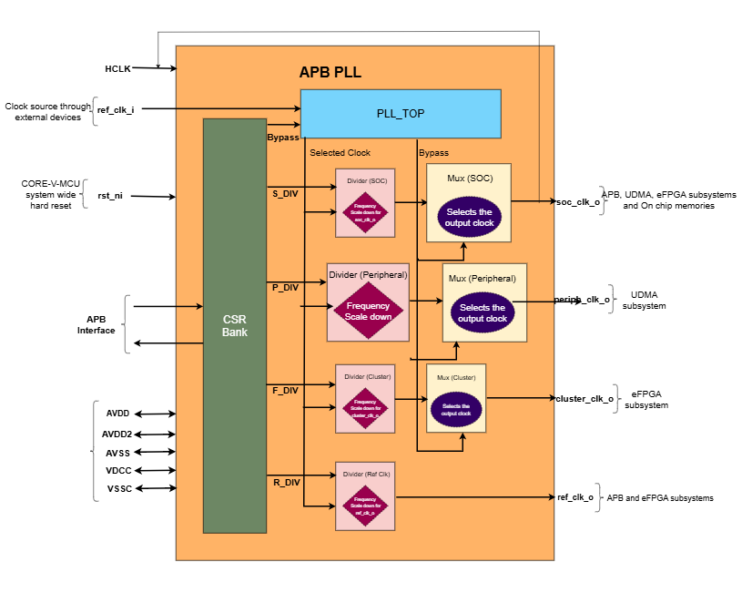

..
   Copyright (c) 2023 OpenHW Group
   Copyright (c) 2024 CircuitSutra

   SPDX-License-Identifier: Apache-2.0 WITH SHL-2.1

.. Level 1
   =======

   Level 2
   -------

   Level 3
   ~~~~~~~

   Level 4
   ^^^^^^^
.. _apb_fll_if:

APB PLL
=======

APB PLL generates four clock signals which can be configured independently for a unique output. 

Features
---------
-  Multiple output clock generation

   - SOC clock
   - Peripheral clock
   - Cluster clock
   - Reference clock 

-  Configurable divisor for each output clock

-  Configurable bypass mode

Architecture
------------

Block Diagram of APB PLL:

- The APB PLL consists of the following key components:
- APB control logic, APB PLL CSRs, PLL Top, 4 clock dividers and 3 multiplexers.

APB control logic
~~~~~~~~~~~~~~~~~
The APB control logic interfaces with the APB bus to decode and execute commands.
It handles CSR reads and writes according to the APB protocol, providing a standardized interface to the system.

APB PLL CSRs
~~~~~~~~~~~~

- APB PLL CSRs store the following configurations  

  - Peripheral divisor, eFPGA divisor, SOC divisor and Reference clock divisor.
  - Reset and Bypass. 
  - Mode, Lock, Power down, PLL divisor power down.
  - Feedback divisor and Output divisor.
  - PLL fractional part, PLL spread spectrum step and modulation frequency.

Introduction
^^^^^^^^^^^^^
- APB PLL module's main objective is to generate output clock signal based on the ref_clk_i provided.
- APB PLL has various submodules/components like PLL TOP, cascaded divider and mux for peripheral clock, cascaded divider and mux for soc clock, cascaded divider and mux for eFPGA clock.
- Timer controller manages all the other submodules through few control signals like active, controller reset and update.
- FW performs Initialization and drives various configuration CSR. 

PLL TOP 
^^^^^^^
- PLL TOP generats output clock which acts as the input to the cascaded divider and mux.
- PLL TOP takes BYPASS and ref_clk_i as input and process it accordingly
- When the BYPASS bitfield is '1' then output clock is driven by the ref_clk_i clock.
- When the BYPASS bitfield is '0' then output clock is driven by the time period of 2.5 times the unit of time.

Cascaded divider and mux 
^^^^^^^^^^^^^^^^^^^^^^^^^
- Cascaded divider and mux combinations are used to generate various clock signals for peripheral, soc and core domains. 
- Input signal from PLL TOP is provided to each of these 3 Cascaded divider and mux combinations to get 3 unique output clock siganls.
- Working of the cascaded divider and mux is same for all the 3 cases. 

Divider:
^^^^^^^^
- Divider reduces the clock frequency by the DIV value times the original frequency.
- Divider receives input from the PLL TOP and provides the output scaled down clock signal to the mux or multiplexer.
- For each divider, the frequency is reduced by the number of times mentioned in the DIV bitfield of respective register.
      
Multiplexer or Mux:
^^^^^^^^^^^^^^^^^^^
- Multiplexer selects the output signal to be generated for each domain depening on BYPASS bitfield of REG_CTL register.
- It takes two input clocks, One input clock is received from the divider and other input clock is ref_clk_i.
- When the BYPASS bitfield is '1' then output clock is driven by the ref_clk_i clock.
- When the BYPASS bitfield is '0' then output clock is driven by the clock received from the divider.

System Architecture:
--------------------

The figure below depicts the connections between the APB PLL and rest of the modules in Core-V-MCU:-

   APB PLL Core-V-MCU connections diagram

- The ref_clk_i is provided by the external devices through soc peripherals.
- This clock signal can be scaled using various CSR configurations.
- APB PLL generates various clock signals for the following 
   -  Peripheral domain
   -  Core domain (core, memories, event unit etc) 
   -  Cluster or the eFPGA domain
   -  Reference clock for all the above domains when they are bypassed.

Programmers View:
-----------------

Initial Configurations:
~~~~~~~~~~~~~~~~~~~~~~~
There are CSR bitfields in the APB PLL that are required to be configured before any operations are initiated. 

-  Peripheral divisor of APB PLL by configuring the P_DIV in PERIPH_DIV.
-  SOC divisor of APB PLL by configuring the S_DIV bitfields of SOC_DIV register.
-  eFPGA divisor of APB PLL by configuring the F_DIV bitfields of CLUSTER_DIV register.
-  reference divisor of APB PLL by configuring the R_DIV bitfields of REF_DIV register..
-  Mode selection of APB PLL by configuring the MODE in REG_CTL CSR.
-  Locked or unlocked by configuring the LOCK in in REG_CTL CSR.
-  Power down by configuring the PD in REG_CTL CSR.
-  Divisor Power down by configuring the PDDP in REG_CTL CSR.

Control configurations/operations:
~~~~~~~~~~~~~~~~~~~~~~~~~~~~~~~~~~~

There are CSR bitfields in the APB PLL which controls operations 

- set the BYPASS in REG_CTL so that APB_PLL can bypass the domain clock signals and provide reference clock as input.
- set the RESET in REG_CTL so that APB_PLL can be resetted.

Status configurations:
~~~~~~~~~~~~~~~~~~~~~~

The status of the clock ouputs are provided by the following pins

- soc_clk_o, periph_clk_o, cluster_clk_o and ref_clk_o pins are used to provide the status of APB PLL output clock signals.

APB FLL CSRs
------------

REG_CTL
~~~~~~~

- Address Offset = 0x00

+----------+------+-------+------------+---------------------------------+
|   Field  |   Bi |   T   |   Default  |           Description           |
|          | ts   | ype   |            |                                 |
+==========+======+=======+============+=================================+
| LOCK     | 31:31| R     |            | PLL Lock                        |
|          |      |       |            |                                 |
|          |      |       |            | 1= Locked,                      |
|          |      |       |            |                                 |
|          |      |       |            | 0= Unlocked                     |
+----------+------+-------+------------+---------------------------------+
| RSVD3    | 30:26| RW    | 0          | Reserved 3                      |
|          |      |       |            |                                 |
+----------+------+-------+------------+---------------------------------+
| PDDP     | 25:25| RW    | 1          | PLL Divisor Power Down          |
|          |      |       |            |                                 |
|          |      |       |            | 1=Power Down,                   |
|          |      |       |            |                                 |
|          |      |       |            | 0=Normal Operation              |
+----------+------+-------+------------+---------------------------------+
| PD       | 24:24| RW    | 1          | PLL Power Down                  |
|          |      |       |            |                                 |
|          |      |       |            | 1=Power Down,                   |
|          |      |       |            |                                 |
|          |      |       |            | 0=Normal Operation              |
+----------+------+-------+------------+---------------------------------+
| RSVD2    | 23:18| RW    | 0          | Reserved 2                      |
|          |      |       |            |                                 |
+----------+------+-------+------------+---------------------------------+
| MODE     | 17:16| RW    | 0          | MODE                            |
|          |      |       |            |                                 |
|          |      |       |            | 0=Normal,                       |
|          |      |       |            |                                 |
|          |      |       |            | 1=Fractional,                   |
|          |      |       |            |                                 |
|          |      |       |            | 2=SpreadSpectrum,               |
|          |      |       |            |                                 |
|          |      |       |            | 3=Reserved                      |
+----------+------+-------+------------+---------------------------------+
| RSVD1    | 15:14| RW    | 0          | Reserved 1                      |
|          |      |       |            |                                 |
+----------+------+-------+------------+---------------------------------+
| DM       | 13:8 | RW    | 1          | Reference Clock Divisor         |
|          |      |       |            |                                 |
+----------+------+-------+------------+---------------------------------+
| RSVD0    | 7:2  | RW    | 0          | Reserved 0                      |
|          |      |       |            |                                 |
+----------+------+-------+------------+---------------------------------+
| RESET    | 1:1  | RW    | 1          | PLL Reset                       |
|          |      |       |            |                                 |
|          |      |       |            | 1 = Reset                       |
|          |      |       |            |                                 |
|          |      |       |            | 0 = Normal Operation            |
+----------+------+-------+------------+---------------------------------+
| BYPASS   | 0:0  | RW    | 1          | PLL/Divisor Bypass, 1 = all     |
|          |      |       |            |                                 |
|          |      |       |            | 1 = all                         |
|          |      |       |            | clocks are Reference Clock      |
+----------+------+-------+------------+---------------------------------+

REG_DIV   
~~~~~~~

- Address Offset = 0x04

+-------+------+------+--------+-------------------------------------+
|   Fi  |   Bi |   Ty |   Def  |   Description                       |
| eld   | ts   | pe   | ault   |                                     |
+=======+======+======+========+=====================================+
| RSVD1 | 31:27| RW   | 0      | Reserved 1                          |
|       |      |      |        |                                     |
+-------+------+------+--------+-------------------------------------+
| DN    | 2    | RW   | 0xa0   | PLL Feedback Divisor (0xa0 = PLL at |
|       | 6:16 |      |        | 1.6GHz)                             |
+-------+------+------+--------+-------------------------------------+
| RSVD0 | 15:3 | RW   | 0      | Reserved 0                          |
|       |      |      |        |                                     |
+-------+------+------+--------+-------------------------------------+
| DP    | 2:0  | RW   | 0x4    | PLL Output Divisor (0x4 = 400MHz    |
|       |      |      |        | CLK0)                               |
+-------+------+------+--------+-------------------------------------+

REG_FRAC   
~~~~~~~~

- Address Offset = 0x08

+---------+-------+--------+------------+------------------------------+
|   F     |   B   |   T    |   Default  |   Description                |
| ield    | its   | ype    |            |                              |
+=========+=======+========+============+==============================+
| RSVD0   |31:24  | RW     | 0          | Reserved 0                   |
|         |       |        |            |                              |
+---------+-------+--------+------------+------------------------------+
| FRAC    | 23:0  | RW     | 0x00       | PLL Fractional part of DN    |
+---------+-------+--------+------------+------------------------------+

REG_SS1  
~~~~~~~

- Address Offset = 0x0C

+--------+-------+--------+----------+-------------------------------+
|   F    |   B   |        |   D      |   Description                 |
| ield   | its   | Type   | efault   |                               |
+========+=======+========+==========+===============================+
| RSVD0  | 31:11 | RW     | 0        | Reserved 0                    |
|        |       |        |          |                               |
+--------+-------+--------+----------+-------------------------------+
| SRATE  | 10:0  | RW     | 0x00     | PLL Spread Spectrum Triangle  |
|        |       |        |          | modulation Frequency          |
+--------+-------+--------+----------+-------------------------------+

REG_SS2  
~~~~~~~

- Address Offset = 0x10

+-----------+-------+-------+----------+------------------------------+
|   Field   |   B   |   T   |   D      |   Description                |
|           | its   | ype   | efault   |                              |
+===========+=======+=======+==========+==============================+
| RSVD0     |31:24  | RW    | 0        | Reserved 0                   |
|           |       |       |          |                              |
+-----------+-------+-------+----------+------------------------------+
| SSLOPE    | 23:0  | RW    | 0x00     | PLL Spread Spectrum Step     |
+-----------+-------+-------+----------+------------------------------+

REG_SOC  
~~~~~~~

- Address Offset = 0x14

+---------+-------+--------+-----------+------------------------------+
|         |   B   |        |           |   Description                |
| Field   | its   | Type   | Default   |                              |
+=========+=======+========+===========+==============================+
| RSVD0   |31:10  | RW     | 0         | Reserved 0                   |
|         |       |        |           |                              |
+---------+-------+--------+-----------+------------------------------+
| S_DIV   | 9:0   | RW     | 0x00      | SOC clock Divisor            |
+---------+-------+--------+-----------+------------------------------+

REG_PERIPH  
~~~~~~~~~~

- Address Offset = 0x18

+--------+------+-------+----------+---------------------------------+
|   F    |   Bi |   T   |   D      |   Description                   |
| ield   | ts   | ype   | efault   |                                 |
+========+======+=======+==========+=================================+
| RSVD0  |31:10 | RW    | 0        | Reserved 0                      |
|        |      |       |          |                                 |
+--------+------+-------+----------+---------------------------------+
| P_DIV  | 9:0  | RW    | 0x00     | Peripheral clock Divisor        |
+--------+------+-------+----------+---------------------------------+

REG_CLUSTER  
~~~~~~~~~~~

- Address Offset = 0x1C

+---------+------+--------+----------+-------------------------------+
|         |   Bi |        |   D      |   Description                 |
| Field   | ts   | Type   | efault   |                               |
+=========+======+========+==========+===============================+
| RSVD0   |31:10 | RW     | 0        | Reserved 0                    |
|         |      |        |          |                               |
+---------+------+--------+----------+-------------------------------+
| F_DIV   | 9:0  | RW     | 0x00     | FPGA clock Divisor            |
+---------+------+--------+----------+-------------------------------+

REG_REF  
~~~~~~~

- Address Offset = 0x20

+-------+------+-------+----------+----------------------------------+
|   Fi  |   Bi |   T   |   D      |   Description                    |
| eld   | ts   | ype   | efault   |                                  |
+=======+======+=======+==========+==================================+
| RSVD0 |31:10 | RW    | 0        | Reserved 0                       |
|       |      |       |          |                                  |
+-------+------+-------+----------+----------------------------------+
| R_DIV | 9:0  | RW    | 0x28     | Reference clock Divisor          |
|       |      |       |          | 0x28=250KHz Refclock             |
+-------+------+-------+----------+----------------------------------+

Firmware Guidelines
-------------------

Initialization:
~~~~~~~~~~~~~~~
- When the HRESETn signal is low, CSRs default to 0 and outputs are low.
- At every positive edge of the clock the CSR CSRs are updated based on APB signals.
- FW can update the below bitfields to any custom value before ref_clk_i is triggered. Otherwise, all the config values of CSRs to be updated to default.

  - The S_DIV bitfields of SOC_DIV register.

  - The F_DIV bitfields of CLUSTER_DIV register.

  - The P_DIV bitfields of PERIPH_DIV register.

  - The R_DIV bitfields of REF_DIV register.

Output clock generation of the APB_PLL:
~~~~~~~~~~~~~~~~~~~~~~~~~~~~~~~~~~~~~~~
- FW initialization is performed.
- ref_clk_i is triggered.
- FW can observe the following APB_PLL generated output clock signals:
   - soc_clk_o
   - periph_clk_o
   - cluster_clk_o
   - ref_clk_o

Bypass the domain clock signals:
~~~~~~~~~~~~~~~~~~~~~~~~~~~~~~~~
- FW initialization is performed.
- APB PLL is working to generate output clock signals by above method.
- if the BYPASS bitfield is set to '1' then all the domain output clock signals are driven by the ref_clk_i.

Reset the APB PLL:
~~~~~~~~~~~~~~~~~~
- FW initialization is performed.
- APB PLL is working to generate output clock signals by above method.
- APB PLL can be resetted in the following 3 ways:
   - RESET bitfield in the register REG_CTL is '1'
   - HRESETn pin is low.
   - rst_ni is low.
- Once the APB PLL is resetted then no output clocks are generated.

Pin Diagram
-----------

The figure below represents the input and output pins for the APB PLL:-

.. figure:: apb_pll_pin_diagram.png
   :name: APB_PLL_Pin_Diagram
   :align: center
   :alt:
   
   APB PLL Pin Diagram

Clock and Reset Signals
~~~~~~~~~~~~~~~~~~~~~~~
  - HCLK: System clock input
  - HRESETn: Active-low reset input

APB Interface Signals
~~~~~~~~~~~~~~~~~~~~~
  - PADDR[11:0]: APB address bus input
  - PSEL: APB peripheral select input
  - PENABLE: APB enable input
  - PWRITE: APB write control input (high for write, low for read)
  - PWDATA[31:0]: APB write data bus input
  - PREADY: APB ready output to indicate transfer completion
  - PRDATA[31:0]: APB read data bus output
  - PSLVERR: APB slave error

APB PLL Interface Signals
~~~~~~~~~~~~~~~~~~~~~~~~~~
  - ref_clk_i: Reference clock input
  - rst_ni: Reset the clock dividers and multiplexers
  - soc_clk_o: Output clock for the core soc domain
  - periph_clk_o: Output clock for the peripheral domain
  - cluster_clk_o: Output clock for the cluster/eFPGA domain
  - ref_clk_o: Output reference clock
  - AVDD: Bidirectional voltage AVDD
  - AVDD2: Bidirectional voltage AVDD2
  - AVSS: Bidirectional voltage AVSS
  - VDDC: Bidirectional voltage VDDC
  - VSSC: Bidirectional voltage VSSC 