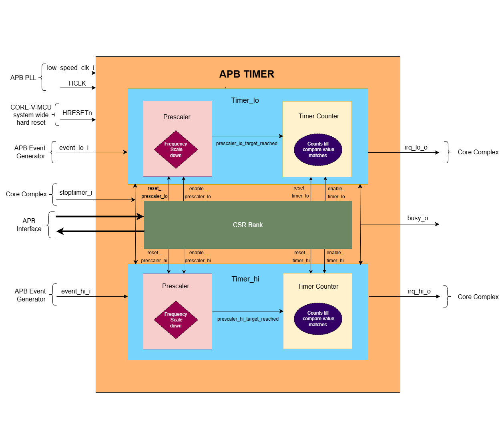

..
   Copyright (c) 2023 OpenHW Group
   Copyright (c) 2024 CircuitSutra

   SPDX-License-Identifier: Apache-2.0 WITH SHL-2.1

.. Level 1
   =======

   Level 2
   -------

   Level 3
   ~~~~~~~

   Level 4
   ^^^^^^^
.. _apb_timer:

APB Timer
=========

APB Timer primarily generates interrupts to the Core complex or CPU subsytem with a finite configurable delay. It manages the interrupt generation through various configurations of prescaler, reference clock and timer counters. 

Features
---------
-  Multiple trigger input sources

-  Two 32-bit configurable prescaler

-  Configurable interrupts

-  Support for two independent 32-bit timers or a single 64-bit timer

-  Supports one-shot and compare-clear modes.

-  Configurable control operations of timer: (Start, Stop and Reset)

Architecture
------------

The figure below is a high-level block Diagram of APB Timer:

APB Timer Components
~~~~~~~~~~~~~~~~~~~~~~

- The APB TIMER consists of the following key components: 
   - Control operations for 32 bit Timer: Generation of few control signals like reset and enable signals for two 32 bit timer (timer_lo and timer_hi)
   - Control operations for 64 bit Timer: Generation of few control signals like reset and enable signals for a 64 bit timer
   - Prescalers: Prescalers scales down the frequency with the PRESCALER_COUNT amount of times. prescaler_lo and prescaler_hi are supported.  
   - Timer Counters: 2 Timer counters  primarily generates the interrupt siganls irq_lo_o or irq_hi_o. It can be configured independently for 32 bit or in cascadded manner for 64 bit. 

Control operations for 32 bit Timer
~~~~~~~~~~~~~~~~~~~~~~~~~~~~~~~~~~~~~

- APB Timer generates few control signals(i.e reset, enable) to control the prescaler and timer sub modules.
- For timer_lo, the following signals like reset_prescaler_lo, enable_prescaler_lo, reset_timer_lo, enable_timer_lo are generated. 
- For timer_hi, the following signals like reset_prescaler_hi, enable_prescaler_hi, reset_timer_hi, enable_timer_hi are generated. 
- For 32-bit timer, timer_hi control signals are independent of timer_lo control signals. Let us understand how these signals are generated for 32- bit timer_lo:

reset_prescaler_lo:
^^^^^^^^^^^^^^^^^^^

- By default reset_prescaler_lo signal is set to '0'
- reset_prescaler_lo signal is set to '1': 

   - When PRESCALER_EN_BIT is set to '1' and prescaler_lo_target_reached is set '1'.
   - When the RESET_BIT in the CFG_REG_LO CSR is set to '1'.
   - When the RESET_LO in the TIMER_RESET_LO CSR is set to '1'. 

enable_prescaler_lo:
^^^^^^^^^^^^^^^^^^^^^

- By default, the enable_prescaler_lo will be '0'.
- if the REF_CLK_EN_BIT is set to '1', then the enable_prescaler_lo will be set to any value only at the positive edge of the reference clock 
- enable_prescaler_lo is set to '1':  

   - when PRESCALER_EN_BIT and ENABLE_BIT of CFG_REG_LO is '1' and stop_timer_i is '0'.

reset_timer_lo:
^^^^^^^^^^^^^^^^

- By default reset_timer_lo signal is set to '0'.
- reset_timer_lo signal is set to '1': 

   - When CMP_CLR_BIT is set to '1' and timer_lo_target_reached is set '1'. (i.e Compare clear mode is enabled)
   - When the RESET_BIT in the CFG_REG_LO CSR is set to '1'.
   - When the RESET_LO in the TIMER_RESET_LO CSR is set to '1'. 

enable_timer_lo:
^^^^^^^^^^^^^^^^

- By default the enable_timer_lo will be '0' and enable_timer_lo will be '0' when timer_lo_target_reached is set to '1'.
- if the REF_CLK_EN_BIT is set to '1', then the enable_timer_lo will be set to any value only at the positive edge of the reference clock.
- if event_lo_i signal is '1' and IEM_BIT of CFG_REG_LO is '1' then the ENABLE_BIT of CFG_REG_LO is set to '1'.
- if TIMER_START_LO is set to any value other than '0' then the ENABLE_BIT of CFG_REG_LO is set to '1'.
- enable_timer_lo is set to '1':

   - when ENABLE_BIT of CFG_REG_LO is '1' and stop_timer_i is '0' (If prescaler_lo is disabled).
   - when ENABLE_BIT of CFG_REG_LO and prescaler_lo_target_reached is '1' and stop_timer_i is '0' (If prescaler_lo is enabled).

Important Note:
^^^^^^^^^^^^^^^^

- The control signals for the 32-bit timer_hi are generated in the similar way as 32-bit timer_lo.

Control operations for 64 bit Timer
~~~~~~~~~~~~~~~~~~~~~~~~~~~~~~~~~~~~~
   
- Only 1 prescaler_lo is used and the control signals of prescaler are driven in the similar way of 32-bit timer.
- Both timer_hi and timer_lo are used in the cascadded fashion.
- enable_timer_lo, enable_prescaler_lo and reset_prescaler_lo are set in the similar way
   
reset_timer_lo:
^^^^^^^^^^^^^^^

- By default reset_timer_lo signal is set to '0' for every positive edge of the selected clock and if the below 3 conditions are not met.
- reset_timer_lo signal is set to '1': 

   - When CMP_CLR_BIT in the CFG_REG_LO CSR, timer_lo_target_reached and timer_hi_target_reached are set to '1'.
   - When the RESET_BIT in the CFG_REG_LO CSR is set to '1'.
   - When the RESET_LO in the TIMER_RESET_LO CSR is set to '1'. 
   
reset_timer_hi:
^^^^^^^^^^^^^^^^
- By default reset_timer_hi signal is set to '0' for every positive edge of the selected clock and if the below 3 conditions are not met.
- reset_timer_hi signal is set to '1': 
   - When CMP_CLR_BIT in the CFG_REG_LO CSR, timer_lo_target_reached and timer_hi_target_reached are set to '1'.
   - When the RESET_BIT in the CFG_REG_HI CSR is set to '1'.
   - When the RESET_HI in the TIMER_RESET_HI CSR is set to '1'.

enable_timer_hi:
^^^^^^^^^^^^^^^^
- By default the enable_timer_hi will be '0' and enable_timer_hi will be '0', when timer_lo_target_reached and timer_hi_target_reached is set to '1'.
- if the REF_CLK_EN_BIT is set to '1', then the enable_timer_hi will be set to any value only at the positive edge of the reference clock.
- if event_lo_i signal is '1' and IEM_BIT of CFG_REG_LO is '1' then the ENABLE_BIT of CFG_REG_LO is set to '1'.
- if TIMER_START_LO is set to any value other than '0' then the ENABLE_BIT of CFG_REG_LO is set to '1'.
- enable_timer_hi is set to '1':

   - when ENABLE_BIT of CFG_REG_LO is '1', counter value of timer_lo is 0xFFFFFFFF and stop_timer_i is '0' (If prescaler_lo is disabled).
   - when ENABLE_BIT of CFG_REG_LO and prescaler_lo_target_reached is '1', and counter value of timer_lo is 0xFFFFFFFF and stop_timer_i is '0' (If prescaler_lo is enabled).

Important Note:
^^^^^^^^^^^^^^^^

- For 32 bit or 64 bit mode, if the stop_timer_i is set to '1', then all the enable related control signals like  enable_prescaler_hi, enable_prescaler_lo, enable_timer_hi and enable_timer_lo are set to '0'.
- For 64 bit mode, if the MODE_MTIME_BIT is set to '1', then issue an interrupt irq_lo_o irrespective of whether the interrupt is enabled or disabled through the IRQ_BIT.

Prescaler
~~~~~~~~~
- Prescalers main objective is to scale down the frequency of the input clock with the PRESCALER_COUNT amount of times.
- Prescaler generates prescaler_lo_target_reached event after N number of clock cyles. where N is prescaler compare value.
- The operation is same for prescaler_lo and prescaler_hi in both the 32 bit and 64 bit mode. For explanation we have used prescaler_lo CSRs below.
- PRESCALER_COMP bitfield of CFG_REG_LO CSR, enable_prescaler_lo and reset_prescaler_lo are passed as inputs to the prescaler.
- Prescaler maintains a precaler counter whose initial value is '0'.
- For every positive edge of the HCLK clock, if enable_prescaler_lo is set to '1'

   - precaler counter is incremented by value '1' until it reaches the PRESCALER_COMP value.
   - Once the precaler counter reaches PRESCALER_COMP value and prescaler_lo_target_reached event is set to '1'.
   - Once the reset_prescaler_lo is set to '1', precaler counter and prescaler_lo_target_reached are resetted to '0'.
   - precaler counter starts incrementing and the same process repeats to generate multiple such events.

- If the enable_prescaler_lo is set to '0', then the prescaler will pause its operation. (i.e the prescaler counter will not be set to '0')

Timer Counter 
~~~~~~~~~~~~~
- Timer counter primarily generates the output interrupts irq_lo_o or irq_hi_o for the Core complex. 
- 32 bit Timer generates timer_lo_target_reached event after N number of clock cyles. where N is timer compare value.
- The operation is same for timer_lo and timer_hi in both the 32 bit and 64 bit mode. For explanation we have used timer_lo CSRs below.
- TIMER_CMP_LO, TIMER_VAL_LO, reset_timer_lo and enable_timer_lo are passed as inputs to the timer.
- Timer maintains a timer counter whose initial value is '0' and FW can overwrite/program this timer counter to any value by configuring TIMER_VAL_LO CSR. 
- For every positive edge of the HCLK clock, if enable_timer_lo set to '1'

   - timer counter is incremented by value '1' until it reaches the TIMER_CMP_LO value.
   - Once the timer counter reaches TIMER_CMP_LO value and timer_lo_target_reached event is set to '1'.
   - if the IRQ_BIT is set to '1', then the irq_lo_o interrupt will be asserted.
   - if one shot mode is enabled:
      - Once enable_timer_lo is set to '0', then the timer will pause its operation. (i.e the timer counter will not be set to '0')
   - if compare clear mode is enabled:
      - Once reset_timer_lo is set to '1', timer counter and timer_lo_target_reached are resetted to '0'.
      - timer counters starts incrementing and the same process repeats to generate multiple such events.

Working of APB Timer:
----------------------

- FW performs Initialization and drives various configuration CSR. 
- Once start is issued, Timer counts from initial value till it reaches the target value and generates an output interrupt.
- If the prescaler is also enabled, prescaler and timer works in the cascaded manner. when the prescaler_lo_target_reached is set to '1', Timer is enabled and the Timer Counter is incremented by '1'.
- Assuming Initial value of Timer Counter is '0'. then it will reach to N, if prescaler_lo_target_reached is issued N times by the prescaler.

Timer configurations based on datawidth:
~~~~~~~~~~~~~~~~~~~~~~~~~~~~~~~~~~~~~~~~~

32 bit timer:
^^^^^^^^^^^^^
- if the MODE_64_BIT is set to '0', It supports 32 bit timer_lo and 32 bit timer_hi. they can be configured parallelly at the same time.
- timer_lo which has a 32 bit prescaler and 32 bit counter which will have unique input_lo and irq_lo_o interrupt pins.
- timer_hi which has a 32 bit prescaler and 32 bit counter which will have unique input_hi and irq_hi_o interrupt pins.

64 bit timer:
^^^^^^^^^^^^^
- if the MODE_64_BIT is set to '1', It supports a single 64 bit timer.
- the 64 bit timer has a 32 bit prescaler_lo. 64 bit timer is managed by using both 32 bit timer_lo and 32 bit timer_hi.
- For all the FW configurations, The FW has to drive timer_lo related input_lo input pins and CSRs.
- The output interrupt will be issued on irq_lo_o pin.

Modes of Timer:
~~~~~~~~~~~~~~~

One shot mode:
^^^^^^^^^^^^^^^
   - For 32-bit timer, the timer will be disabled when the timer_lo counter reaches the TIMER_CMP_LO for the first time. Similar operation is done for the timer_hi.
   - For 64-bit timer, The timer will be disabled when the timer_lo counter reaches 0xFFFFFFFF and the timer_hi counter reaches TIMER_CMP_LO for the first time.

Compare clear mode:
^^^^^^^^^^^^^^^^^^^^

- 32 bit Timer: 
   - When the timer_lo counter reaches the TIMER_CMP_LO, the timer is not disbaled instead timer_lo counter will be reset to '0'. 
   - As the timer is still enabled, the timer_lo counter will be increement by '1' for every positive edge of the clock until it reaches the TIMER_CMP_LO.
   - The same process is repeated.
- 64 bit Timer: 
   - When the timer_lo counter reaches 0xFFFFFFFF and the timer_hi counter reaches target count, the timer is not disbaled instead timer_lo counter and timer_hi counter will be resetted to '0'. 
   - As the timer_lo and timer_hi are still enabled, the timer_lo counter will be increement by '1' for every positive edge of the clock until timer_lo counter reaches 0xFFFFFFFF and the timer_hi counter reaches TIMER_CMP_HI.
   - The same process is repeated. 

System Architecture:
--------------------

The figure below depicts the connections between the APB TIMER and rest of the modules in Core-V-MCU:-

.. figure:: apb_timer_soc_connections.png
   :name: APB Timer SoC Connections
   :align: center
   :alt:

   APB TIMER Core-V-MCU connections diagram

- The event_lo_i and event_hi_i input to the APB Timer is provided by APB_EVENT_GENERATOR. 
- APB Timer process this input signals based on the various CSR configurations.
- APB Timer generate few output event signals that are further passed as interrupts to the Core complex.
- APB Timer receives the input stop_timer_i from core complex that can stop the operations of APB TIMER.

Programmers View:
-----------------

Initial Configurations:
~~~~~~~~~~~~~~~~~~~~~~~
There are CSR bitfields in the APB timer that are required to be configured before any operations are initiated. 
As we have 2 Timer modules that can be configured individually. Each timer has to be configured with appropriate values.

-  Mode selection of 32 bit or 64 bit counters by configuring the MODE_64_BIT in CFG_REG_LO or CFG_REG_HI CSR.
-  Enable or disable the ref_clk by configuring the REF_CLK_EN_BIT in CFG_REG_LO or CFG_REG_HI CSR.
-  Enable or disable the prescaler by configuring the PRESCALER_EN_BIT in CFG_REG_LO or CFG_REG_HI CSR.
-  Prescaler compare value can configured by using the PRESCALER_COMP in CFG_REG_LO or CFG_REG_HI CSR.
-  One shot mode can be enabled or disbaled by configuring the ONE_SHOT_BIT in CFG_REG_LO or CFG_REG_HI CSR.
-  Compare clear mode can be enabled or disbaled by configuring the CMP_CLR_BIT in CFG_REG_LO or CFG_REG_HI CSR.
-  event input can be enabled or disbaled by configuring the IEM_BIT in CFG_REG_LO or CFG_REG_HI CSR.
-  Configure the MODE_MTIME_BIT bit so that in the 64 bit mode even if the IRQ_bit is not set an interrupt is being driven when the count == compare_value. Configure the MODE_MTIME_BIT in CFG_REG_LO or CFG_REG_HI CSR.
-  Overwriting the counter value directly via the by configuring the TIMER_VAL_LO or TIMER_VAL_HI CSR.
-  Initial counter value can be configured by using the TIMER_VAL_LO or TIMER_VAL_HI CSR.
-  Timer compare value can be configured by using the TIMER_CMP_LO or TIMER_CMP_HI CSR.
-  stop_timer_i is used to stop the counter operation of the both the timer_lo and timer_hi directly.

Control configurations/operations:
~~~~~~~~~~~~~~~~~~~~~~~~~~~~~~~~~~~

There are CSR bitfields in the APB advanced timer which controls operations of each of the timer module and its sub modules. 

- set the ENABLE_BIT in CFG_REG_LO or CFG_REG_HI CSR so that timer_lo or timer_hi can start counting. 
- set the START_LO or START_HI in TIMER_START_LO or TIMER_START_HI CSR respectively so that timer_lo or timer_hi can start counting. 
- set the RESET_BIT in CFG_REG_LO or CFG_REG_HI CSR so that timer_lo or timer_hi can be resetted.
- set the RESET_LO or RESET_HI in TIMER_RESET_LO or TIMER_RESET_HI CSR respectively so that timer_lo or timer_hi can be resetted.

Status configurations:
~~~~~~~~~~~~~~~~~~~~~~

The counter values of all the 4 Timers can be read via the following CSR bitfields in the APB advanced timer. 

- Use the TIMER_VAL_LO or TIMER_VAL_HI CSR for the current value of the timer_lo counter or timer_hi counter respectively.
- busy_o pin is used to provide the status of APB Timer will be driven high if anyone of the counter is enabled..

APB Timer CSRs
------------------

Refer to  `Memory Map <https://github.com/openhwgroup/core-v-mcu/blob/master/docs/doc-src/mmap.rst>`_ for the peripheral domain address of the SoC Controller.

NOTE: Several of the APB Timer CSRs are volatile, meaning that their read value may be changed by the hardware.
For example, writing the TIMER_VAL_LO CSR will set the initial counter value of timer_lo. A subsequent read will return the latest updated counter value of timer_lo. 
As the name suggests, the value of non-volatile CSRs is not changed by the hardware. These CSRs retain the last value written by the software.
A CSR's volatility is indicated by its "type".

Details of CSR access type are explained `here <https://docs.openhwgroup.org/projects/core-v-mcu/doc-src/mmap.html#csr-access-types>`_.

CFG_REG_LO 
~~~~~~~~~~ 

- Address Offset = 0x000
- Type: volatile

+------------------+-------+--------+---------+--------------------------------+
|     Field        | Bits  | Access | Default |         Description            |
+==================+=======+========+=========+================================+
| MODE_64_BIT      | 31:31 |   RW   |   0x0   | 1 = 64-bit mode, 0=32-bit mode |
+------------------+-------+--------+---------+--------------------------------+
| MODE_MTIME_BIT   | 30:30 |   RW   |   0x0   | 1=MTIME mode Changes interrupt |
|                  |       |        |         | to be >= CMP value             |
+------------------+-------+--------+---------+--------------------------------+
| PRESCALER_COMP   | 15:8  |   RW   |   0x0   | Prescaler compare value        |
+------------------+-------+--------+---------+--------------------------------+
| REF_CLK_EN_BIT   |  7:7  |   RW   |   0x0   | 1= use Refclk for counter,     |
|                  |       |        |         | 0 = use APB bus clk for counter|
+------------------+-------+--------+---------+--------------------------------+
| PRESCALER_EN_BIT |  6:6  |   RW   |   0x0   | 1= Use prescaler               |
|                  |       |        |         | 0= no prescaler                |
+------------------+-------+--------+---------+--------------------------------+
| ONE_SHOT_BIT     |  5:5  |   RW   |   0x0   | 1= disable timer when          |
|                  |       |        |         | counter == cmp value           |
+------------------+-------+--------+---------+--------------------------------+
| CMP_CLR_BIT      |  4:4  |   RW   |   0x0   | 1=counter is reset once        |
|                  |       |        |         | counter == cmp,                |
|                  |       |        |         | 0=counter is not reset         |
+------------------+-------+--------+---------+--------------------------------+
| IEM_BIT          |  3:3  |   RW   |   0x0   | 1 = event input is enabled     |
+------------------+-------+--------+---------+--------------------------------+
| IRQ_BIT          |  2:2  |   RW   |   0x0   | 1 = IRQ is enabled when        |
|                  |       |        |         | counter ==cmp value            |
+------------------+-------+--------+---------+--------------------------------+
| RESET_BIT        |  1:1  |   RW   |   0x0   | 1 = reset the counter          |
+------------------+-------+--------+---------+--------------------------------+
| ENABLE_BIT       |  0:0  |   RW   |   0x0   | 1 = enable the counter to count|
+------------------+-------+--------+---------+--------------------------------+

CFG_REG_HI 
~~~~~~~~~~ 

- Address Offset = 0x004
- Type: volatile

+------------------+-------+--------+---------+--------------------------------+
|     Field        | Bits  | Access | Default |         Description            |
+==================+=======+========+=========+================================+
| MODE_64_BIT      | 31:31 |   RW   |   0x0   | 1 = 64-bit mode, 0=32-bit mode |
+------------------+-------+--------+---------+--------------------------------+
| MODE_MTIME_BIT   | 30:30 |   RW   |   0x0   | 1=MTIME mode Changes interrupt |
|                  |       |        |         | to be >= CMP value             |
+------------------+-------+--------+---------+--------------------------------+
| PRESCALER_COMP   | 15:8  |   RW   |   0x0   | Prescaler compare value        |
+------------------+-------+--------+---------+--------------------------------+
| REF_CLK_EN_BIT   |  7:7  |   RW   |   0x0   | 1= use Refclk for counter,     |
|                  |       |        |         | 0 = use APB bus clk for counter|
+------------------+-------+--------+---------+--------------------------------+
| PRESCALER_EN_BIT |  6:6  |   RW   |   0x0   | 1= Use prescaler               |
|                  |       |        |         | 0= no prescaler                |
+------------------+-------+--------+---------+--------------------------------+
| ONE_SHOT_BIT     |  5:5  |   RW   |   0x0   | 1= disable timer when          |
|                  |       |        |         | counter == cmp value           |
+------------------+-------+--------+---------+--------------------------------+
| CMP_CLR_BIT      |  4:4  |   RW   |   0x0   | 1=counter is reset once        |
|                  |       |        |         | counter == cmp,                |
|                  |       |        |         | 0=counter is not reset         |
+------------------+-------+--------+---------+--------------------------------+
| IEM_BIT          |  3:3  |   RW   |   0x0   | 1 = event input is enabled     |
+------------------+-------+--------+---------+--------------------------------+
| IRQ_BIT          |  2:2  |   RW   |   0x0   | 1 = IRQ is enabled when        |
|                  |       |        |         | counter ==cmp value            |
+------------------+-------+--------+---------+--------------------------------+
| RESET_BIT        |  1:1  |   RW   |   0x0   | 1 = reset the counter          |
+------------------+-------+--------+---------+--------------------------------+
| ENABLE_BIT       |  0:0  |   RW   |   0x0   | 1 = enable the counter to count|
+------------------+-------+--------+---------+--------------------------------+

TIMER_VAL_LO 
~~~~~~~~~~~~ 

- Address Offset = 0x008
- Type: volatile

+-----------------+------+--------+---------+-----------------------------+
|     Field       | Bits | Access | Default |        Description          |
+=================+======+========+=========+=============================+
| TIMER_VAL_LO    | 31:0 |   RW   |   0x0   | 32-bit counter value - low  |
|                 |      |        |         | 32-bits in 64-bit mode      |
+-----------------+------+--------+---------+-----------------------------+

TIMER_VAL_HI 
~~~~~~~~~~~~ 

- Address Offset = 0x00C
- Type: volatile

+-----------------+------+--------+---------+-----------------------------+
|     Field       | Bits | Access | Default |        Description          |
+=================+======+========+=========+=============================+
| TIMER_VAL_HI    | 31:0 |   RW   |   0x0   | 32-bit counter value - high |
|                 |      |        |         | 32-bits in 64-bit mode      |
+-----------------+------+--------+---------+-----------------------------+

TIMER_CMP_LO 
~~~~~~~~~~~~ 

- Address Offset = 0x010
- Type: non-volatile

+-----------------+------+--------+---------+-----------------------------+
|     Field       | Bits | Access | Default |        Description          |
+=================+======+========+=========+=============================+
| TIMER_CMP_LO    | 31:0 |   RW   |   0x0   | compare value for low       |
|                 |      |        |         | 32-bit counter              |
+-----------------+------+--------+---------+-----------------------------+

TIMER_CMP_HI 
~~~~~~~~~~~~ 

- Address Offset = 0x014
- Type: non-volatile

+-----------------+------+--------+---------+-----------------------------+
|     Field       | Bits | Access | Default |        Description          |
+=================+======+========+=========+=============================+
| TIMER_CMP_HI    | 31:0 |   RW   |   0x0   | compare value for high      |
|                 |      |        |         | 32-bit counter              |
+-----------------+------+--------+---------+-----------------------------+

TIMER_START_LO 
~~~~~~~~~~~~~~ 

- Address Offset = 0x018
- Type: non-volatile

+-----------------+------+--------+---------+-----------------------------+
|     Field       | Bits | Access | Default |        Description          |
+=================+======+========+=========+=============================+
| START_LO        | 31:0 |  WS    |   0x0   | Write strobe address for    |
|                 |      |        |         | starting low counter        |
+-----------------+------+--------+---------+-----------------------------+

TIMER_START_HI 
~~~~~~~~~~~~~~ 

- Address Offset = 0x01C
- Type: non-volatile

+-----------------+------+--------+---------+-----------------------------+
|     Field       | Bits | Access | Default |        Description          |
+=================+======+========+=========+=============================+
| START_HI        | 31:0 |  WS    |   0x0   | Write strobe address for    |
|                 |      |        |         | starting high counter       |
+-----------------+------+--------+---------+-----------------------------+

TIMER_RESET_LO 
~~~~~~~~~~~~~~ 

- Address Offset = 0x020
- Type: non-volatile

+-----------------+------+--------+---------+-----------------------------+
|     Field       | Bits | Access | Default |        Description          |
+=================+======+========+=========+=============================+
| RESET_LO        | 31:0 |  WS    |   0x0   | Write strobe address for    |
|                 |      |        |         | resetting the low counter   |
+-----------------+------+--------+---------+-----------------------------+

TIMER_RESET_HI 
~~~~~~~~~~~~~~ 

- Address Offset = 0x024
- Type: non-volatile

+-----------------+------+--------+---------+-----------------------------+
|     Field       | Bits | Access | Default |        Description          |
+=================+======+========+=========+=============================+
| RESET_HI        | 31:0 |  WS    |   0x0   | Write strobe address for    |
|                 |      |        |         | resetting the high counter  |
+-----------------+------+--------+---------+-----------------------------+

Firmware Guidelines
-------------------

Initialization:
~~~~~~~~~~~~~~~
- When the HRESETn signal is low, CSRs default to 0 and outputs are low.
- At every positive edge of the clock the CSR CSRs are updated based on APB signals.
- FW can update the below bitfields to any custom value before START bitfield in the REG_TIM[0-3]_CMD CSR is set to '1' and the timer is not active yet (which means the timer is started for the first time). Otherwise, all the config values of all sub-modules are commanded to be updated to default .

Initializing the Prescaler:
^^^^^^^^^^^^^^^^^^^^^^^^^^^^^^^

  - By default precalers are disabled, set PRESCALER_EN_BIT bitfield of CFG_REG_LO or CFG_REG_HI CSRs to enable the prescaler_lo or prescaler_hi respectively. 

  - If the Prescalers are enabled, Write to the PRESCALER_COUNT bitfield of CFG_REG_LO or CFG_REG_HI CSRs to specify the compare value for the prescaler_lo or prescaler_hi respectively. 

Initializing the Timer counter:
^^^^^^^^^^^^^^^^^^^^^^^^^^^^^^^^^^^^

  - Write to CSRs TIMER_VAL_LO and TIMER_VAL_HI to specify the initial counter value for timer_lo or timer_hi respectively. 

  - Write to CSRs TIMER_CMP_LO and TIMER_CMP_HI to specify the compare count for timer_lo or timer_hi respectively. 

  - Write '1' to either ONE_SHOT_BIT bitfield or CMP_CLR_BIT bitfield of CFG_REG_LO or CFG_REG_HI CSRs to select the mode for timer_lo or timer_hi respectively. 

  - By default interrupts are disabled, set IRQ_BIT bitfield of CFG_REG_LO or CFG_REG_HI CSRs to enable the interrupts irq_lo_o or irq_hi_o for timer_lo or timer_hi respectively. 

  - By default input events are disabled, set IEM_BIT bitfield of CFG_REG_LO or CFG_REG_HI CSRs to enable the input events event_lo_i or event_hi_i for timer_lo or timer_hi respectively. 

  - By default reference clock is disabled, set REF_CLK_EN_BIT bitfield of CFG_REG_LO or CFG_REG_HI CSRs to enable the reference clocks for timer_lo or timer_hi respectively. 

  - By default 64 bit mode is disabled and 32 bit mode is enabled, set MODE_64_BIT bitfield of CFG_REG_LO  CSR to enable the 64 bit mode. 

  - set MODE_MTIME_BIT bitfield of CFG_REG_LO or CFG_REG_HI CSRs to generate interrupt irq_lo_o for 64 bit timer irrespective of whether the interrupt is enabled or disabled through the IRQ_BIT.

Start the timer:
~~~~~~~~~~~~~~~~
- FW initialization is performed.
- stop_timer_i should be set to '0'.
- Timer can be started in the following 3 ways:
   - when ENABLE_BIT of CFG_REG_LO or CFG_REG_HI is '1'.
   - when event_lo_i or event_hi_i signal is '1' and IEM_BIT of CFG_REG_LO or CFG_REG_HI is '1'.
   - when TIMER_START_LO or TIMER_START_HI is set to any value other than '0'.
- Once the timer is started FW can observe the counter value getting incremented in the TIMER_VAL_LO or TIMER_VAL_HI CSR.

Stop the timer:
~~~~~~~~~~~~~~~~
- FW initialization is performed.
- Timer is started by above method.
- Timer can be stopped in the following 2 ways:
   - when ENABLE_BIT of CFG_REG_LO or CFG_REG_HI is '0'.
   - when stop_timer_i is set to '0'.
- Once the timer is stopped FW can observe the counter value remain the same in the TIMER_VAL_LO or TIMER_VAL_HI CSR.

Reset the timer:
~~~~~~~~~~~~~~~~
- FW initialization is performed.
- Timer is started by above method.
- Timer can be resetted in the following 2 ways:
   - When the RESET_BIT in the CFG_REG_LO or CFG_REG_HI CSR is set to '1'.
   - When the RESET_LO in the TIMER_RESET_LO or TIMER_RESET_HI CSR is set to '1'.
- Once the timer is stopped FW can observe the counter value resetted to '0' in the TIMER_VAL_LO or TIMER_VAL_HI CSR.

Interrupt generation:
~~~~~~~~~~~~~~~~~~~~~
- FW initialization is performed.
- IRQ_BIT is set to '1' in the CFG_REG_LO or CFG_REG_HI CSR
- Timer is started by above method.
- irq_lo_o or irq_hi_o is set to '1' when the counter value of timer_lo or timer_hi reaches the TIMER_CMP_LO or TIMER_CMP_HI.

Pin Diagram
-----------

The figure below represents the input and output pins for the APB Timer:-

.. figure:: apb_timer_pin_diagram.png
   :name: APB_Timer_Pin_Diagram
   :align: center
   :alt:
   
   APB Timer Pin Diagram

Clock and Reset
~~~~~~~~~~~~~~~
  - HCLK: System clock input
  - HRESETn: Active-low reset input
  - low_speed_clk_i: Reference clock input

APB Interface
~~~~~~~~~~~~~
  - PADDR[11:0]: APB address bus input
  - PSEL: APB peripheral select input
  - PENABLE: APB enable input
  - PWRITE: APB write control input (high for write, low for read)
  - PWDATA[31:0]: APB write data bus input
  - PREADY: APB ready output to indicate transfer completion
  - PRDATA[31:0]: APB read data bus output
  - PSLVERR: APB slave error

APB Event generator Interface
~~~~~~~~~~~~~~~~~~~~~~~~~~~~~~
  - event_lo_i: Input event for the timer_lo
  - event_hi_i: Input event for the timer_hi

Core Complex Interface
~~~~~~~~~~~~~~~~~~~~~~
  - stop_timer_i: Input signal to stop timer
  - irq_lo_o: Output interrupt from timer_lo
  - irq_hi_o: Output interrupt from timer_hi
  - busy_o: Output busy signal that signifies that any one of the timer is active