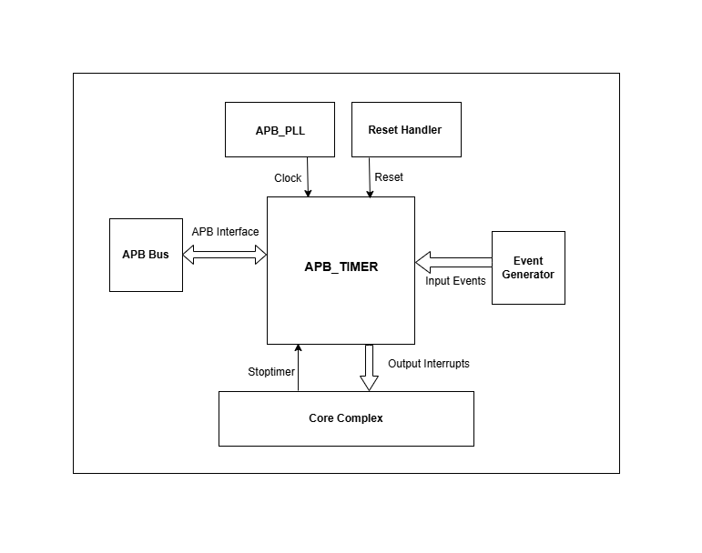

..
   Copyright (c) 2023 OpenHW Group
   Copyright (c) 2024 CircuitSutra

   SPDX-License-Identifier: Apache-2.0 WITH SHL-2.1

.. Level 1
   =======

   Level 2
   -------

   Level 3
   ~~~~~~~

   Level 4
   ^^^^^^^
.. _apb_timer:

APB Timer
=========

APB Timer supports two 32 bit Timer or one 64 bit Timer. Core-V-MCU can configure the APB_Timer to genrate output interrupts after N number of clock cyles.

Features
---------
-  Multiple trigger input sources

-  Configurable 32 bit or 64 bit timer

-  Two 32 bit configurable prescaler

-  Configurable input trigger modes

-  Configurable clock gating for each timer

Architecture
------------

Block Diagram of APB_Timer:

.. image:: apb_timer_image.png
   :width: 5in
   :height: 2.38889in

- The APB TIMER consists of the following key components:
- APB control logic, APB TIMER CSRs, 2 Prescalers and 2 Timers.
- A 64 bit Timer can be configured that generates a single output interrupt or 2 Independent 32 bit Timers can be configured to generate 2 independent output interrupts.

APB control logic
~~~~~~~~~~~~~~~~~
The APB control logic interfaces with the APB bus to decode and execute commands.
It handles register reads and writes according to the APB protocol, providing a standardized interface to the system.

APB TIMER CSRs
~~~~~~~~~~~~~~~

- APB TIMER registers store the configuration for each 32 bit Timer so that both the timers can work independently 

  - Mode 64-bit enable, Prescalar count. 
  - Reference clock enable and Prescalar enable.
  - One shot mode and Compare clear mode.
  - Event input enable and Interrupt enable. 
  - Reset and Enable. 

Inroduction
~~~~~~~~~~~~
- APB Timer has two submodules/components that is Prescaler and Timer.
- FW performs Initialization and drives various configuration register. 
- Once start is issued, Timer counts from initial value till it reaches the target value and generates an output interrupt.
- If the prescaler is also enabled, prescaler and timer works in the cascaded manner. 
- Only when the prescaler prescaler_target_reached is set to '1', Timer is enabled and the Timer Counter is increemented by '1'.
- Assusming Initial value of Timer Counter is '0'. then it will reach to N, if prescaler_target_reached is issued N times by the prescaler.

APB Timer Operations:
~~~~~~~~~~~~~~~~~~~~~

Configurable datawidth of the Timer:
^^^^^^^^^^^^^^^^^^^^^^^^^^^^^^^^^^^^
- 32 bit timer:

   - if the MODE_64_BIT is set to '0', It supports 32 bit timer_low and 32 bit timer_high. they can be configured parallelly at the same time.
   - timer low which has a 32 bit prescaler and 32 bit counter which will have unique input_lo and output_lo interrupt pins.
   - timer high which has a 32 bit prescaler and 32 bit counter which will have unique input_hi and output_hi interrupt pins.

- 64 bit timer:

   - if the MODE_64_BIT is set to '1', It supports a single 64 bit timer.
   - the 64 bit timer has a 32 bit prescaler and 64 bit counter. The FW has to drive low timer related input pins and registers.
   - The output interrupt will be driven in the dedicated pins for timer low.

Modes of Timer:
^^^^^^^^^^^^^^^
- One shot mode:

   - For 32-bit timer, the timer will be disabled when the timer low count reaches the target count for the first time. Similar operation is done for the timer high.
   - For 64-bit timer, The timer will be disabled when the timer low count reaches 0xFFFFFFFF and the timer high count reaches target count for the first time.

- Compare clear mode:

   - 32 bit Timer: 
      - When the the timer count reaches the target count, the timer is not disbaled instead timer count will be reset to '0'. 
      - As the timer is still enabled, the timer count will be increement by '1' for every positive edge of the clock until it reaches the target count.
      - The same process is repeated.
   - 64 bit Timer: 
      - When the timer low count reaches 0xFFFFFFFF and the timer high count reaches target count, the timer is not disbaled instead timer low count and timer high count will be resetted to '0'. 
      - As the timer low and timer high are still enabled, the timer low count will be increement by '1' for every positive edge of the clock until timer low count reaches 0xFFFFFFFF and the timer high count reaches target count.
      - The same process is repeated.  

Control signal for Timer:
^^^^^^^^^^^^^^^^^^^^^^^^^^
- APB Timer generates control signals like reset_prescaler, enable_prescaler, reset_timer, enable_timer. 

Prescaler
~~~~~~~~~

- PRESCALER_COUNT and PRESCALER_EN_BIT are parsed to the prescaler.
- if the ENABLE_BIT and PRESCALER_EN_BIT are set to '1' then Prescaler starts its operation.
- Prescaler maintains a precaler counter whose initial value is '0'. 
- if the REF_CLK_EN_BIT is set to '1', then reference clock will be selected else Hclk will be selected.
- For every positive edge of the selected clock, if PRESCALER_EN_BIT set to '1'

   - precaler counter is incremented by value '1' until it reaches the PRESCALER_COUNT value.
   - Once the precaler counter reaches PRESCALER_COUNT value and prescaler_target_reached event is set to '1' for one clock cycle.
   - After one clock cycle, the precaler counter is resetted to 0 and prescaler_target_reached event is set to '0'.
   - Counters starts incrementing and the same process repeats to generate multiple such events.

- If the RESET_BIT is set to '1' then precaler counter is resetted to '0'.
- If active low reset HRESETN is set to '0', then precaler counter and prescaler_target_reached event is resetted to '0'.
- If the active low Stoptimer_i is set to '0', then the prescaler will pause its operation. (i.e the prescaler counter will not be set to '0')

Timer 
~~~~~
- TIMER_VAL_LO and ENABLE_BIT are parsed to the timer.
- Prescaler maintains a precaler counter whose initial value is '0'. 
- if the REF_CLK_EN_BIT is set to '1', then reference clock will be selected else Hclk will be selected.
- For every positive edge of the selected clock, if PRESCALER_EN_BIT set to '1'

   - if the ENABLE_BIT and PRESCALER_EN_BIT are set to '1' then Prescaler starts its operation.
   - precaler counter is incremented by value '1' until it reaches the PRESCALER_COUNT value.
   - Once the precaler counter reaches PRESCALER_COUNT value and prescaler_target_reached event is set to '1' for one clock cycle.
   - After one clock cycle, the precaler counter is resetted to 0 and prescaler_target_reached event is set to '0'.
   - Counters starts incrementing and the same process repeats to generate multiple such events.

- If the RESET_BIT is set to '1' then precaler counter is resetted to '0'.
- If active low reset HRESETN is set to '0', then precaler counter and prescaler_target_reached event is resetted to '0'.
- If the active low Stoptimer_i is set to '0', then the prescaler will pause its operation. (i.e the prescaler counter will not be set to '0')

Assuming there is no initial count configured for the counter, basic
operations of the timer are explained. The following four combinations
can be run in both 32 bit mode and 64 bit mode.

**Timer operation with both Prescaler and ref_clk disabled:**

-  Timer module directly enables the counter to start incrementing the count for every positive edge of Hclk clock from '0' till it reaches the compare value. When the count reaches the target compare value the timer value drives the output interrupt pins if its enabled.

**Timer operation with Prescaler disabled and ref_clk enabled:**

-  Timer modules wait until the reference clock's edge is detected and then enable the counter to start incrementing the count for every positive edge of the reference clock from '0' till it reaches the compare value. When the count reaches the target compare value the timer value drives the output interrupt pins if its enabled.

**Timer operation with Prescaler enabled and ref_clk disabled:**

-  Timer module will enable the prescaler and counter in the cascaded manner that is once the prescaler target is achieved the counter will start. The prescaler will be configured and once the target compare value of the prescaler is reached then the counter will start incrementing the count for every positive edge of Hclk clock from '0' till it reaches the compare value. When the count reaches the target compare value the timer value drives the output interrupt pins if its enabled.

**Timer operation with Prescaler enabled and ref_clk enabled:**

-  Timer will enable the prescaler and counter in the cascaded manner that is once the prescaler target is achieved and reference clock's edge is detected the counter will start. The prescaler will be configured and once the target compare value of the prescaler is reached then the counter will start incrementing the count for every positive edge of the reference clock from '0' till it reaches the compare value. When the count reaches the target compare value the timer value drives the output interrupt pins if its enabled.

**Programming Model**
---------------------

**Various features enabled in the APB_TIMER:**

-  Mode selection of 32 bit or 64 bit counters by configuring the MODE_64_BIT in CFG_REG_LO or CFG_REG_HI register.

-  Reset the counter value by configuring the RESET_BIT in CFG_REG_LO or CFG_REG_HI register.

-  Enable or disable the ref_clk by configuring the REF_CLK_EN_BIT in CFG_REG_LO or CFG_REG_HI register.

-  Enable or disable the prescaler by configuring the PRESCALER_BIT in CFG_REG_LO or CFG_REG_HI register.

-  Enable or disable the counter to start the counting by configuring the ENABLE_BIT in CFG_REG_LO or CFG_REG_HI register.

-  Configure the Mode_mtime bit so that in the 64 bit mode even if the IRQ_bit is not set an interrupt is being driven when the count == compare_value. Configure the MODE_MTIME_BIT in CFG_REG_LO or CFG_REG_HI register.

-  Stoptimer_i pin is used to stop the counter operation of the timer module directly.

-  busy_o pin is used to provide will be driven high if anyone of the counter is enabled.

-  Overwriting the counter value directly via the by configuring the TIMER_VAL_LO or TIMER_VAL_HI register.

-  Initial counter value can be configured to start the timer counter value by configuring the TIMER_VAL_LO or TIMER_VAL_HI register

System Architecture:
--------------------

The figure below depicts the connections between the APB TIMER and rest of the modules in Core-V-MCU:-

   APB TIMER Core-V-MCU connections diagram

- The event_lo_i and event_hi_i input to the APB_TIMER is provided by APB_EVENT_GENERATOR. 
- APB_TIMER process this input signals based on the various CSR configurations.
- APB_TIMER generate few output event signals that are further parsed as interrupts to the Core complex.
- APB_TIMER receives the input stop_timer_i from Core complex that can stop the operations of APB TIMER.

Programmers View:
-----------------
APB_TIMER has 4 Timers and below programming model is followed:  

Initial Configurations:
~~~~~~~~~~~~~~~~~~~~~~~
There are CSR bitfields in the APB advanced timer that are required to be configured before any operations are initiated. 

Timer module specific configurations:
^^^^^^^^^^^^^^^^^^^^^^^^^^^^^^^^^^^^^

As we have 4 Timer modules. Each timer has to be configured with appropriate values.

- Configure input clock source using CLKSEL bitfield in the REG_TIM[0-3]_CFG.
- Configure input trigger mode using MODE bitfield in the REG_TIM[0-3]_CFG.
- Configure which input has to selected using INSEL bitfield in the REG_TIM[0-3]_CFG.
- Configure prescaler value for scaling down the frequency using PRESC bitfield in the REG_TIM[0-3]_CFG.
- Configure sawtooth mode through which the updown down counter operates using SAWTOOTH bitfield in the REG_TIM[0-3]_CFG.
- Configure updown counter start value and end value using COUNT_START and COUNT_END bitfield respectively in the REG_TIM[0-3]_TH.
- Configure comparator 0 operation and comparator 0 threshold using COMP_OP and COMP_THRESHOLD bitfield respectively in the REG_TIM[0-3]_CH0_TH.
- Configure comparator 1 operation and comparator 1 threshold using COMP_OP and COMP_THRESHOLD bitfield respectively in the REG_TIM[0-3]_CH1_TH.
- Configure comparator 2 operation and comparator 2 threshold using COMP_OP and COMP_THRESHOLD bitfield respectively in the REG_TIM[0-3]_CH2_TH.
- Configure comparator 3 operation and comparator 3 threshold using COMP_OP and COMP_THRESHOLD bitfield respectively in the REG_TIM[0-3]_CH3_TH.

Common configurations:
^^^^^^^^^^^^^^^^^^^^^^

These configurations are common for 4 TIMERs. Typically these are used to enable or disbale output events, clock for TIMERs and select the output events from a group of 16 PWM events.  

- Configure output select event enable that controls to enable or disable any of the 4 bit output events_o using OUT_SEL_EVT_ENABLE bitfield in the REG_EVENT_CFG.
- Configure output event 0 select value which is used to select an event from 16 bit PWM output using using OUT_SEL_EVT0 bitfield in the REG_EVENT_CFG.
- Configure output event 1 select value which is used to select an event from 16 bit PWM output using using OUT_SEL_EVT1 bitfield in the REG_EVENT_CFG.
- Configure output event 2 select value which is used to select an event from 16 bit PWM output using using OUT_SEL_EVT2 bitfield in the REG_EVENT_CFG.
- Configure output event 3 select value which is used to select an event from 16 bit PWM output using using OUT_SEL_EVT3 bitfield in the REG_EVENT_CFG.
- Enable or disable clocks for each TIMER using using CLK_ENABLE bitfield in the REG_CH_EN.

Control configurations/operations:
~~~~~~~~~~~~~~~~~~~~~~~~~~~~~~~~~~~

There are CSR bitfields in the APB advanced timer which controls operations of each of the timer module and its sub modules. 

- set the START bitfield in the REG_TIM[0-3]_CMD to start the Timer and its sub modules input stage, prescaler, updown counter and comparators.
- set the STOP bitfield in the REG_TIM[0-3]_CMD to stop/halt/pause the the Timer and its sub modules input stage, prescaler, updown counter and comparators.
- set the UPDATE bitfield in the REG_TIM[0-3]_CMD to Re-Initialization with the latest CSRs of the the Timer and its sub modules input stage, prescaler, updown counter and comparators.
- set the RESET bitfield in the REG_TIM[0-3]_CMD to Reset the the Timer and its sub modules input stage, prescaler, updown counter and comparators.
- set the ARM bitfield in the REG_TIM[0-3]_CMD to modify the inputs in the input stage.

Status configurations:
~~~~~~~~~~~~~~~~~~~~~~

The counter values of all the 4 Timers can be read via the following CSR bitfields in the APB advanced timer. 

- Use the T[0-3]_COUNTER bitfields in the respective REG_TIM[0-3]_COUNTER to read the values of counter maintained by updowncounter for each of the Timer.

**APB Timer CSRs**
------------------

**CFG_REG_LO offset = 0x000**

+-------------+-------+------+---------+-------------------------------------+
|   Field     | Bits  | Type | Default |            Description              |
+=============+=======+======+=========+=====================================+
| MODE_64_BIT | 31:31 |  RW  |         | 1 = 64-bit mode, 0=32-bit mode      |
+-------------+-------+------+---------+-------------------------------------+
| MOD         | 30:30 |  RW  |         | 1=MTIME mode Changes interrupt to   |
| E_MTIME_BIT |       |      |         | be >= CMP value                     |
+-------------+-------+------+---------+-------------------------------------+
| PRES        | 15:8  |  RW  |         | Prescaler divisor                   |
| CALER_COUNT |       |      |         |                                     |
+-------------+-------+------+---------+-------------------------------------+
| REF         |  7:7  |  RW  |         | 1= use Refclk for counter,          |
| _CLK_EN_BIT |       |      |         | 0 = use APB bus clk for counter     |
+-------------+-------+------+---------+-------------------------------------+
| PRESC       |  6:6  |  RW  |         | 1= Use prescaler                    |
| ALER_EN_BIT |       |      |         | 0= no prescaler                     |
+-------------+-------+------+---------+-------------------------------------+
| O           |  5:5  |  RW  |         | 1= disable timer when counter ==    |
| NE_SHOT_BIT |       |      |         | cmp value                           |
+-------------+-------+------+---------+-------------------------------------+
| CMP_CLR_BIT |  4:4  |  RW  |         | 1=counter is reset once             |
|             |       |      |         | counter == cmp,                     |
|             |       |      |         | 0=counter is not reset              |
+-------------+-------+------+---------+-------------------------------------+
| IEM_BIT     |  3:3  |  RW  |         | 1 = event input is enabled          |
+-------------+-------+------+---------+-------------------------------------+
| IRQ_BIT     |  2:2  |  RW  |         | 1 = IRQ is enabled when counter     |
|             |       |      |         | ==cmp value                         |
+-------------+-------+------+---------+-------------------------------------+
| RESET_BIT   |  1:1  |  RW  |         | 1 = reset the counter               |
+-------------+-------+------+---------+-------------------------------------+
| ENABLE_BIT  |  0:0  |  RW  |         | 1 = enable the counter to count     |
+-------------+-------+------+---------+-------------------------------------+

**CFG_REG_HI offset = 0x004**

+------------------+-------+------+---------+--------------------------------+
|     Field        | Bits  | Type | Default |         Description            |
+==================+=======+======+=========+================================+
| MODE_64_BIT      | 31:31 |  RW  |         | 1 = 64-bit mode, 0=32-bit mode |
+------------------+-------+------+---------+--------------------------------+
| MODE_MTIME_BIT   | 30:30 |  RW  |         | 1=MTIME mode Changes interrupt |
|                  |       |      |         | to be >= CMP value             |
+------------------+-------+------+---------+--------------------------------+
| PRESCALER_COUNT  | 15:8  |  RW  |         | Prescaler divisor              |
+------------------+-------+------+---------+--------------------------------+
| REF_CLK_EN_BIT   |  7:7  |  RW  |         | 1= use Refclk for counter,     |
|                  |       |      |         | 0 = use APB bus clk for counter|
+------------------+-------+------+---------+--------------------------------+
| PRESCALER_EN_BIT |  6:6  |  RW  |         | 1= Use prescaler               |
|                  |       |      |         | 0= no prescaler                |
+------------------+-------+------+---------+--------------------------------+
| ONE_SHOT_BIT     |  5:5  |  RW  |         | 1= disable timer when          |
|                  |       |      |         | counter == cmp value           |
+------------------+-------+------+---------+--------------------------------+
| CMP_CLR_BIT      |  4:4  |  RW  |         | 1=counter is reset once        |
|                  |       |      |         | counter == cmp,                |
|                  |       |      |         | 0=counter is not reset         |
+------------------+-------+------+---------+--------------------------------+
| IEM_BIT          |  3:3  |  RW  |         | 1 = event input is enabled     |
+------------------+-------+------+---------+--------------------------------+
| IRQ_BIT          |  2:2  |  RW  |         | 1 = IRQ is enabled when        |
|                  |       |      |         | counter ==cmp value            |
+------------------+-------+------+---------+--------------------------------+
| RESET_BIT        |  1:1  |  RW  |         | 1 = reset the counter          |
+------------------+-------+------+---------+--------------------------------+
| ENABLE_BIT       |  0:0  |  RW  |         | 1 = enable the counter to count|
+------------------+-------+------+---------+--------------------------------+

**TIMER_VAL_LO offset = 0x008**

+-----------------+------+------+---------+-----------------------------+
|     Field       | Bits | Type | Default |        Description          |
+=================+======+======+=========+=============================+
| TIMER_VAL_LO    | 31:0 |  RW  |   0x0   | 32-bit counter value - low  |
|                 |      |      |         | 32-bits in 64-bit mode      |
+-----------------+------+------+---------+-----------------------------+

**TIMER_VAL_HI offset = 0x00C**

+-----------------+------+------+---------+-----------------------------+
|     Field       | Bits | Type | Default |        Description          |
+=================+======+======+=========+=============================+
| TIMER_VAL_HI    | 31:0 |  RW  |   0x0   | 32-bit counter value - high |
|                 |      |      |         | 32-bits in 64-bit mode      |
+-----------------+------+------+---------+-----------------------------+

**TIMER_CMP_LO offset = 0x010**

+-----------------+------+------+---------+-----------------------------+
|     Field       | Bits | Type | Default |        Description          |
+=================+======+======+=========+=============================+
| TIMER_CMP_LO    | 31:0 |  RW  |   0x0   | compare value for low       |
|                 |      |      |         | 32-bit counter              |
+-----------------+------+------+---------+-----------------------------+

**TIMER_CMP_HI offset = 0x014**

+-----------------+------+------+---------+-----------------------------+
|     Field       | Bits | Type | Default |        Description          |
+=================+======+======+=========+=============================+
| TIMER_CMP_HI    | 31:0 |  RW  |   0x0   | compare value for high      |
|                 |      |      |         | 32-bit counter              |
+-----------------+------+------+---------+-----------------------------+

**TIMER_START_LO offset = 0x018**

+-----------------+------+------+---------+-----------------------------+
|     Field       | Bits | Type | Default |        Description          |
+=================+======+======+=========+=============================+
| TIMER_START_LO  | 31:0 |  WS  |   0x0   | Write strobe address for    |
|                 |      |      |         | starting low counter        |
+-----------------+------+------+---------+-----------------------------+

**TIMER_START_HI offset = 0x01C**

+-----------------+------+------+---------+-----------------------------+
|     Field       | Bits | Type | Default |        Description          |
+=================+======+======+=========+=============================+
| TIMER_START_HI  | 31:0 |  WS  |   0x0   | Write strobe address for    |
|                 |      |      |         | starting high counter       |
+-----------------+------+------+---------+-----------------------------+

**TIMER_RESET_LO offset = 0x020**

+-----------------+------+------+---------+-----------------------------+
|     Field       | Bits | Type | Default |        Description          |
+=================+======+======+=========+=============================+
| TIMER_START_LO  | 31:0 |  WS  |   0x0   | Write strobe address for    |
|                 |      |      |         | resetting the low counter   |
+-----------------+------+------+---------+-----------------------------+

**TIMER_RESET_HI offset = 0x024**

+-----------------+------+------+---------+-----------------------------+
|     Field       | Bits | Type | Default |        Description          |
+=================+======+======+=========+=============================+
| TIMER_START_HI  | 31:0 |  WS  |   0x0   | Write strobe address for    |
|                 |      |      |         | resetting the high counter  |
+-----------------+------+------+---------+-----------------------------+

Pin Diagram
-----------

The figure below represents the input and output pins for the APB Advanced Timer:-

   
   APB Timer Pin Diagram

Clock and Reset Signals
~~~~~~~~~~~~~~~~~~~~~~~
  - HCLK: System clock input
  - HRESETn: Active-low reset input

APB Interface Signals
~~~~~~~~~~~~~~~~~~~~~
  - PADDR[11:0]: APB address bus input
  - PSEL: APB peripheral select input
  - PENABLE: APB enable input
  - PWRITE: APB write control input (high for write, low for read)
  - PWDATA[31:0]: APB write data bus input
  - PREADY: APB ready output to indicate transfer completion
  - PRDATA[31:0]: APB read data bus output
  - PSLVERR: APB slave error

APB Timer Interface Signals
~~~~~~~~~~~~~~~~~~~~~~~~~~~~
  - low_speed_clk_i: Reference clock input
  - stop_timer_i: Input signal to stop timer
  - event_lo_i: Input event for the timer low
  - event_hi_i: Input event for the timer high
  - irq_lo_o: Output interrupt from timer low
  - irq_hi_o: Output interrupt from timer high
  - busy_o: Output busy signal that signifies that any one of the timer is active